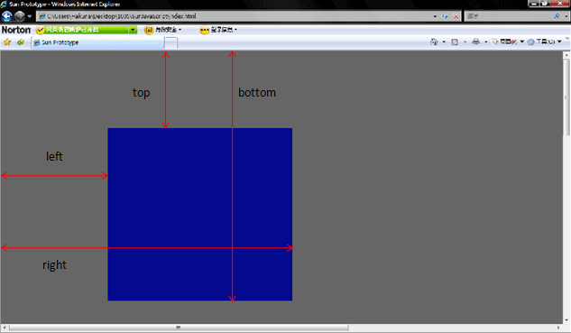
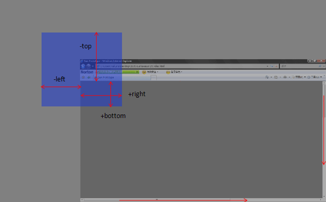

# 【汽车&学术方向CR】

> 2017-03-10

> 郭勇 程恩 杨奇

## CR方向：旅游&出行&POI
- CR项目：国际酒店重构 
- 项目描述：国际酒店项目SF1.0迁移SF2.0。
- 涉及模板：
    - for_mphotel(国际酒店结果页阿拉丁)
- 预览地址：https://m.baidu.com/s?iscookie=1&word=%E4%BD%9B%E7%BD%97%E4%BC%A6%E8%90%A8%E9%85%92%E5%BA%97

## for_mphotel | POI | 王天立

### $isQuery没有用到，block foot致空，showLeftText 和foot_right 已经无意义

```

...







    <div class="c-span6 wa-for-mphotel-tar">
        <div class="c-blocka c-moreinfo">
            <i class="c-icon c-gap-left-small">&#xe734</i>        
        </div>
    </div>


```

### iconfont没用引用

```
    @font-face {
      font-family: "wa-sigma-mphotel-cicons";
      src: url('/static/font/aladdin/wise_hotel/iconfont.eot'); /* IE9*/
      src: url('/static/font/aladdin/wise_hotel/iconfont.eot#iefix') format('embedded-opentype'), /* IE6-IE8 */
      url('/static/font/aladdin/wise_hotel/iconfont.woff') format('woff'), /* chrome, firefox */
      url('/static/font/aladdin/wise_hotel/iconfont.ttf') format('truetype'), /* chrome, firefox, opera, Safari, Android, iOS 4.2+*/
      url('/static/font/aladdin/wise_hotel/iconfont.svg#iconfont') format('svg'); /* iOS 4.1- */
    }

```

### 建议
删除无用代码


## Fusion b-lightbox 组件，学习

- [组件说明](http://pmd.baidu.com:8123/doc/#b-lightbox)
- [Demo](http://pmd.baidu.com:8123/build/components/b-lightbox/demo.html)
- [Vue API](http://cn.vuejs.org/v2/api/)

### 组件原理

获取容器位置

``` javascript 
    /*
     * Get the rect of element
     */
    function elementRect($el, containerWidth, containerHeight) {
        var rect;
        if ($el && $el.length) {
            rect = $el.get(0).getBoundingClientRect();
        } else {
            rect = {
                width: 1,
                height: 1,
                top: containerHeight / 2,
                left: containerWidth / 2
            };
        }
        rect.right = containerWidth - rect.width - rect.left;
        rect.bottom = containerHeight - rect.height - rect.top;
        return rect;
    }

```

getBoundingClientRect 方法返回元素的大小（不含margin）及其相对于视口（左上角）的位置

<p></p>
<p></p>

放大图片到容器

```
    /*
     * Calc the size of box1 [h1, w1] to be contained within box2 [h2, w2]
     * @return {Object} the size of box1 after resize
     */
    function containRect(h1, w1, h2, w2) {
        var rect = {
            width: w2,
            height: h2,
            top: 0,
            left: 0,
            bottom: 0,
            right: 0
        };
        if (h2 * w1 > h1 * w2) {
            rect.height = w2 * h1 / w1;
            rect.bottom = rect.top = (h2 - rect.height) / 2;
        } else {
            rect.width = h2 * w1 / h1;
            rect.right = rect.left = (w2 - rect.width) / 2;
        }
        return rect;
    }

    animateToFullScreen: function($el, $from) {
            var w2 = $(window).width();
            var h2 = $(window).height();
            var transform = 'scale3d(%c,%c,1) translate3d(%xpx,%ypx,0px)';
            var to = {
                left: 0,
                right: 0,
                top: 0,
                bottom: 0
            };

            if($from){
                var from = elementRect($from, w2, h2);
                to = containRect(from.height, from.width, h2, w2);
                transform = transform
                    .replace(/%c/g, from.width / to.width)
                    .replace('%x', from.left - to.left)
                    .replace('%y', from.top - to.top);
                $el
                    .css('top', to.top).css('bottom', to.bottom)
                    .css('left', to.left).css('right', to.right);
            }
            else{
                transform = transform
                    .replace(/%c/g, 0)
                    .replace('%x', 0)
                    .replace('%y', 0);
                $el.css('transform-origin', '50% 50% 0');
            }
            // hide .prev and .next while scaling
            applyTransform($el, transform).css('overflow', 'hidden');

            this.animating++;
            //wait DOM render
            this.timer = setTimeout(function() {
                $el.animate({
                    'transform': 'scale3d(1,1,1) translate3d(0px,0px,0px)',
                    '-webkit-transform': 'scale3d(1,1,1) translate3d(0px,0px,0px)',
                }, {
                    duration: this.getProp('fadeInDuration'),
                    easing: 'ease-in-out',
                    complete: function() {
                        $el.css('overflow', '')
                            .css('top', '').css('left', '')
                            .css('bottom', '').css('right', '')
                            .css('transform-origin', '');
                        this.animating--;
                    }.bind(this)
                });
            }.bind(this));
        },

```

判断滑动方向
```

        /*
         * Get the swipe target selector
         * Cancel swipe if deltaX is not long enough.
         * But enforce swipe for quick touchmoves.
         */
        getSwipeTarget: function() {
            var deltaX = this.endX - this.beginX;
            var direction = getDirection(deltaX, 0.3 * $(window).width());
            if (direction === 0) {
                var deltaT = Math.max(this.endTime - this.beginTime, 1);
                var v = deltaX / deltaT;
                direction = getDirection(v, 0.3);
            }

            function getDirection(offset, max) {
                if (offset > max) return -1;
                if (offset < -max) return 1;
                return 0;
            }
            return ['.prev', '.current', '.next'][direction + 1];
        }

```

设置背景图
```
        /*
         * Set the background of the image
         * @param {jQuery} container the container to set background of
         * @param {Number} idx the index of the background image
         * @param {String} placeholder the url of the placeholder image during loading
         */
        setBackground: function($container, idx, placeholder) {
            $container.data('ready', 'no');
            this.getImage(idx).then(function(img) {
                clearBackground($container);

                // no more images
                if (!img) return $container.html(this.NOMORE_HTML);

                // init placeholder info
                if (placeholder) {
                    $container.css('background-image', 'url(' + placeholder + ')');
                } else {
                    $container.append($(this.LOADING_HTML));
                }

                // async loading
                var tmp = new Image();
                tmp.onload = function() {
                    clearBackground($container).css('background-image', 'url(' + img.src + ')');
                };
                tmp.onerror = function() {
                    if (!placeholder) {
                        clearBackground($container).html(this.ERROR_HTML);
                    }
                }.bind(this);
                tmp.src = img.src;

                // enable swipe to
                $container.data('ready', 'yes');
            }.bind(this));
        }

```
