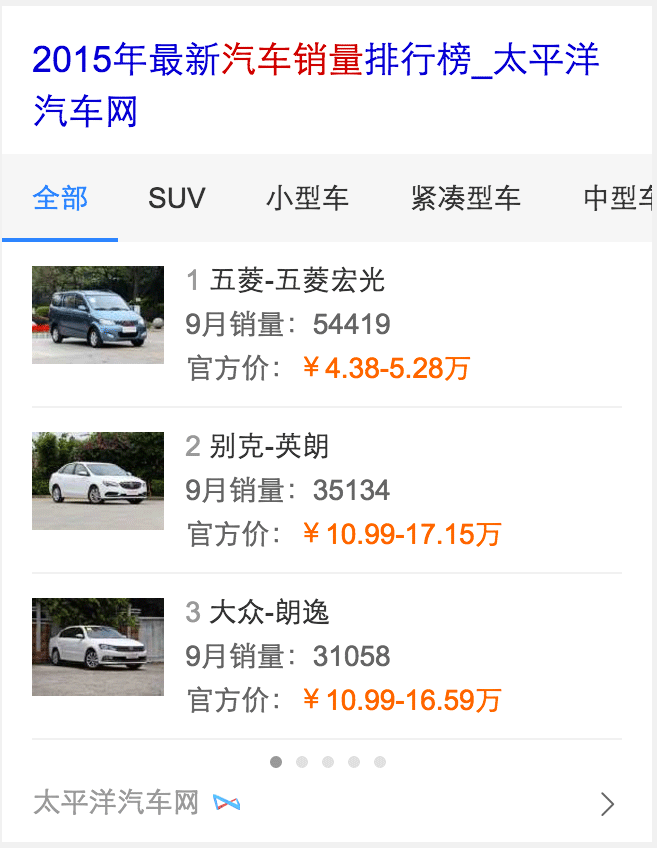
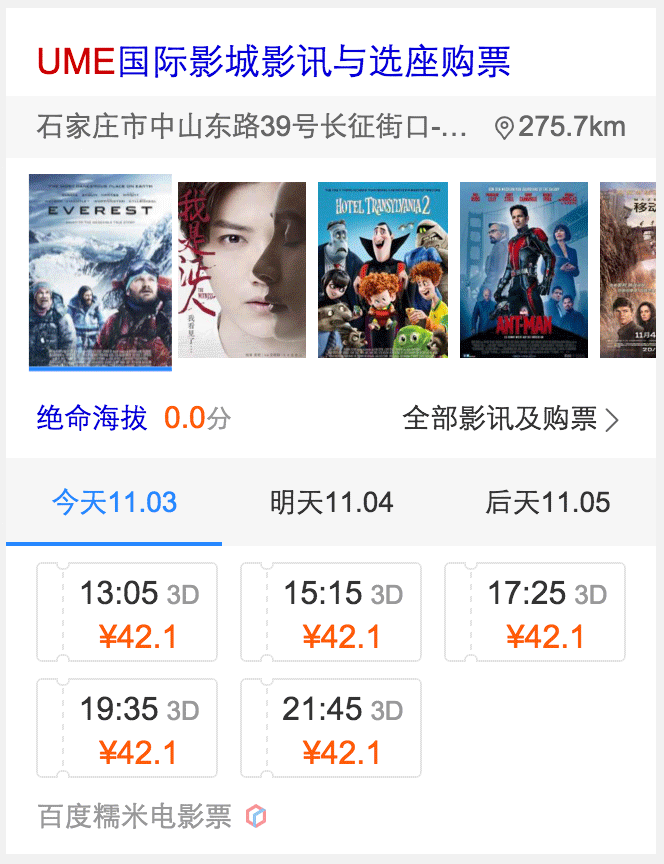

# 谢耀武

> 从2015-10-26到2015-10-30

## 10.30商品项目 - 汽车排行榜

### 背景与目标

用户在购车或了解汽车行业时，有查询排行榜的需求。常见查询的排行榜维度有：销量、点评和热度。而线上无此类卡片，销量排行榜可以更好的满足用户需求。

### 完成情况

该模板是新增模板，模板名是`wise_car_rank`，模板已上线，影响pv:10W

### 效果截图

### 后续

优化召回策略，扩大召回面

## 栅格化迁移 - 电影院

### 背景与目标

该模板属于栅格化重点类目

### 完成情况

栅格化迁移模板，模板名是`wz_dianyingyuan_new`，模板已上线，属于全量覆盖式上线，影响pv:

### 效果截图

### 遇到的问题

由于数据是异步渲染，且模板需要使用调框功能，顾修改了`c_base/iphone.bdbox_invoke.tpl`，请参考 [base升级日志](http://sfe.baidu.com/#/阿拉丁/无线网页搜索/base模板升级日志) 里的`#2015-10-26`

## 解决的bug

* 修复线上电影老模板2个bug，[story](http://icafe.baidu.com/issue/3797193/show?spaceId=9168&cid=5&projectId=)
* 修改商品模板并上线-非标类商品卡片加上百度vip跳转的监控链接，[story](http://icafe.baidu.com/issue/3797677/show?spaceId=9168&cid=5&projectId=)

## 接下来的排期项目

1. 栅格化电影项目-电影票泛需求,电影院泛需求
1. 商品类目-汽车口碑模板开发
1. 商品项目-汽车主卡优化
1. 汽车评测卡的2期优化-添加多tab的支持
