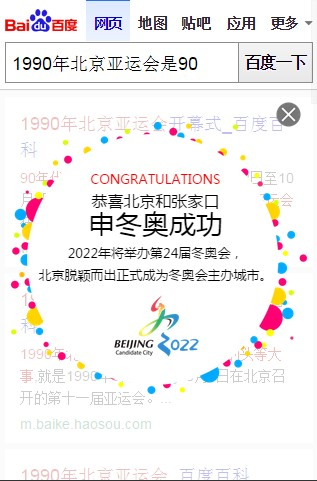

# 陈锐

> 从2015-11-02到2015-11-06

## 1. 通用庆祝彩蛋模板（PC & WISE）

### * 背景与目标
旧的庆祝模版升级，效果如下图，QUERY= “北京申奥”

### * 效果截图

### * 完成情况

WISE(celebrate)周三完成开发，PC(right_celebrate)周五完成开发，下周上线模板。
预计影响(参考北京申奥) PC：72W，WISE：278W

### * 后续

后续计划从该模板中抽出通用的浮层模板和弹层组件。

## 2. 梳理运营项目后续计划

### * 背景与目标
规范项目开发流程，解决开发上的问题和痛点，提升开发效率。
提升运营产品的收益。

### * 主要内容
1. 模板开发和上线（内部）：开发规范，效率，测试，工具和组件化
1. 项目流程（对接部门PM）：需求整理，项目流程化，收益评定
1. 数据统计（对接部门UBS）：展现量，点击交互，特殊交互(如滑动)，结果页导流，拉登陆，活跃用户，留存用户
1. 中间页开发及上线 （对接部门AE）：中间页开发，上线，联调，统计，登录/登出

## 3. 下周计划

1. 梳理运营项目开发上后续的计划，确立目标和任务拆分。
2. 效果库的精简和移动端适配
