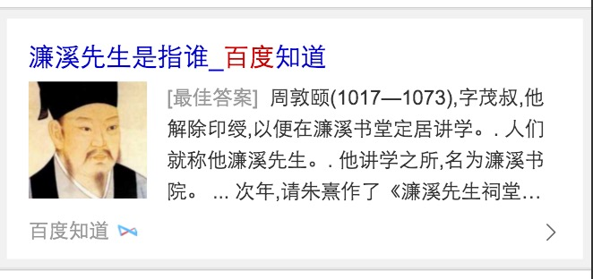
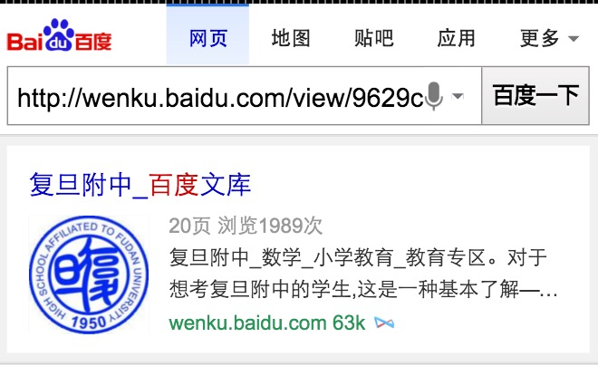
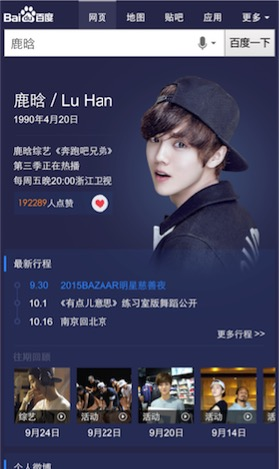

# 刘泉有

> 从2015-11-02到2015-11-08

## 自由产品出图项目

### 背景与目标

zhidao,wenku,wenkuala,www_zhidao_normal,wenda模板中支持出图样式.

### 完成情况

本周三数据ready，联调结果正常，有图能以出图样式展示，无图则以原有样式展示。可依安排时间上线。

### 效果截图

## 场景化-人物

### 背景与目标

前期数据调研发现，用户对于同一query的需求，跟随搜索时间、地点、联网方式、用户自身属性等因素的改变而呈现不同的趋势。我们可以从现有数据中抽象出这些趋势的一些规律，将其应用到产品设计和召回中，有效减少用户筛选成本，增加产品使用率。因此我们可以通过条件触发的sigma形式，将粉丝的各维度需求在sigma卡片上做聚合展示，让粉丝通过搜索来追星，获取明星的全面信息。

### 完成情况

本周开始着手该项目，数据，开发，本周五可完成第一版，与PM开始联调。计划下周达到上线状态。

### 效果截图

## 下周

- 完善场景化-人物，达到上线状态。
- 自由产品出图上线。