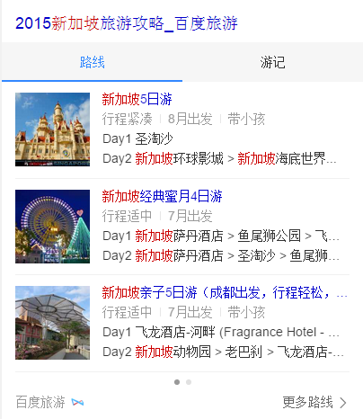
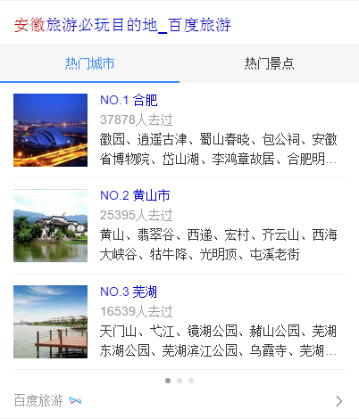
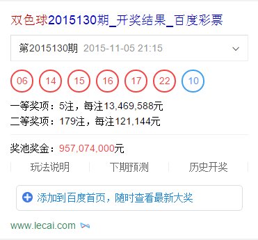

# 李晓

> 从2015-11-02到2015-11-06

## 10.30旅游项目 - 旅游攻略卡片

### 背景与目标

Wise端攻略集合需求未被充分满足，卡片分散，触发机制有差异，现需要将样式收拢，统一触发效果和产品体验。
该卡片在国家、省份、城市目的地旅游下触发，景点目的地旅游下不触发。

### 完成情况

该模板是新增模板，模板名是`lvyouraiders`，10.30号全流量上线，影响pv:约200W

### 效果截图

## 10.30旅游项目 - 国家省份旅游卡片

### 背景与目标

在国家省份目的地名下按照城市和景点两个维度推送的热门poi，帮助用户快速判断行程目的地。

### 完成情况

该模板是新增模板，模板名是`lvyouviewspot`，10.30号全流量上线，影响pv:约30W

### 效果截图

### 后续

优化产品样式&扩大召回

## 彩票 - 数字彩手百下加添加到首页功能

### 背景与目标

轻应用迁移，遗留手百下有添加到首页功能的相关query，如彩种+开奖结果、彩种+期号、彩种+期号+开奖结果，未覆盖。

### 完成情况

模板升级，扩大彩种+开奖结果、彩种+期号、彩种+期号+开奖结果召回，模板名是`lottery_v2`，11.05号全流量上线，影响pv:约300W

### 效果截图

## https报警bug修复

### 报警描述

[报警地址，query:网上挂号](https://m.baidu.com/from=844b/pu=sz@1320_2001/s?cip=220.115.30.1&baiduid=6C1E055B6D579FE2FD1CB8A9F7C0E461&word=网上挂号&sword=网上挂号&ts=9405646&t_kt=24&rsv_iqid=17215973903531982078&sa=is_4&rsv_sug4=5683&inputT=4867&ss=100&rq=wang shang g&tn=iphone&icolor=100891,100806,100763,100907,100039)

### 完成情况

wise_doctor模板引起报错，11.02号已上线修复

## https报警bug修复

### 报警描述

[报警地址，query:<img class="base" src="http://w](https://m.baidu.com/from=381a/s?cip=61.135.169.87&baiduid=774D272839AE5A78C6E93A9A9854B3B3&word=++++++++++++%3Cspan+class%3D%22image%22%3E%3Cimg+class%3D%22base%22+src%3D%22http%3A%2F%2Fw&sword=++++++++++++%3Cspan+class%3D%22image%22%3E%3Cimg+class%3D%22base%22+src%3D%22http%3A%2F%2Fw&sword=++++++++++++%3Cspan+class%3D%22image%22%3E%3Cimg+class%3D%22base%22+src%3D%22http%3A%2F%2Fw&sword=++++++++++++%3Cspan+class%3D%22image%22%3E%3Cimg+class%3D%22base%22+src%3D%22http%3A%2F%2Fw&ts=9818451&t_kt=0&rsv_iqid=17266554040881022390&sa=ib&rsv_sug4=3701&ss=001&inputT=4&tn=iphone&icolor=100270,100165,100273,100423,115,100109,100917&tn=iphone&icolor=101012,100271,101047,100039,100096,100207,100291,100921,100099&tn=iphone&icolor=101012,100271,101047,100039,100096,100207,100291,100921,100099)

### 完成情况

fanyi模板、wenkuala模板引起报错，11.05号已上线修复

## 接下来的排期项目

### 旅游
1. 美食购物景点卡片主链改为动态变化，10.22-10.23开发加测试，pm需求改动为主链文案也跟随动态变化，数据提交中【11.03号已上线】
1. 度量衡模板栅格化，涉及模板converter、conv【11.06号pm确认效果加测试，预计11.11模板上线】
1. 十三陵目的地景点卡片优化，ue图本周三11.04到位，涉及两个模板【11.06产生schema，11.9-11.12开发】
1. 121项目评审、排期

### 人物
1. 121项目评审、排期

