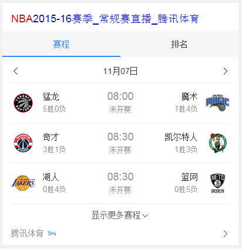
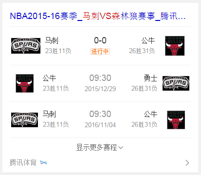

# 常健驰

> 从2015-11-02到2015-11-06

## NBA主卡开发

### 背景与目标

wise端NBA现有样式展现和逻辑有较多不足，已无法满足用户对于NBA赛事的信息获取，为更好的满足并丰富用户获取信，针对用户的不同需求对整体样式进行优化。

### 完成情况

模板在10月30日已上线，召回query: [nba](https://m.baidu.com/s?word=nba)，预估日pv量在60w。

### 效果截图

## NBA球队vs球队模板开发

### 背景与目标

属于栅格化迁移项目里的重点类目

### 完成情况

模板已开发完成，资源方没有提供数据无法提测，已催pm-安瑞。

### 效果截图

## 修复和优化的模板

* 修复线上宣讲会卡片、校园简历、校园招聘模板无法统计点击日志，原因是由于没有添加date-click属性，并且宣讲会数据中mu参数错误导致

## 后续排期

* 文库模板-document已放到测试环境，数据不全，在等rd补全数据
* 星座卡片-PM2.5迭代模板开发
* 生效查询模版开发
