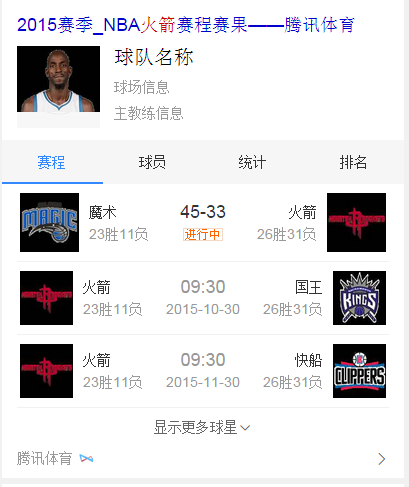

# 李阳阳

> 从2015-11-2到2015-11-6

## 10.30体育项目 - NBA优化项目球队

### 背景与目标

对于球队维度的需求，线上没有卡片可对相应内容进行承载，造成需求满足缺失，基于用户对球队的需求，通过数据加以整合，以满足用户对信息的获取。

### 完成情况

该模板是新增模板，模板名是`wise_team_info`，模板开发完成，pm和ue确认效果中，准备今天提测

### 效果截图

### 后续

球队项目模板提测，上线模板
球员卡片现在的进度：
图片没有解析完，数据要换接口，这两天资源方给回馈，等待资源准备好，可上线

## 接下来的排期项目

1. pc端企业异常名录模板的复用 
1. test

1.政务模板