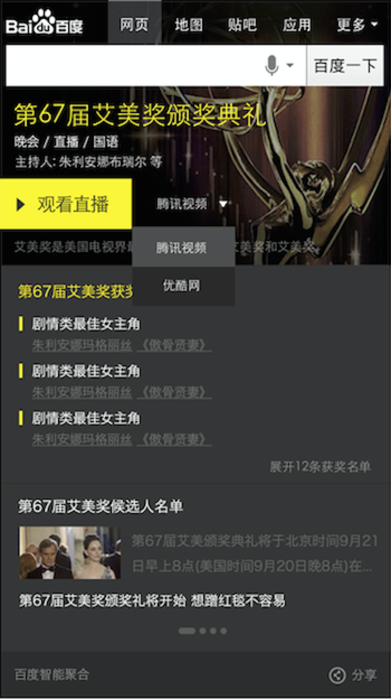
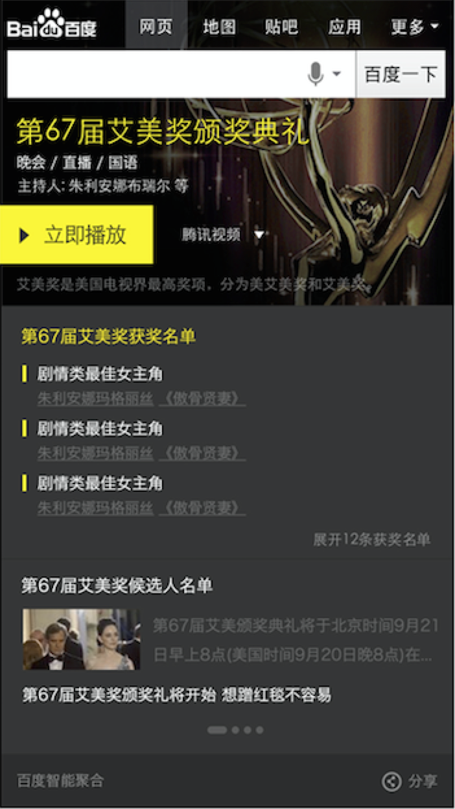
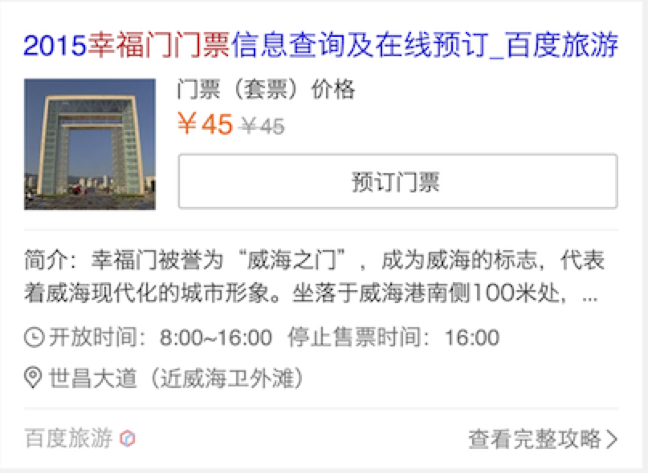

# 王培

> 从2015-11-02到2015-11-06

## 长视频运营项目

### 背景与目标

```
    为了全面满足网友现有需求，挖掘新的运营模式，优化整体搜索结果页用户体验。
```

### 完成情况

`开发中···`

### 效果截图

- 直播前：

    

- 直播中：

    

- 直播后：

    

### 后续

- 11.09开始测试

- 11.11上线模板


## 栅格化旅游门票模板

### 背景与目标

```
    模板栅格化迁移
```

### 完成情况

`模板开发已完成，等待资源更新中···`

### 效果截图



### 后续

```
资源更新后上线模板
```

## 下周计划

- 明星人物运营卡片

    - 小流量测试
    
    - 第二版样式修改
    
- 未来商店运营卡片


