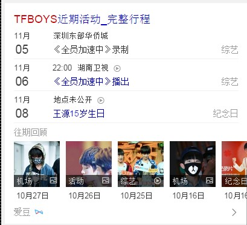

# 谢玲娟

> 从2015-11-02到2015-11-06

## 产品-人物-明星行程

### 背景

上线优化样式（没有图片and视频的近期行程置灰，不可点）

### 进度

`小流量中`

pv：3~4w

### 效果截图

## 产品-人物-百科 

### 进度

`小流量中`（下周出结论）。

抽取实验对照组各4%，实验影响面约28w。模板ID： 6850 英文名： star_baike

### 效果图

## 产品-人物-组合

### 进度

`待UE图`，下周样式优化后上线新模板。

## 问答连接服务

### 背景

针对问答类型的query，在问答卡片给用户提供答案信息的基础上，通过深入挖掘query潜在的服务型需求，通过和app、HTML5页的对接技术，将用户最需要的服务型资源提供给用户，全方位地满足用户深层次需求。

pv：30w

### 进度

提测中，下周上线。

## 推荐-图文更多推荐

### 背景

搜索结果页面底部的相关搜索也是链接形式的推荐，在产品定位上有一定的重合。重新实验展开也是图文推荐的样式，评估收益。

### 进度

提测中，下周上线。

## 推荐-样式优化

### 背景

为了达到更好的推荐效果，计划当推荐卡片内容为书籍/影片时，用竖图替换现有方图

### 进度

提测中，下周上线。

## Bscroll横滑组件

### 背景

原先的横滑js在模板中代码冗余，且横滑的点击日志不准确。

### 进度

已上线

## 下周

1. 产品-人物-百科全流量模板改造并上线（实验结果为正的话）。
1. 产品-人物-组合UE出图后模板优化并上线（UE能及时给审核后图的话）。
1. 问答连接服务上小流量实验。
1. 推荐-图文更多推荐上线。
1. 推荐-（书籍、影视类目）样式优化上线。