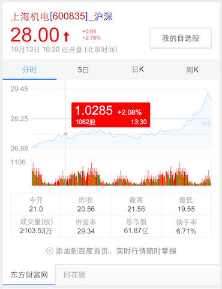
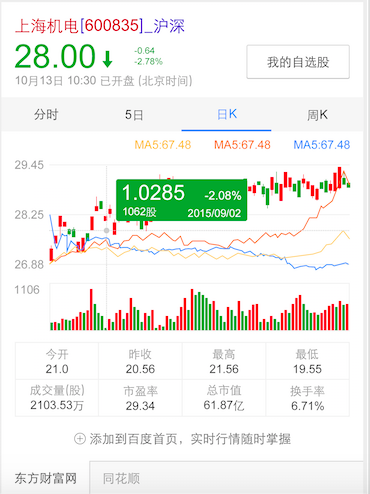

# 朱雷

> 从2015-11-02到2015-11-06

## 12.1金融项目 - 股票行情卡片升级

### 背景

股票行情卡片升级，升级点包括增加k线图和交易量图，优化原先的趋势图样式，增加展开动画效果。

### 完成情况

需要修改`stockdynamic`和`stockdynamic_moretab`两个模板，目前正在开发中，预计11月11日提测。影响面4000w

### 效果截图

## 接下来的项目

股票和寻址的一二一项目需求还未评审，评审后给出排期
