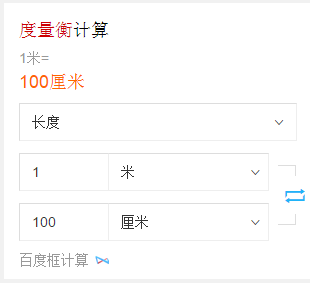

# 李晓

> 从2015-11-09到2015-11-13

## 度量衡模板栅格化

### 完成情况

涉及模板converter、conv，11.11号全流量上线

### 效果截图

### 线上效果

[1厘米](https://m.baidu.com/ssid=c301b4f3c9b5b9cfd2bbbac57107/s?word=1%E5%8E%98%E7%B1%B3&ts=9855696&t_kt=0&rsv_iqid=12474768279015515647&sa=ib&pvt=100181%401447319850&rsv_sug4=4017&ss=101&inputT=3230)

## 接下来的排期项目

### 旅游
1. 十三陵目的地景点卡片优化【11.9-11.12开发，预计11.17号上线】
1. 121项目- 主题泛需求旅游【11.12号开始设计，待开展】

### 人物
1. 121项目 - 明星通用sigma【已评审，后机制改为复用‘鹿晗’场景化卡片形式】
1. 121项目 - 全员加速中人物联动卡片【已评审，新增唯一答案模板，后续综艺人物考虑复用，11.13ue定稿，11.16-11.20开发加测试】

