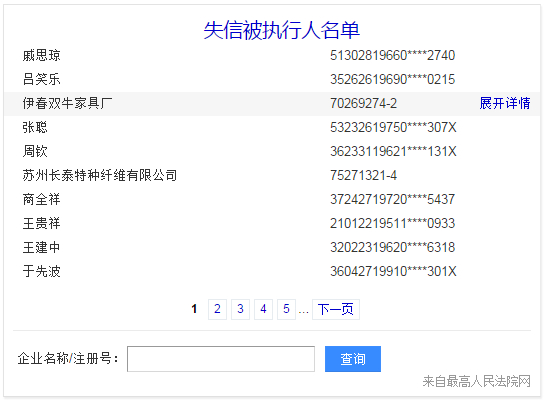
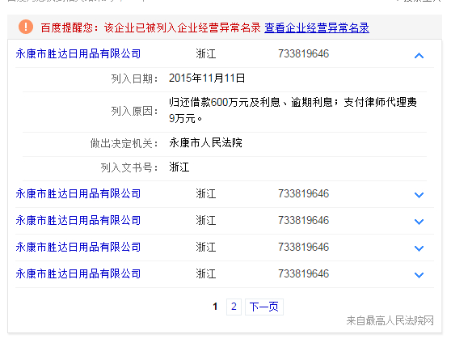

# 李阳阳

> 从2015-11-09到2015-11-13

## 12.1企业异常名录

### 背景与目标

基于与北京市工商局合作，目前获得一批企业经营异常名录，形式上复用目前线上【失信被执行人】模板。

### 完成情况

该模板是pc端和wise端都需要做，现在wise端的进度是ue图变为周一给，因为这个套wise端的模板没有可复用的模板，样式需要新设计，比较慢，还有一个原因中间的ue设计人换了一个人，导致pm给的进度是变为了周一给ue图，然后由于模板是imini的，xml已跟rd对好，rd胜楠也变为了环境周一给，醉了醉了

模板pc端的复用，我修改好了，共涉及到三个模板，样式预览如下图

### 效果截图1

交互式，在第一张图的异常名录的名字在大搜发起搜索，去召回第二个图片的展示，然后再第二个图的点击企业详细名录，召回第三个模板的样式，pc端目前是等待rd环境搭好联调，大概下周一开始

## 12.1购物-汽车主卡优化

### 背景与目标

用户在搜索车系词时，有查看车系基本信息和具体车型的需求。线上车型卡片数据不够丰富，车型展现不符合用户习惯，召回不够全面，资源方质量不好，且不符合栅格化规范，故优化主卡。

### 完成情况

该模板是新增模板，模板名是`wise_car_cars`，模板正在开发

## 12.1wise问答聚合卡片

### 背景与目标

用户在搜索一个问答类query时，往往会遇到以下痛点：
   对于所关心的问题，不知道如何准确的表述，因此造成搜索结果不能很好地满足。
   当搜索问题时，往往有相关若干个子问题或者相关话题其他方面的搜索需求，当前搜索结果中并没有一站式的解决方案。
该卡片从理解用户的query需求入手，结合相关用户的上下文搜索记录，将当前query包含的话题进行展开，通过相关的问题+答案聚合的展示形式，满足深层次的搜索需求。展开维度包括但不限于：
   需求细化，比如用户搜索“牙疼怎么办”，聚合“牙疼怎么能快速止疼”。
   需求横向扩展，例如搜索“牙疼怎么办”，聚合“牙疼是什么原因”。

基本交互：
       三个问题的聚合
       默认第一个问题展开
       可展开收起的按钮

### 完成情况

已完成，卡片pm给组内看了下，模板名：wise_question_answer,基本没什么问题，现在等着rd那边出正式的数据，然后再跟你这边联调下。

### 效果图片

## pc值周，没有遇到问题，每天最多时3个上线，平均1-2个上线

## 12.1wise菜谱卡片，和wise的企业异常名录

todo