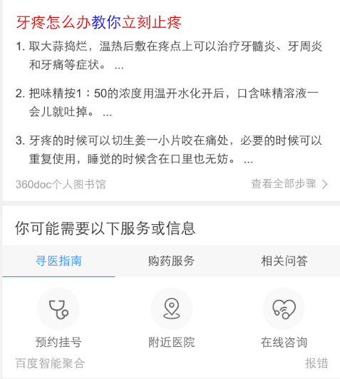
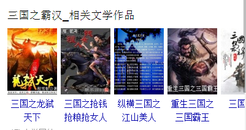

# 谢玲娟

> 从2015-11-09到2015-11-13

## 【问答链接服务】 `本周三已上线` 30w

## 背景

### 针对问答类型的query，在问答卡片给用户提供答案信息的基础上，通过深入挖掘query潜在的服务型需求

## 效果图

## 【推荐】影视，书籍类目竖图 `本周四已上线` 3亿

## 背景

### 增强视觉效果，与pc保持一致

## 效果图

## 【推荐】新增更多推荐图文形式`本周五上线` 3亿

## 背景

### 在wise通用推荐中增加“更多推荐”，用户点击展开query级别的推荐内容，经过UBS评估为略正收益。实验展开也是图文推荐的样式，评估收益

### 效果图

## Bscroll升级 `本周五上线`

## 背景

### 新的组件升级了两处：1、组件中获取模板url、不用模板传；2、组件收模板传的gOrder作为一个标识，在模板中有多个滑动区块时区分。

## 【推荐】事件、电子产品横图

todo

## 【121人物】全员加速中

todo

## 【121人物】通用明星sigma

todo
