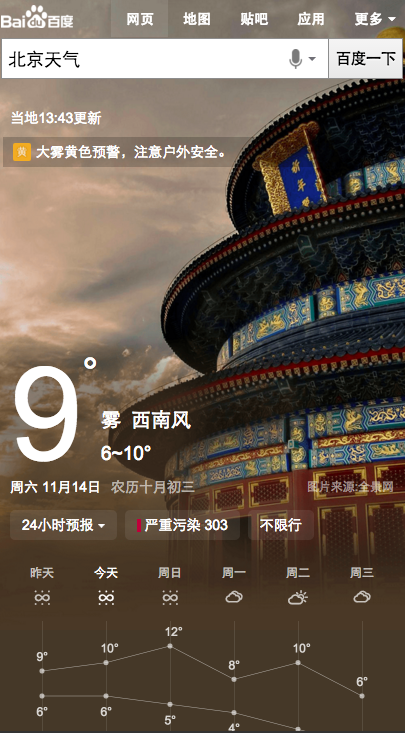
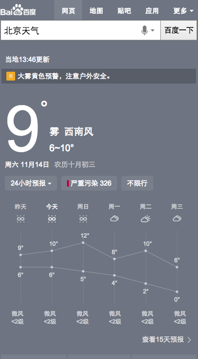

# 朱雷

> 从2015-11-09到2015-11-13

## 天气创新突击

### 背景与目标

探索在天气这种卡片下，增加生活入口，探索精准答案型的查询在移动互联网应该怎么开展。

### 完成情况

模板周二上线了第一版，周三到周五迭代了3次，目前线上有3种样式，分别是有背景九宫格版、无背景九宫格版、无背景瀑布流版。数据等待UBS产出。

### 效果截图

1. 有背景九宫格版

1. 无背景九宫格版

1. 无背景瀑布流版

## todo

下周开始继续开发股票行情卡，暂定周三提测
