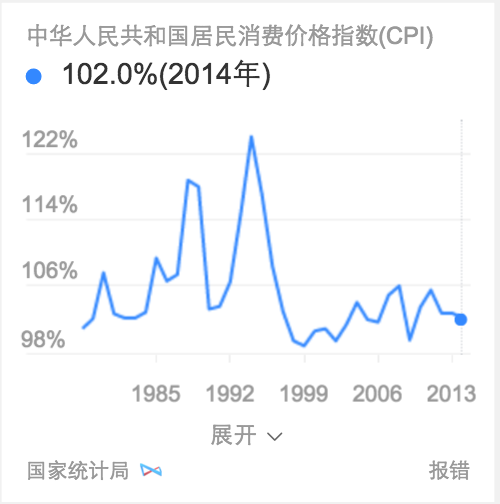

# 范黎明
> 从2015-11-16到2015-11-20

## 图表添加cpi和人口数据

### 背景和目标

在cpi和人口数据周3准备好的情况下，适配这两个指标

### 影响面

gdp和人均gdp是1.5W

### query

XXXX年XXXgdp(2010北京[gdp|人均gdp])

### 效果截图

## 违章wise手百改变策略和pc bug修复

### 背景和目标

* 手百的展现策略改为和其他浏览器保持一致，适配手百下展现问题
* pc下修复了提出的bug，周二上线

### query

[北京]意想不到的猜不出来的交通违章  

## 暴雪项目

### 进展

熟悉了环境，搭好了开发环境

## 下周计划

* 周一上线图表，结束图表的开发
* 周二完成暴雪的基本结构，能够实现同后端的数据联调