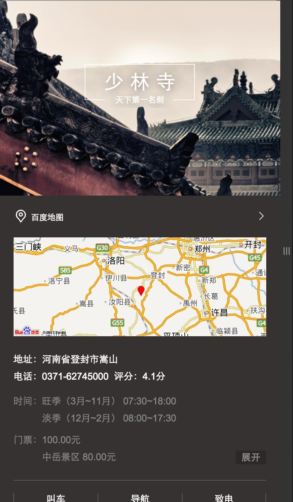

# 刘泉有

> 从2015-11-16到2015-11-20

## 1. 场景化出行（wise_scene_trav）

### * 背景与目标
一些景点的信息聚合，提供用户搜索景点的便捷性，给部分产品线导流。
预计下周一上线。

### * 完成情况
- 本周二出行数据ready,周三调通数据，QA周四周五测试。
- Query=少林寺，特性条件触发，初始影响面PV=6.5W，试验期间减半

## 2. 场景化餐饮（wise_scene_food）

### * 背景与目标
各种餐饮名店信息聚合，吃货的福利。为用户提供更便捷的餐饮搜索信息，给部分产品线导流。

### * 完成情况
- 本周四晚数据ready，周五数据调通，预计下周上线。

## 3. 场景化人物（wise_scene_person_kv）

### * 背景与目标
上周已上线。

### * 完成情况
- 这周都是修一些小细节，加小功能。
- Query=鹿晗，暂时只有鹿晗能触发，初始影响面PV=6.5W，试验期间减半

## 4. 场景化人物（wise_scene_person_kv）

### * 背景与目标
上周已上线。

### * 完成情况
- 这周都是修一些小细节，加小功能。
- Query=鹿晗，暂时只有鹿晗能触发，初始影响面PV=20W,
- 上线符合预期效果

## 5. 自由产品出图（zhidao,zhidaoala,wenku,wenkuala,www_zhidao_normal）

### * 背景与目标
以上五个模板增加出图样式。

### * 完成情况
- 前端已完成。
- 后端在进行人工评估。

## 4. 下周计划

1. 场景化出行上线。
2. 场景化餐饮测试，BUG回归，上线。
3. 场景化城市启动。
