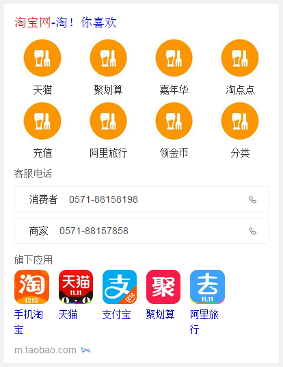

# 常健驰

> 从2015-11-16到2015-11-20

## 12.1wise寻址卡片

### 背景与目标

目前wise端官网寻址均为title+简单摘要的形式展现，调研发现2.7%的寻址类需求明显差于竞品。新增寻址卡片，可满足用户对官网首页及周边信息（子频道、相关APP、查询框、登录框、客服电话等）的需求，提升用户体验。

### 完成情况

模板已完成，app下载功能修改需求延期两天，后由于app图片大小引起争议，没有统一下来导致无法提测，在周五确定app图片的大小，并且改变展现方式（原来的滑屏改为一屏的2n图片，最多6张图片），现模板已分配给 `qa-郭书` 同学。

### 效果截图

## 12.1 pm2.5

### 背景与目标

目前线上pm2.5卡片内容过于单一，样式不够优美，需要对卡片进行优化，增加更多信息，丰富卡片内容

### 完成情况

这个项目刚刚介入，只写了xml数据格式，由于星座的ue图准备周五给出，所以pm2.5准备往后延期，先做优先级较高的星座卡片

### 最终效果截图

暂无截图

## 修复bug

* 修改mobilephone模板中手机归属地的来源信息 目前只修改了pc端的，由于wise端版本较老，需要重新栅格化，预计周五下午到周一下班前 [pc 效果](https://www.baidu.com/s?wd=13260286162&rsv_spt=1&rsv_iqid=0xdba078fa000267d7&issp=1&f=8&rsv_bp=0&rsv_idx=2&ie=utf-8&tn=baiduhome_pg&rsv_enter=1&rsv_sug3=5&rsv_sug1=4)

## 接下来的排期

* 星座卡片开发
* 生肖卡片开发
* 天气指数-pm2.5卡片开发
