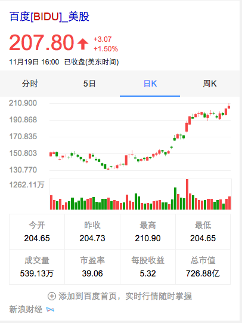

# 朱雷

> 从2015-11-16到2015-11-20

## 12.1金融 - 主卡

### 背景与目标

主卡迭代，增加K线图和量图需求

### 完成情况

目前卡片基本完成，图标部分数据还有问题，已经推动资源方更新，预计下周二数据ready，最快下周三提测模板。12.1前上线有风险。影响面4000w。

### 效果截图

## 12.1金融 - 泛需求

### 背景与目标

数据查询和辅助决策是股票相关query下用户最主要的两个需求，目前wise端股票泛需求词的搜索结果下，仅有上证指数的走势特型，缺少其他重要板指的数据和能够让用户参考的新闻消息，相比竞品有非常明显的缺失。

### 完成情况

行情数据卡UE图需要重新出，项目可能会delay。已经让PM赵博发邮件说明情况。

新闻盘点卡片复用线上股票消息面卡片，需要做kv数据的兼容，预计11月20日完成。

## 天气突击实验

### 效果评估结果

1.点击增加

`长点击率：`102025、101613、101614和102024对比，分别相对增加9.51%、3.93%、4.90%（实验组：23.29%、22.10%、22.30%，对照组：21.26%）

`整体点击率：`102025、101613、101614和102024对比，分别相对增加84.74%、72.93%、69.67%（实验组：61.30%、57.38%、56.30%、33.18%）

`长点击占比：`102025、101613、101614和102024对比，分别相对降低40.74%、39.9%、38.19%（实验组：37.94%、38.47%、39.57%，对照组：64.02%）

综合分析以上几个指标，长点击率相对增加的百分比，大大低于整体点击率增加的幅度。可见，新卡片能带来更多的点击，也说明用户对增加的交互、外链等导流是有需求的，只是对落地页满意度不高，所以长点击占比大幅下降。

`产品建议：`后续产品迭代优化，可以多关注落地页，提高落地页质量。

2.换query比例增加

`换query比例：`102025、101613、101614和102024对比，分别相对增加37.31%、19.33%、24.99%（实验组：0.99%、0.86%、0.90%，对照组：0.72%）

换query比例上升的主要是受实验组用户搜索“北京天气预报”、“北京天气预报一周”，“北京天气预报15天”这三个后续query的量明显增加所致，说明用户对天气的需求满足不是很好。

`产品建议：`

* 从换的query来看，用户对‘北京天气预报一周’的需求很高，而卡片展现的并非今天以后一周的完整天气情况，可以考虑多展现几天数

* 用户对“北京天气预报15天”有强需求，而卡片中‘查看15天预报’展现在右下角，用户不容易看到，建议调整位置。
