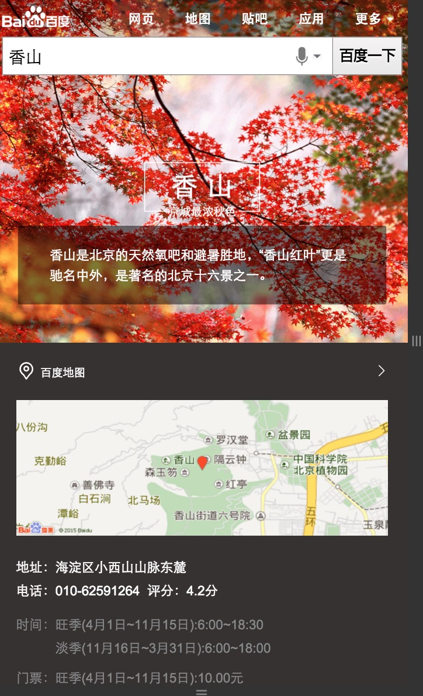
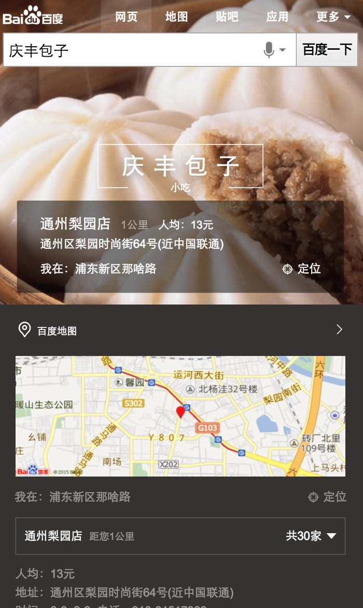

# 刘泉有

> 从2015-11-22到2015-11-27

## 1. 场景化出行（wise_scene_trav）

### * 背景与目标
通过时间、地点场景信息定位有出行需求的用户，展现场景化出行卡片，围绕出行需求，集合信息、交通、消费等功能，精准满足其出行需求。

### * 完成情况
- 本周四(11-26)上线。
- 实验组/对照组流量各50%，每组影响pv约3.5w/天；策略触发后，场景化卡片覆盖的pv约1w/天。
- Query=香山(天安门，故宫等)，地点策略+时间策略。
- [点这里点这里](https://www.baidu.com/from=844b/s?word=%E9%A6%99%E5%B1%B1&ts=0015366&t_kt=0&rsv_iqid=5504612005285293655&rsv_t=f77fpuYM6PishRuwv6A9PSlfWEsQ%252FkBKd%252FtsgBcmqwBGyhR9vBwtIJNd3A&sa=ib&ms=1&rsv_sug4=3888&ss=101&inputT=2065&sid=102251)

## 2. 场景化餐饮（wise_scene_food）

### * 背景与目标
各种餐饮名店信息聚合，吃货的福利。为用户提供更便捷的餐饮搜索信息，给部分产品线导流。

### * 完成情况
- 预计本周五(11-27)上线。

## 3. 场景化人物（wise_scene_person_kv）
从现有数据中抽象出这些趋势的一些规律，将其应用到产品设计和召回中，有效减少用户筛选成本，增加产品使用率。因此我们可以通过条件触发的sigma形式，将粉丝的各维度需求在sigma卡片上做聚合展示，让粉丝通过搜索来追星，获取明星的全面信息。
### * 背景与目标

### * 完成情况
- 本周添加微博与热门微博条数限制，已上线。
- Query=鹿晗，暂时只有鹿晗能触发，初始影响面PV=6.5W，试验期间减半。
- 人物后续工作已转李晓童鞋。
- [点这里点这里](https://www.baidu.com/from=844b/s?word=%E9%B9%BF%E6%99%97&ts=9424931&t_kt=0&rsv_iqid=7099597460254613959&rsv_t=5473vbvJQ6CHpRcFDZVOcjgQ8PfD4HRnZdMdiAW4%252BJY8bnEwuCP4PPXMZA&sa=ib&ms=1&rsv_sug4=1960&ss=101&inputT=733)

## 4. 自由产品出图（zhidao,zhidaoala,wenku,wenkuala,www_zhidao_normal）

### * 背景与目标
以上五个模板增加出图样式。

### * 完成情况
- 前端已完成。
- 后端在进行人工评估。
- 本周部署环境供RD评估。

## 5. 场景化城市（wise_scene_city）

### * 背景与目标
不同地方的用户，在搜索相同的地域Query时，需求不同；根据用户所在地，用户搜索时间等条件，判断用户搜索的真实需求，整合现有资源，为用户提供高颜值高精准度的搜索结果展现。

### * 完成情况
- 交互评审。

## 6. 场景化大学（wise_scene_colleges）

### * 背景与目标
根据不同用户群体，不同地域，给用户提供不同高校信息的聚合展示。
### * 完成情况
- 暂时无计划。

## 7. 下周计划

1. 场景化城市开发。
2. 场景化出行，场景化餐饮迭代。
