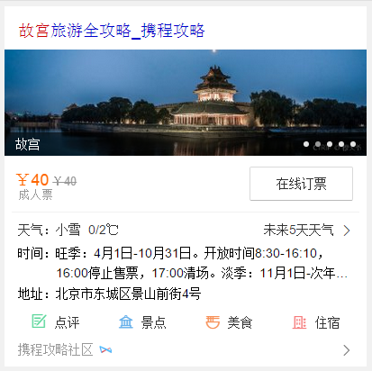
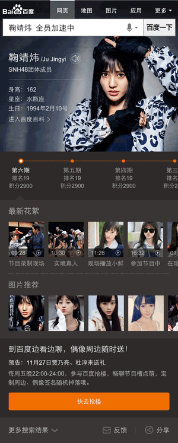
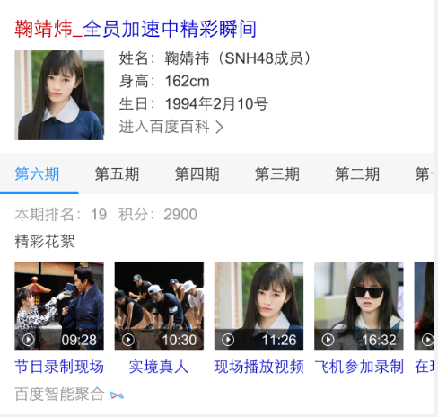
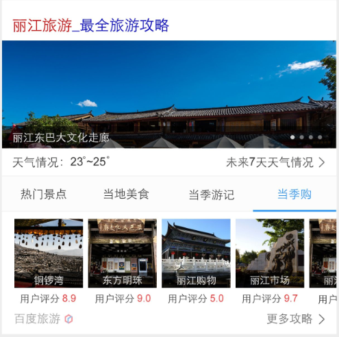

# 李晓

> 从2015-11-23到2015-11-27

## 1、旅游 - 目的地景点卡片优化

### 背景

* 原有目的地/景点改版

### 完成情况

* 涉及模板travel_strategy，11.20日模板上线，影响面约100W;

* 11.24上午小流量上线, 实验组（10%）：对照组（10%）

### 覆盖query

* 国内景点，如：故宫、天安门广场

### 效果截图

### 后续计划

* 原城市旅游卡片wise_city_travel，按照此策略做相应的交互、样式方面的升级。

## 2、人物 - 娱乐人物通用sigma

### 背景

* 热门娱乐人物日检索pv达1000w以上，65~70%点击集中于7张阿拉丁卡片。
* 娱乐人物方向需要有更大的媒体化合作空间。
* 颜值提升，体验升级，是百度wise端近期整体目标。

### 完成情况

* 新增模板star_variety，11.27日模板上线，影响面约5W;

### 覆盖query

* 全员加速中相关明星，如：贾乃亮全员加速中

### 效果截图

* 唯一答案

* 白卡

### 后续计划

* 扩大召回

## 3、旅游 - 城市卡片优化

### 背景

* 原城市卡片样式升级改版，介入更多资源方扩大召回

### 完成情况

* 升级模板wise_city_travel，11.27日模板上线，影响面约200W;

### 覆盖query

* 国内外城市

### 效果截图

## 下周计划

### 旅游
1. 主题泛需求旅游【ue暂未定稿】

### 人物
1. 粉丝场景化，需迁移mini机制、沉浸式样式升级、格瓦拉下拉交互升级【开发中】

