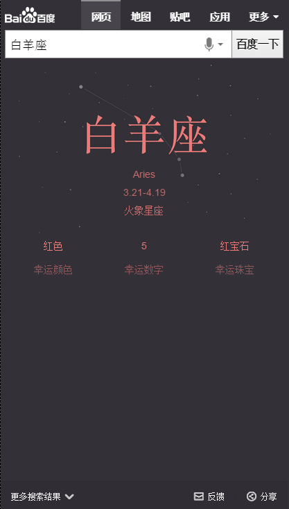

# 常健驰

> 从2015-11-23到2015-11-27

## 12.1wise寻址卡片

### 背景与目标

目前wise端官网寻址均为title+简单摘要的形式展现，调研发现2.7%的寻址类需求明显差于竞品。新增寻址卡片，可满足用户对官网首页及周边信息（子频道、相关APP、查询框、登录框、客服电话等）的需求，提升用户体验。

### 完成情况

模板测试完成，评估已完成，三级单已走完，预计11月27日下午模板上线。

### 效果截图

## pm2.5

### 背景与目标

目前线上pm2.5卡片内容过于单一，样式不够优美，需要对卡片进行优化，增加更多信息，丰富卡片内容

### 完成情况

pm2.5延期先做优先级较高的星座模板

## 单一星座模板开发

### 背景与目标

将原有星座阿拉丁卡片改为sigma形式，增加更多星座信息（性格分析、运势、配对），为用户节省搜索时间。同时提升卡片颜值，提升用户体验。

### 完成情况

昨天数据到位和ue图到位开始做，目前已完成20%左右。

### 效果截图

## 接下来的排期

* 生肖卡片开发
* wise手机号模板栅格
* 天气指数-pm2.5卡片开发
