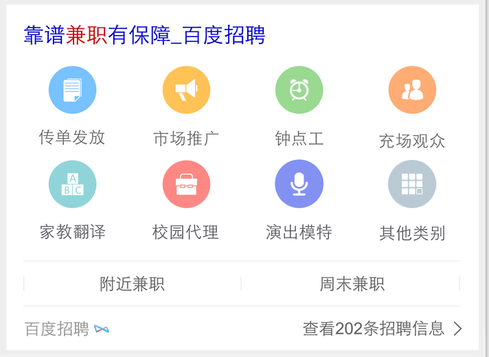

# 刘玲玲

> 从2015-11-23到2015-11-27

## 本周进展

## kap爱生活-途虎汽车

### 背景与目标

为途虎完成搜索流量导入

### 完成情况

pc （11.24）上线完成  query=保养、品牌+保养（奥迪保养）目前还没开零流量
wise pm走单中 

### 效果截图

## kap大学排行榜

### 背景与目标

背景：大学排名一直是报考学生做出决策和寻找合适的高校的重要方式。对于大学排名线上现在主要是针对重点大学的相关排名和信息，但经过调研发现，用户对于二本大学等批次大学的搜索占比也很大，同时用户还会以工科类排名等方式进行搜索。而现有排名机制可以横向进行拓展，减少用户换query比例，进而优化。
目标：用户在搜索大学相关排名的时候，对于排名的需求纬度较多，如地区、批次、类型。通过优化全面满足各个纬度的大学排名。

### 完成情况

wise 评审走单中，因title主链跳转被撤回（title及其链接由之前的不变，到现在随着不同筛选条件title及其链接改变），现在在拼title链接中。
pc（11月24）上线一次（后续会同步wise的title链接跳转的问题再上一次），query=二本大学排名、北京二本大学排名 sid=7498

## wise百度词典卡片

### 背景与目标

针对线上中中释义卡片进行升级，主要满足用户字、词、成语实体卡片的查询，也作为字词成语实体卡片的一期项目，后期将继续问答卡片的满足。

### 完成情况

样式已开发完，待渲染数据，rd配环境中

### 效果截图
问答类

实体类

## 泛需求兼职kap

### 背景与目标

1、兼职在整个招聘中占据4.6%，均采用精确需求卡片覆盖，需求不符合，初步拉部分兼职query需求应该至少在20w起（保守估计）
2、整个兼职目前的已接入招聘资源质量差，集中给用户“假、骗、无保障”印象，是最大的顽疾；是个痛点—而之前使用58赶集等数据无法解决，反而令用户上当；
3、目前兼职领域冒起一批新兴兼职资源，有保障预付工资等形式在逆袭大型招聘网站，如兼职猫，探路、一米、斗米等兼职先后获得相关领导人接见与上样式，同时近期一批货的巨额融资：斗米4000w美金、探鹿1000w美金（他们的日活在几w左右），是新兴020布局的重要一环，但是这些创业企业缺少流量用户入口，这点是我们的一个机遇；另外新兼职客单利润和用户粘性高，内部了解兼职利润约为工资的20%，高频属性，对于目前没有巨头态势下，无论从生态和盈利布局都是一个重要的点；
4、兼职对于构建招聘垂搜来说是个重要组成，校招，社招，兼职
5、结合运营活动（寒假兼职期）改善用户形象和养成入口，打出品牌，同时为之后做铺垫。
6、目前线上资源有效性较差，无法满足用户需求，样式单一

### 完成情况

schame已建完，卡片待开发 query=兼职、地区+兼职

### 效果截图

## 值周

## 下周排期项目

### 教育

百度词典 

### 招聘

泛需求兼职卡片 

海淘优惠卡片bug修改

