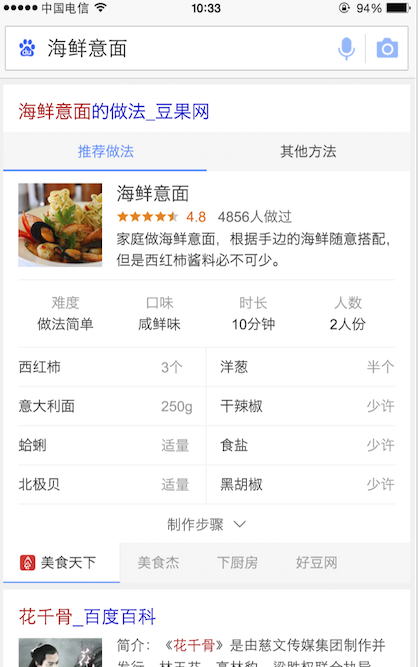
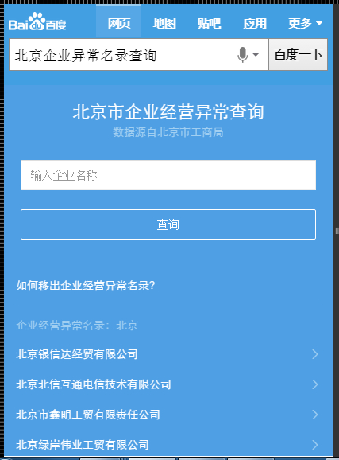
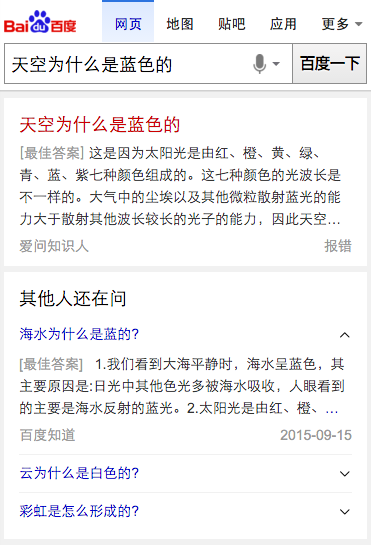

# 李阳阳

> 从2015-11-23到2015-11-27

## 12.1菜谱精确和泛需求

### 背景与目标

针对百度搜索中的一系列菜谱相关的query，提供定制化的阿拉丁，优化现有阿拉丁，更加方便用户找菜谱的相关操作。。

### 完成情况

菜谱精确和泛需求的联调，今天预约了人力准备提测，rd那边还得在灌数据，灌好就提测

### 效果截图

## 12.1企业异常名录模板

### 背景与目标

百度政务之窗一期-政务寻址卡片同北京工商局合作初见成效，现同工商局达成进一步合作，从工商局获得一批北京市企业经营异常名录，可复用线上失信人模板展示这批数据。

### 完成情况

依然在进行唯一答案卡的开发中，后续继续

### 效果截图

## 附录

## 球员的卡片在本周二的时候，全流量上线了

### 背景与目标
wise端NBA球员信息获取，多类信息阅读成本较高，为更好的满足用户获取信息，简化寻址成本，因而新增球员卡样式进行满足。

### 影响面
影响PV日均约20w

### 效果截图

query="<a href='https://m.baidu.com/s?word=%E7%A7%91%E6%AF%94&ts=2499152&t_kt=0&rsv_iqid=15875572381009388166&rsv_t=913dP%252FPOGJN1D0mLK5WVSsjTaVhSQh%252FsjdSLmqned%252FCUF%252F20agHP&sa=ihr_5&rsv_sug4=1265&ss=001&sid=102239'>科比</a>"

二维码扫描

## 实体问答卡片，周四小流量上线了，主卡和副卡的结合，50%的流量

### 项目背景

本卡片基于用户问答搜索行为的上下文关联，提供用户当前搜索query的更多相关主题的问题+答案的聚合服务，全面解决用户潜在的搜索需求。

### 影响面
影响PV日均约7w

### 效果截图

### query=<a href='https://m.baidu.com/s?word=%E5%A4%A9%E7%A9%BA%E4%B8%BA%E4%BB%80%E4%B9%88%E6%98%AF%E8%93%9D%E8%89%B2%E7%9A%84&ts=2499152&t_kt=0&rsv_iqid=15875572381009388166&rsv_t=913dP%252FPOGJN1D0mLK5WVSsjTaVhSQh%252FsjdSLmqned%252FCUF%252F20agHP&sa=ihr_5&rsv_sug4=1265&ss=001&sid=102239'>天空为什么是蓝色的</a>，抽样sid="102239"

## 接下来的排期

* 继续企业名录的开发
