# 产品方向周报
> 从2015-11-30到2015-12-04


## 项目1——12.1金融 - 主卡

### 背景

主卡迭代，增加K线图和量图需求，提升用户体验

### 完成情况

模板核心是中间的图表，采用canvas实现，为了照顾高清屏，先绘制2倍尺寸的图片，然后用css缩小到1倍尺寸，没有什么技术难点。模板已经上线，影响面2000w/日。

### 示例query

* 美股：bidu
* A股：600030

### 效果图

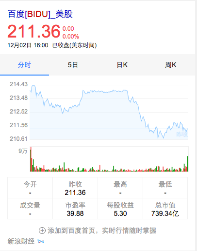

## 项目2——天气突击

### 背景

在北京天气的query下进行实验，尝试在生活相关的卡片下接入衣食住行的服务，探索新方向

### 完成情况

本周进行了几次样式迭代，最终确定头图+瀑布流的方案。无技术难点。目前实验在『北京天气』这个query下已经全量，影响面50w/日。

#### 示例query

北京天气

### 效果图

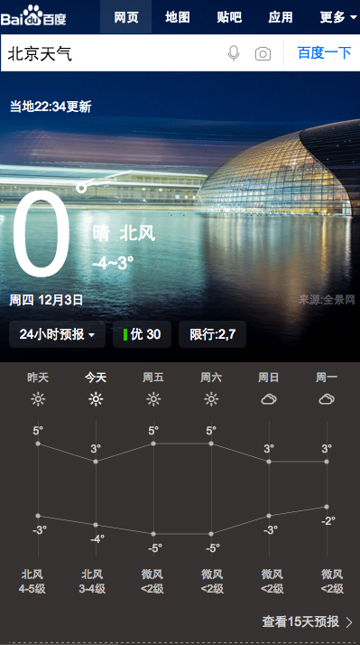

## 项目3——12.1 UGC花絮

### 背景与目标

①满足用户在检索正片的同时，对花絮预告的需求，尤其是高质量ugc内容——提升导流  
②由于在pc上尝试单独出现相关短视频卡片，效果忒差，因此使用侧滑的方式，在不影响现用卡片的基础上，展现短视频——尝试新交互

### pv

<span style="color:blue;">预计100万左右</span>

### 完成情况

<span style="color:red">pm老大对于侧滑新交互有争议,改了一版逻辑,只在特定的query下会出现侧滑.调整了剧集的展现逻辑.可能会等12.30的下拉卡片一起上,做小流量点击实验<span>

下拉卡片:
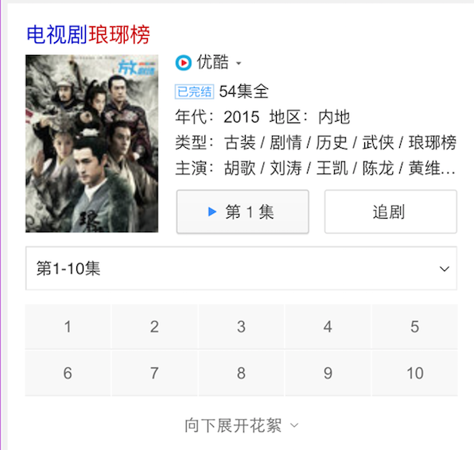

### 效果截图

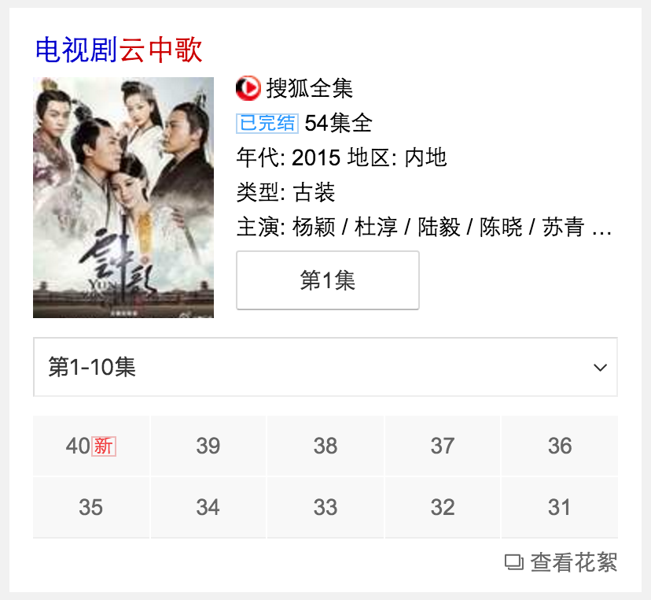

## 项目4——12.1 电视剧直播

### 背景与目标

用户在电视台直播电视剧最新一集、综艺最新一期的时间段，没有电视的用户会在网上搜索卡片来观看直播，例如中国好声音的直播，极限挑战直播，花千骨大结局直播、琅琊榜直播等。

### pv

 <span style="color:blue;">预计pv82万<span>

### 完成情况

 <span style="color:red">11.22日上线了模板</span>
 <span style="color:red">当时AE的rd没人力,做成的kv,现在要改成AE,调整字段在上一版</span>

### 最终效果截图


## 项目5——12.1 二手房

### 背景与目标

wise端，暂时并没有相关的特型去满足用户的筛选，用户需进入到房产相关网站去完成一系列动作。而二手房泛需求卡片，就是让用户在百度搜索结果页就完成目标的选择，缩短用户直达实体的路径，从而提升用户体验。

### pv

 <span style="color:blue;">预计pv 15万左右</span>

### 完成情况

 <span style="color:red">pm(当时的pm怀孕休假了,中间另一pm接手)希望点击title,和或落地页会根据当前筛选项精确跳转.当时的pm评审时并没有提出这个需求.资源方也没给相应数据.目前pm在和资源方沟通,貌似资源方很不情愿再改,持续跟进<span>

### 效果截图


## 项目6——场景化出行（wise_scene_trav）

### * 背景与目标
通过时间、地点场景信息定位有出行需求的用户，展现场景化出行卡片，围绕出行需求，集合信息、交通、消费等功能，精准满足其出行需求。

### * 完成情况
- 11月26日已上线。
- 实验组/对照组流量各50%，每组影响pv约3.5w/天；策略触发后，场景化卡片覆盖的pv约1w/天。
- Query=香山(天安门，故宫等)，地点策略+时间策略。
- [点这里~点这里~](https://www.baidu.com/from=844b/s?word=%E9%A6%99%E5%B1%B1&ts=0015366&t_kt=0&rsv_iqid=5504612005285293655&rsv_t=f77fpuYM6PishRuwv6A9PSlfWEsQ%252FkBKd%252FtsgBcmqwBGyhR9vBwtIJNd3A&sa=ib&ms=1&rsv_sug4=3888&ss=101&inputT=2065&sid=102251)
-


- <span style="color:red">本周出行项目完成了几次迭代，包括添加sto日志，sto规则调整。</span>

## 项目7——场景化餐饮（wise_scene_food）

### * 背景与目标
各种餐饮名店信息聚合，吃货的福利。为用户提供更便捷的餐饮搜索信息，给部分产品线导流。

### * 完成情况
- 12月1日已上线。
- 实验圈定query总 pv约3.5w/天；根据策略，卡片会在午饭和晚饭时段触发；触发后，卡片覆盖的pv约1w/天
- Query=全聚德(麻辣诱惑，海底捞等)。
- [点这里~点这里~](http://cq01-aladdin-product-05.epc.baidu.com:8003/s?word=%E6%B5%B7%E5%BA%95%E6%8D%9E&ts=2862183&t_kt=0&sa=ib&rsv_sug4=5921&inputT=4644&ss=100&cip=47.153.191.255&tn=iphone&sid=102122)
- <span style="color:red">本周出行项目完成了几次迭代，包括添加sto日志，sto规则调整。推荐，评论样式调整。</span>


## 项目8——场景化城市（wise_scene_city）

### * 背景与目标
不同地方的用户，在搜索相同的地域Query时，需求不同；根据用户所在地，用户搜索时间等条件，判断用户搜索的真实需求，整合现有资源，为用户提供高颜值高精准度的搜索结果展现。

### * 完成情况

- <span style="color:red">12月2日开始开发，4日联调。预计场景化-异地城市下周三可完成开发联调测试上线,本地城市部分预计周五达到上线标准.</span>


## 项目9——自由产品出图（zhidao,zhidaoala,wenku,wenkuala,www_zhidao_normal）

### * 背景与目标
以上五个模板增加出图样式。

### * 完成情况
- 前端已完成。
- <span style="color:red">后端在准备小流量上线事宜，计划下周三(12月9日)上线。</span>
- <span style="color:red">本周于项目组商议小流量上线细节。</span>


## 项目10——人物 - 粉丝场景化迁移mini机制

### 背景

* 为更好地支持场景化的触发，方便pm更快铺量更好干预，与后端rd统一商定迁移为mini机制


### 完成情况

* 升级模板wise_scene_person_kv，12.02日模板上线，12.04日数据切换为mini机制，影响面约125W;

### 覆盖query

* 鹿晗，迪丽热巴，杨洋，郑爽，李易峰，杨幂

### 线上效果

* [迪丽热巴](https://www.baidu.com/ssid=c301b4f3c9b5b9cfd2bbbac57107/from=844b/rsv_t=ec11VZwBeJHV%2FlC9GiM0F3B%2FHrvW%2Fz9TjFNZXr3HaNs0gxP%2BMLDQcl9lEQ/s?word=%E8%BF%AA%E4%B8%BD%E7%83%AD%E5%B7%B4&sa=ts_1&ts=6784958&t_kt=0&ms=1&ss=101&rq=dilireba&rsv_sug4=4516&inputT=2391&oq=%E6%9D%A8%E5%B9%82)

### 效果截图

* 唯一答案

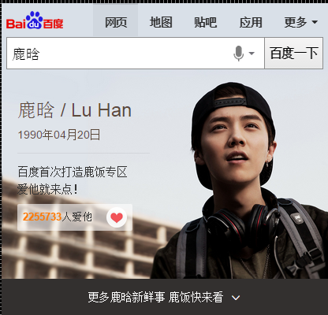

### 后续计划

* 沉浸式样式升级实验、“天使之翼”格瓦拉下滑样式实验


## 项目11——场景化大学（wise_scene_colleges）

### * 背景与目标
根据不同用户群体，不同地域，给用户提供不同高校信息的聚合展示。
### * 完成情况

- <span style="color:red">于后端核对数据。</span>
- <span style="color:red">数据格式制定。</span>


## 项目12——场景化标准化制定

### 背景和目标

```
场景化涉及到多个方向，如：人物、出行、餐饮、城市、大学等等，每一个都是一个大的sigma样式，
不同sigma样式中有很多小卡样式是类似甚至一样的，所以我们会将场景化中的子卡样式进行抽离，形成公共模块，
对后端返回数据格式、UE样式进行规范化，从而能够减少沟通成本和多方开发的成本。
```

### 完成情况

- 11月30号对所有的样式进行梳理和拆封，设计每个公共子卡的数据格式规范，制定RD需要控制的样式数据模块
- 12月01号召集pm/ue/rd 一起进行会议讨论，并约定场景化标准，形成一致共识
- 12月03号又和RD对细节进行沟通和交流，形成文档参考地址：http://ala-fe.baidu.com/scene/scene.md

### 后续计划

- 在大学这个方向上严格按照规范来进行推进和开发

## 项目13——场景化展开收起动画

### 背景与目标

由于前几个场景化上线紧急，展开收起暂无动画，觉得交互不太友好，计划为展开收起加一个交互动画，提高用户体验。

### 完成情况

- 根据忧总,浪波的建议，出了两版DEMO，总体效果不错，PM认同。

- 技术实现方案整体用css3来控制，通过translateY和opacity来控制收起展开后内容渐变呈现效果，用height的高度渐变来控制整体可见区域内容显示

### 后续计划

- 收起动画部分可以更人性化一点，更流畅，下周一再出两版优化后DEMO, 让大家过一遍，觉得可以就封装为插件，场景化公用。

## 项目14——旅游 - 目的地景点卡片优化

### 背景

* 原有目的地/景点改版

### 完成情况

* 涉及模板travel_strategy，11.20日模板上线，影响面约100W;

* 11.24上午小流量上线, 实验组（10%）：对照组（10%），

* <span style="color:red">实验结论尚未产出</span>

### 覆盖query

* 国内景点，如：故宫、天安门广场

### 效果截图


### 后续计划

* 原城市旅游卡片wise_city_travel，按照此策略做相应的交互、样式方面的升级。


## 项目15——旅游 - 城市卡片优化

### 背景

* 原城市卡片样式升级改版，介入更多资源方扩大召回

### 完成情况

* 升级模板wise_city_travel，11.27日模板上线，影响面约200W，

* <span style="color:red">数据待上线</span>

### 覆盖query

* 国内外城市

### 效果截图


## 项目16——sigma优化

* `sigma`弱状态时对其他模板的影响优化
* 分享接口优化
* 反馈接口优化
* 全屏背景色接口优化

详情点：[psdoc issues](http://gitlab.baidu.com/psfe/psdoc/issues/3)

### 下周计划

评审通过后将于周一、二、三进行抽`query`和接口各状态测试，测试通过后上线

> 由于该测试涉及到各种参数修改，QA不好回归，并且只是接口修改功能没有修改，顾自测通过即可

## 项目17——12.1购物-3c比价二期

### 背景与目标

在原有比价阿拉丁的基础上，增加返利元素，节省用户的购买费用，优化用户的购买流程和体验。

### 完成情况

这是优化的线上模板(`wise_3c_price`)，模板于 12-02 全量上线，影响面`200w`，[召回：iphone6](https://m.baidu.com/s?word=iphone6&tn=iphone)

### 最终效果截图


## 项目18——12.30 - 购物非标类卡片优化

### 背景与目标

用户在搜索商品的时候，有购买、浏览商品的需求。而目前线上无此类卡片，且大多自然结果为一些不知名的网站，商品质量无法保障。

购物非标类卡片对接电商，旨在为用户提供商品，商品优惠、优质商品推荐和购买指南等信息服务。

以全屏瀑布流的形式，让用户可以在百度更为流畅的浏览商品。

### 完成情况

该需求属于在线上模板`generalshopping`上做优化，但会重构整个代码，新ue图没有滑屏，但加入了新交互：全屏浏览+无限滚动模式，目前全屏浏览需要等@杨帆那边组件上线后开发，@杨帆那边预计组件 12.15 左右上线

## 项目19——12.30 - 购物商品列表卡-特卖卡（新卡）

### 背景与目标

用户在搜索商品的时候，有购买、浏览商品的需求。而购物特卖卡片配合电商的优惠活动，结合返利信息，把更多的优惠呈现给用户。且特卖模板也可以兼容适合列表形式展现的商品。

### 完成情况

目前未开展

该模板属于新模板，预计影响面`200w`，预计今天（12-04）出ue初稿

### 功能点

该模板内有`倒计时`功能，目前就自己实现好了，没必要组件化

## 项目20——12.30 - 二手车阿拉丁（新模板pk老模板）

### 背景与目标

用户在查询二手车时，有查看具体车型信息的需求。而线上卡片只是一个入口，二手车卡片展示车型信息，可以更好的帮助用户决策，满足需求。

### 完成情况

该模板属于新模板`wise_usedcar`，上线全量后会pk掉老模板，目前`schema`已定初版，属于地域召回策略，预计影响面`40w`，确认稿目前没有排期

## 项目21——12.30 - 疾病卡

### 背景与目标

目前疾病卡片只满足于基础的疾病介绍需求，此次尝试增加相关推荐服务，在满足疾病介绍的同时，为用户提供更好的服务。

### 完成情况

目前该模板还在评估是新增模板还是复用线上模板

### 效果图


## 项目22——12.1wise寻址卡片

### 背景与目标

目前wise端官网寻址均为title+简单摘要的形式展现，调研发现2.7%的寻址类需求明显差于竞品。新增寻址卡片，可满足用户对官网首页及周边信息（子频道、相关APP、查询框、登录框、客服电话等）的需求，提升用户体验。

### 完成情况

模板在 `11月27日` 已成功上线 目前走的小流量 召回query：[招商银行](https://m.baidu.com/ssid=35f0c4bed4c2e7dbe7db260e/s?word=%E6%8B%9B%E5%95%86%E9%93%B6%E8%A1%8C&sa=tb&ts=9104360&t_kt=0&ss=101&t_it=1&rsv_sug4=3669&inputT=2245&oq=%E6%8B%9B%E8%A1%8C&sid=102322) 实际PV：带icon:23.4w，不带icon430w，小流量抽了20%

### 效果截图

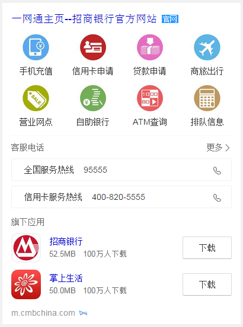

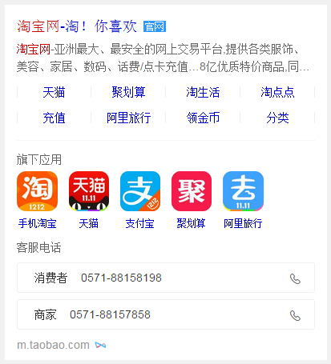

## 项目23——单一星座模板开发

### 背景与目标

将原有星座阿拉丁卡片改为sigma形式，增加更多星座信息（性格分析、运势、配对），为用户节省搜索时间。同时提升卡片颜值，提升用户体验。

### 完成情况

模板在 `11月27日` 晚上已完成，`pm-沙悦` 已确认，`ue-王菲` 由于休假导致确认时间延期到周三，后提出些细节问题，昨天已修改 召回query：[白羊座](http://cq01-mbu-web31.epc.baidu.com:8003/s?word=%E7%99%BD%E7%BE%8A%E5%BA%A7&ts=9314372&t_kt=0&rsv_iqid=5888755071663447762&sa=ihr_1&rsv_sug4=878&ss=001)

### 效果截图

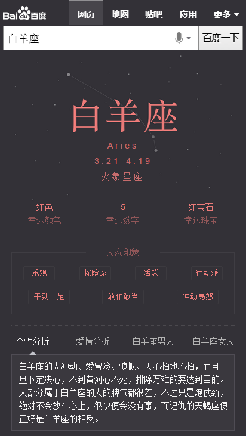

## 项目24——wise手机号模板 —— tpl = “mobilephone”

### 背景与目标

资源方替换，由手机在线替换为百度手机卫士。wise模板属于老模板，需要栅格化才能上线

### 完成情况

`12月2日` 模板完成，功能效果经 `pm-王保丹` 确认可以上线, `12月3日` 成功上线，召回query：[13260286162](https://m.baidu.com/ssid=22266368616e676a69616e636869df09/s?word=13260286162&ts=1423295&t_kt=0&rsv_iqid=17301057313063360982&rsv_t=63f9u7IqYgrIFHxoe%252By6%252FhW%252B6Jtz%252FMuZctuYMNPJhLSRpqlQDV%252FM&sa=ihr_3&rsv_pq=17301057313063360982&rsv_sug4=814&ss=001)

### 效果截图

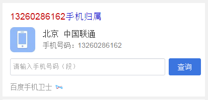

## 项目25——度秘

### 背景与目标

wise结果同步度秘，度秘访问wise的json接口和度秘对大搜索阿拉丁截图通用展现方案已经完成，
下一步展开阿拉丁模板适配度秘信息模板的映射，以便获得最优展现。度秘为用户提供更优的数据资源，大大提高用户体验

### 整体计划及排期
* <span style="color:green">一期适配（24个），现有信息模板已经支持的，预计12.7上线</span>
* 二期适配（32个），需要多实体卡片上线后支持的（NA1.1和手百7.1），预计12.14上线
* 三期适配（8个），多实体卡片升级和现有模板调整的（NA和手百的下一个版本，时间待定）

### 完成情况

公18个模版，有14个OK，2个线上不召回，1个测试环境不召回数据，1个客户端不召回模板,已告知相关负责人

## 项目26——生肖首页

### 背景与目标

目前无生肖阿拉丁产品，在做竞品分析中，其他搜索产品能对生肖内容有特型展现来满足用户需求；在年底年初之际，用户对生肖query需求较高，所以需生肖卡片，满足这部分用户需求。

根据用户query分析，这部分用户搜索需求主要停留在十二生肖，xx属相，xx属相xx年运势，xx属与xx相配

### 完成情况

由于度秘项目的插入，生肖项目延期两天，xml数据昨天已完成，生肖图标已自行切好

## 项目27——pm2.5(无进展)

### 背景与目标

目前线上pm2.5卡片内容过于单一，样式不够优美，需要对卡片进行优化，增加更多信息，丰富卡片内容

### 完成情况

pm2.5 `延期` 先做优先级较高的星座和生肖模板

## 项目28——kap大学排行榜

### 背景与目标

背景：大学排名一直是报考学生做出决策和寻找合适的高校的重要方式。对于大学排名线上现在主要是针对重点大学的相关排名和信息，但经过调研发现，用户对于二本大学等批次大学的搜索占比也很大，同时用户还会以工科类排名等方式进行搜索。而现有排名机制可以横向进行拓展，减少用户换query比例，进而优化。
目标：用户在搜索大学相关排名的时候，对于排名的需求纬度较多，如地区、批次、类型。通过优化全面满足各个纬度的大学排名。

### 进展情况

wise 12月04号上线
pc （因数据及样式调整）12月04号再上线一次
query=二本大学排名、北京二本大学排名 sid=7498

### 效果截图

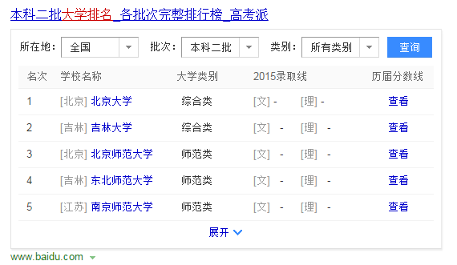
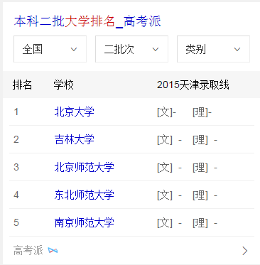

## 项目29——wise百度词典卡片

### 背景与目标

针对线上中中释义卡片进行升级，主要满足用户字、词、成语实体卡片的查询，也作为字词成语实体卡片的一期项目，后期将继续问答卡片的满足。

### 进展情况

rd环境已配好，渲染数据开发中，

### 效果截图

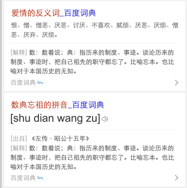
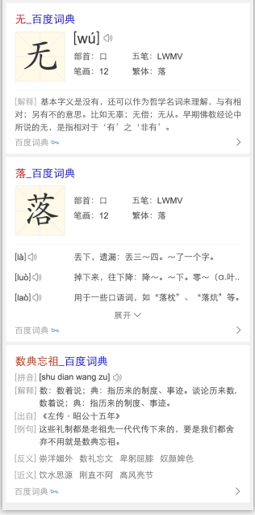

## 项目30——泛需求兼职kap

### 背景与目标

1、兼职在整个招聘中占据4.6%，均采用精确需求卡片覆盖，需求不符合，初步拉部分兼职query需求应该至少在20w起（保守估计）
2、整个兼职目前的已接入招聘资源质量差，集中给用户“假、骗、无保障”印象，是最大的顽疾；是个痛点—而之前使用58赶集等数据无法解决，反而令用户上当；
3、目前兼职领域冒起一批新兴兼职资源，有保障预付工资等形式在逆袭大型招聘网站，如兼职猫，探路、一米、斗米等兼职先后获得相关领导人接见与上样式，同时近期一批货的巨额融资：斗米4000w美金、探鹿1000w美金（他们的日活在几w左右），是新兴020布局的重要一环，但是这些创业企业缺少流量用户入口，这点是我们的一个机遇；另外新兼职客单利润和用户粘性高，内部了解兼职利润约为工资的20%，高频属性，对于目前没有巨头态势下，无论从生态和盈利布局都是一个重要的点；
4、兼职对于构建招聘垂搜来说是个重要组成，校招，社招，兼职
5、结合运营活动（寒假兼职期）改善用户形象和养成入口，打出品牌，同时为之后做铺垫。
6、目前线上资源有效性较差，无法满足用户需求，样式单一

### 进展情况

已开发完成，自测调整中（图片模板及加载慢）

### 效果截图

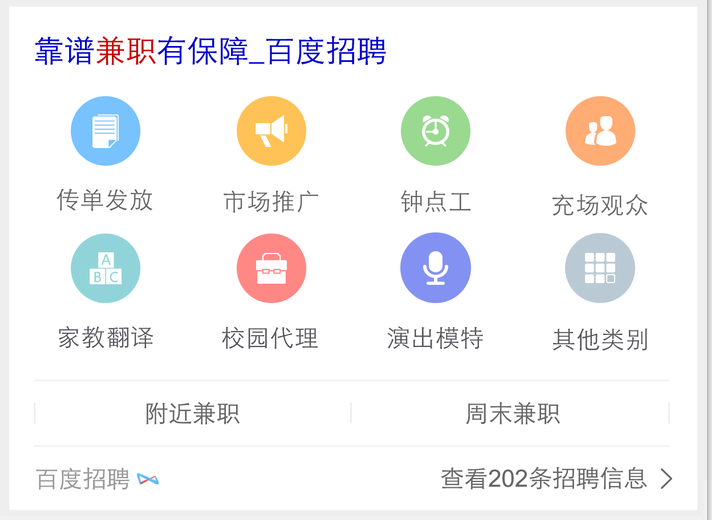

## 项目31——海淘优惠卡片bug修改

### 进展情况

已排查出原因，因资源方更新数据时，把数据结构弄错，导致数据无法展示。已告知pm.


## 项目32——12.1菜谱精确和泛需求

### 背景与目标

针对百度搜索中的一系列菜谱相关的query，提供定制化的阿拉丁，优化现有阿拉丁，更加方便用户找菜谱的相关操作。。

### 完成情况

- 本周无开发量

- 模板现在正在走三级单，卡在关总那里还没有批，12月04号能够走完单，就可以上线

### 效果截图

<p>菜谱的精确需求图：</p>

<p>点击制作步骤图：</p>

<p>点击tab相关菜谱图：</p>

<p>菜谱的泛需求图：</p>


<p>这两个样式的模板只要是设计到滑屏、异步获取数据、展开收起的效果，大部分的时间都在拼字符串，很是不想拼字符串哈，但是也还算顺利，没有特别难的地方，html和js的时间比=1:2吧</p>

## 项目33——12.1企业异常名录模板

### 背景与目标

百度政务之窗一期-政务寻址卡片同北京工商局合作初见成效，现同工商局达成进一步合作，从工商局获得一批北京市企业经营异常名录，可复用线上失信人模板展示这批数据。

### 完成情况

唯一答案卡的将要开发完成，后续继续白卡，还有一张搜精确公司的卡片需要处理

### 效果截图

<p>开始搜‘北京市企业异常名录查询’出现<p>

<p>点击：如何移出企业经营异常名录？出现下图浮层：</p>

<p>点击每条的公司名称出现一下浮层：</p>

<p>点击右下角的查看更多，出现一下浮层：</p>


<p>模板主要涉及到异步获取数据，还有浮层，和下拉刷新，html：js=1:4,在下拉刷新的实现上赶到有点困难，现在似乎有点思路了，这一块还在进行调试</p>

<p>后期进展，等唯一答案完事了，今天必须把唯一卡搞完，白卡就简单了，因为逻辑基本一样，还有一个搜具体名称的卡片，那张卡片设计到展开收起，成本不是很大</p>


## 项目34——https中word字段有汉字的转码修改，支持线上https问题

### 背景与目标

Wise模板中连接跳转含有中文的https问题，验证问题是否存在，可以使用fiddler进行抓包（在chrome浏览器中会自动encode，问题不能复现）。

### 完成情况

五个卡片都修改完了，12月04号上线


## 项目35——【星河项目】
### 项目背景
在原有推荐模板的基础上，新增可跳转逻辑，展现sigma样式推荐卡片，满足用户多维度的相关推荐需求，<span style="color:green">全量pv1000w</span>。

### 本周进度

* 上线情况：<span style="color:green">12.1日已上线</span>，新增sigma_recommend_search推荐大卡&&sigma_celebrity_rela优化title可跳转逻辑。
* 目前：小流量中，抽取66%流量，影响面600w。
* 效果图：

## 项目35——【推荐卡四图样式】
### 项目背景
在原有推荐模板的基础上，新增四图样式。目的是与竞品做比对，得出对照结论。后续四图每个月上一次实验，每次持续一周。

### 本周进度

* 上线情况：<span style="color:green">12.2日已上线</span>，sigma_celebrity_rela优新增四图逻辑。
* 目前：小流量中，抽取4%流量，影响面1000w。
* 效果图：

## 项目36——【sigma颜色问答大卡】
### 项目背景
优化搜索颜色类query时的用户体验，例如：“卡其色是什么颜色”“墨绿色是什么颜色”，用全屏颜色+简洁的说明文字的形式来精准满足用户需求，提升搜索产品的“颜值”。样式上采用唯一答案的样式风格。

### 本周进度

* 数据已ready，今天介入开发。

## 项目37——【app分发】
### 项目背景
在线上已有横滑模板的基础上做的优化，主要为下方展现的文案除了“app名称”外，增加了“下载量”、“评分”文案。其他交互没有变化，仍未横滑，点击后仍然发起新的搜索

### 本周进度

* 12.3开发完毕。对效果中。预计下周一上线。

## 项目38——音乐融合-影视原声带

### 项目背景

```
1、背景：辐射垂直行业，覆盖影视类歌曲需求，如花千骨歌曲，琅琊榜插曲等
```

### 完成情况

- 12月04日开始开发，支持多资源方，预计下周一提测

### 后续

- 1207提测 1208上线

## 项目39——歌词卡片（上线）

### 背景与目标

```
背景：目前线上百度音乐的歌词卡片存在数据覆盖不全且存在歌词版本不准确的问题（q=终于等到你歌词，q=小苹果歌词完整版，q=loser歌词），优化pc&wise歌词结果（q=终于等到你歌词）并扩大覆盖

目标：预计歌词卡片覆盖影响面10w，其中3w为纯新增歌词覆盖
``` 
### 完成情况

- PV：10w

- 状态：

    - 模板开发和测试完成，11月27号全流量上线，线上query：听海歌词
    
## 效果截图

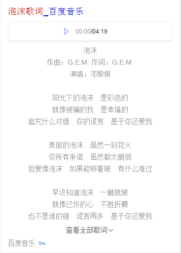


## 想法&反馈
### middle组件中当弹出浮层后会把body设置为fixed，如果内有背景图就会被拉伸。暂时用了hack方法解决这个问题，后续会新开发一个。
### 排期留出适当buffer时间，以防其他事情介入影响项目进度。

### 组内技术和团队建设想法和举措

#### 背景：

- 1、Aladdin产品业务需求多，开发时间紧

- 2、fe关注自己块的需求实现偏多，缺少沟通和交流

- 3、代码质量块关注度不高
	
- 4、项目完成后思考和沉淀不够。
 
#### 解决方案：
- 1、 控制模板数量，抽象产品需求，优先考虑复用线上样式 
	@谢耀武、李浪波 先采用review效果的形式

- 2、 积累UI交互，调研NA和主流交互效果和技术实现，应用到阿拉丁
	@李嘉隆、李浪波 初步计划：12月17号产出初步调研结论和todolist

- 3、 抽样标准化组件（js/css） 全员参加，主处理者
	@朱雷 近期计划：分享组件 and 浮层组件，后续持续review todo

- 4、 开发中痛点收集和解决
	@刘泉有

- 5、 文档梳理，gitlab上用问答形式执行，sfe上梳理官方开发导航文档
	@谢耀武、李晓

- 6、 代码质量，两周/次  互相review其他同学的模板或js文件代码，反馈问题再讨论 
	@谢玲娟

- 7、 两周次15mins左右站会，交流开发心得和吐槽
	@李晓 下周四开始执行第一次

- 8、 定期组织娱乐活动（桌游、others）
	@谢玲娟 组织

- 9、技术或其他topic分享 每周一次  目前已进行4期
	
- 注：上述都有主的负责人，全员都可以参加
 
 
#### 预期达到效果：

- 1、  活跃团队氛围，增加凝聚力

- 2、  增加技术、工作中业务的交流和吐槽机会

- 3、  互相学习代码，提高代码质量

- 4、  技术和可用性组件沉淀

### UI交互调研

#### 本周进展

- 调研上线翻页技术实现，下周产出小demo；展开收起动画效果实现，已在场景化上调试效果；书写交互的base js框架，预计12月16后出初版


## 值周修复

* 修复抢票日历在6plus下闪动问题


## TODOLIST

* 分享组件
* 天气突击迭代
* 图片沉浸式
* 金融1230
* 跟进二手房
* 跟进电视剧直播改成AE
* 跟进影视12.30项目
* 场景化城市开发，联调，测试，上线。
* 场景化出行，场景化餐饮，场景化城市迭代。
* 目测场景化大学要开始了。。。
* 旅游:主题泛需求旅游【暂时hold住】
* 人物1： 粉丝场景化，沉浸式样式升级实验【开发中，预计12.7日开发完成】
* 人物2： 粉丝场景化，“天使之翼”格瓦拉下滑样式实验【12.07~12.09日开发】
* 教育：百度词典数据渲染
* 招聘1：泛需求兼职卡片 
* 招聘2：厨师招聘卡片样式优化
* 汽车票点到点 配合上线
* 音乐原声带多资源方 上线
* 音乐沉浸式体验开始开发  前四天开发，第五天测试


