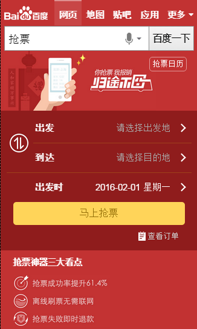

# 陈锐

> 从2015-11-30到2015-12-04

## 1. 春运抢票运营活动
### * 背景和目标
临近春运，越来越多的用户有抢火车票的需求，为了满足这部分用户的需求，培养用户在百度买火车票的习惯，并且带来一定的GMV收益，我们紧急上线了一个抢票运营活动；

卡片上只做用户出发地、目的地和出发时间收集，抢票过程在携程完成。
覆盖8个query：抢票、云抢票、抢火车票、春运抢票、手机抢票、火车票抢票、百度抢票、百度云抢票，所有推广资源导到这8个query上;

### * 效果图

### * 完成进度
唯一答案卡片：本周四（12/03）完成并上线

中奖名单页面：本周五（12/04）完成并上线

### * 影响面
预计pv，峰值200w每天

## 2. 运营项目开发改进进度

- 下周四12/10，ubs的同学会给出一个运营参数统计规范，包括：点击交互，点击跳转，pv，页面停留时长，导流等。

- 后续运营规范和改进进度整理到WISE文档里面。

- 列表

<table border="1">
    <tr>
        <td>序号</td><td>类别</td><td>任务名</td><td>负责人</td><td>进度</td>
    </tr>
    <tr>
        <td>1</td><td>base模板</td><td>顶部通栏c_base_top</td><td>浪波</td><td>思考中...</td>
    </tr>
    <tr>
        <td>2</td><td>base模板</td><td>运营基类模板c_base_optl</td><td>陈锐</td><td>正在整理（基于ubs输出的规范）</td>
    </tr>
    <tr>
        <td>3</td><td>运营模板</td><td>通用浮层模板</td><td>陈锐</td><td>已完成浮层导流模板，后续基于此模版改进</td>
    </tr>
    <tr>
        <td>4</td><td>中间页</td><td>PC/WISE统计</td><td>陈锐</td><td>2015-12-18</td>
    </tr>
    <tr>
        <td>5</td><td>中间页</td><td>PC/WISE登录</td><td>陈锐</td><td>2015-12-18</td>
    </tr>
    <tr>
        <td>6</td><td>运营组件</td><td>动画效果库优化</td><td>陈锐</td><td>2015-12-31</td>
    </tr>
    <tr>
        <td>7</td><td>平台</td><td>用户登录和统计</td><td>小琴</td><td>2015-12-15</td>
    </tr>
    <tr>
        <td>8</td><td>平台</td><td>实现平台测速</td><td>小琴</td><td>平台二期</td>
    </tr>
    <tr>
        <td>9</td><td>平台</td><td>运营项目预览平台</td><td>小琴</td><td>平台二期</td>
    </tr>
    <tr>
        <td>10</td><td>平台</td><td>中间页开发整合到平台</td><td>小琴</td><td>平台二期</td>
    </tr>
</table>

## 3. 下周计划
- 提前收集和确定年前重点运营项目
- 继续推进运营项目流程改进

