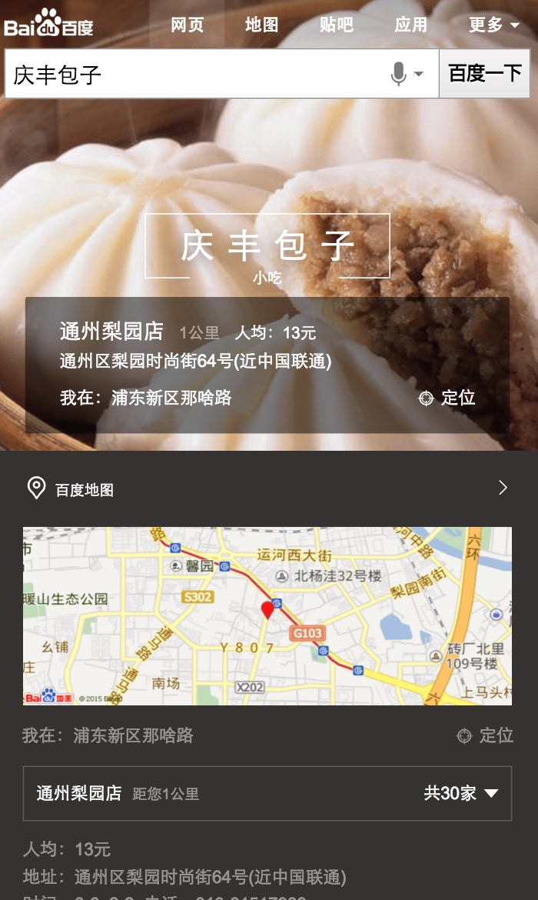

# 刘泉有

> 从2015-11-29到2015-12-04

## 1. 场景化出行（wise_scene_trav）

### * 背景与目标
通过时间、地点场景信息定位有出行需求的用户，展现场景化出行卡片，围绕出行需求，集合信息、交通、消费等功能，精准满足其出行需求。

### * 完成情况
- 11月26日已上线。
- 实验组/对照组流量各50%，每组影响pv约3.5w/天；策略触发后，场景化卡片覆盖的pv约1w/天。
- Query=香山(天安门，故宫等)，地点策略+时间策略。
- [点这里~点这里~](https://www.baidu.com/from=844b/s?word=%E9%A6%99%E5%B1%B1&ts=0015366&t_kt=0&rsv_iqid=5504612005285293655&rsv_t=f77fpuYM6PishRuwv6A9PSlfWEsQ%252FkBKd%252FtsgBcmqwBGyhR9vBwtIJNd3A&sa=ib&ms=1&rsv_sug4=3888&ss=101&inputT=2065&sid=102251)
-

- 本周出行项目完成了几次迭代，包括添加sto日志，sto规则调整。

## 2. 场景化餐饮（wise_scene_food）

### * 背景与目标
各种餐饮名店信息聚合，吃货的福利。为用户提供更便捷的餐饮搜索信息，给部分产品线导流。

### * 完成情况
- 12月1日已上线。
- 实验圈定query总 pv约3.5w/天；根据策略，卡片会在午饭和晚饭时段触发；触发后，卡片覆盖的pv约1w/天
- Query=全聚德(麻辣诱惑，海底捞等)。
- [点这里~点这里~](http://cq01-aladdin-product-05.epc.baidu.com:8003/s?word=%E6%B5%B7%E5%BA%95%E6%8D%9E&ts=2862183&t_kt=0&sa=ib&rsv_sug4=5921&inputT=4644&ss=100&cip=47.153.191.255&tn=iphone&sid=102122)
- 本周出行项目完成了几次迭代，包括添加sto日志，sto规则调整。推荐，评论样式调整。

## 3. 场景化城市（wise_scene_city）

### * 背景与目标
不同地方的用户，在搜索相同的地域Query时，需求不同；根据用户所在地，用户搜索时间等条件，判断用户搜索的真实需求，整合现有资源，为用户提供高颜值高精准度的搜索结果展现。

### * 完成情况

- 12月2日开始开发，4日联调。预计场景化-异地城市下周三可完成开发联调测试上线,本地城市部分预计周五达到上线标准.

## 4. 自由产品出图（zhidao,zhidaoala,wenku,wenkuala,www_zhidao_normal）

### * 背景与目标
以上五个模板增加出图样式。

### * 完成情况
- 前端已完成。
- 后端在准备小流量上线事宜，计划下周三(12月9日)上线。
- 本周于项目组商议小流量上线细节。

## 5. 场景化人物（wise_scene_person_kv）
从现有数据中抽象出这些趋势的一些规律，将其应用到产品设计和召回中，有效减少用户筛选成本，增加产品使用率。因此我们可以通过条件触发的sigma形式，将粉丝的各维度需求在sigma卡片上做聚合展示，让粉丝通过搜索来追星，获取明星的全面信息。
### * 背景与目标

### * 完成情况
- 本周添加微博与热门微博条数限制，已上线。
- Query=鹿晗，暂时只有鹿晗能触发，初始影响面PV=6.5W，试验期间减半。
- 人物后续工作已转李晓童鞋。
- [点这里~点这里~](https://www.baidu.com/from=844b/s?word=%E9%B9%BF%E6%99%97&ts=9424931&t_kt=0&rsv_iqid=7099597460254613959&rsv_t=5473vbvJQ6CHpRcFDZVOcjgQ8PfD4HRnZdMdiAW4%252BJY8bnEwuCP4PPXMZA&sa=ib&ms=1&rsv_sug4=1960&ss=101&inputT=733)

- 本周未更新。

## 6. 场景化大学（wise_scene_colleges）

### * 背景与目标
根据不同用户群体，不同地域，给用户提供不同高校信息的聚合展示。
### * 完成情况

- 于后端核对数据。
- 数据格式制定。

## 7. 场景化公共模板提取文档整理

### * 背景与目标

由于场景化大卡内各子卡形式复杂且大多数样式类似，可复用，于RD,UE商议一套规范，让各子模块尽最大可能复用以减少开发成本，增强模块复用性，可维护性。

### * 完成情况

- 于忧总，浪波，李晓妹纸公共模板提取,文档整理完毕，规范制定完毕。
- 后面会使用新规范去开发场景话的东西，流程化开发，提高开发效率，减少于RD沟通成本。把经历重点放在交互，展现上。
- 预计第一个用新规范前后端使用的项目是场景化-大学，其余以上线版本会陆续重构。

## 8. 场景化展开收起动画

### * 背景与目标

由于前几个场景化上线紧急，展开收起暂无动画，觉得交互不太友好，计划为展开收起加一个交互动画，提高用户体验。

### * 完成情况

- 根据忧总,浪波的建议，出了两版DEMO，总体效果不错，PM认同。
- 后续计划，收起动画部分可以更人性化一点，更流畅，下周一再出两版优化后DEMO, 让大家过一遍，觉得可以就封装为插件，场景化公用。

## 9. 下周计划

1. 场景化城市开发，联调，测试，上线。
2. 场景化出行，场景化餐饮，场景化城市迭代。
3. 目测场景化大学要开始了。。。

## 想法&吐槽
- middle组件中当弹出浮层后会把body设置为fixed，如果内有背景图就会被拉伸。暂时用了hack方法解决这个问题，后续会新开发一个。
- 排期留出适当buffer时间，以防其他事情介入影响项目进度。

