# 李阳阳

> 从2015-11-30到2015-12-4

## 12.1菜谱精确和泛需求

### 背景与目标

针对百度搜索中的一系列菜谱相关的query，提供定制化的阿拉丁，优化现有阿拉丁，更加方便用户找菜谱的相关操作。。

### 完成情况

模板现在正在走三级单，卡在关总那里还没有批，一会要是上线前批了，就下午上线模板

### 效果截图

菜谱的精确需求图：

点击制作步骤图：

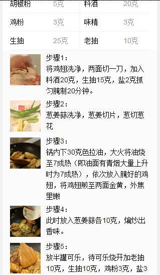

点击tab相关菜谱图：

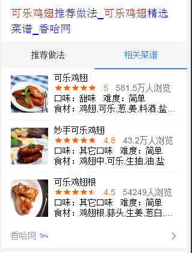

菜谱的泛需求图：

这两个样式的模板只要是设计到滑屏、异步获取数据、展开收起的效果，大部分的时间都在拼字符串，很是不想拼字符串哈，但是也还算顺利，没有特别难的地方，html和js的时间比=1:2吧

## 12.1企业异常名录模板

### 背景与目标

百度政务之窗一期-政务寻址卡片同北京工商局合作初见成效，现同工商局达成进一步合作，从工商局获得一批北京市企业经营异常名录，可复用线上失信人模板展示这批数据。

### 完成情况

唯一答案卡的将要开发完成，后续继续白卡，还有一张搜精确公司的卡片需要处理

### 效果截图

开始搜‘北京市企业异常名录查询’出现

点击：如何移出企业经营异常名录？出现下图浮层：

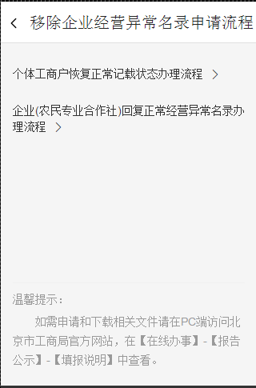

点击每条的公司名称出现一下浮层：

点击右下角的查看更多，出现一下浮层：

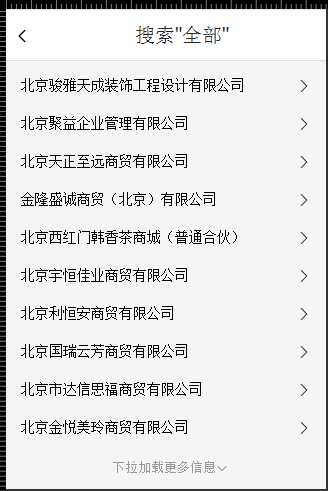

模板主要涉及到异步获取数据，还有浮层，和下拉刷新，html：js=1:4,在下拉刷新的实现上赶到有点困难，现在似乎有点思路了，这一块还在进行调试

后期进展，等唯一答案完事了，今天必须把唯一卡搞完，白卡就简单了，因为逻辑基本一样，还有一个搜具体名称的卡片，那张卡片设计到展开收起，成本不是很大

## https中word字段有汉字的转码修改

### 背景与目标

Wise模板中连接跳转含有中文的https问题，验证问题是否存在，可以使用fiddler进行抓包（在chrome浏览器中会自动encode，问题不能复现）。

### 完成情况

五个卡片都修改完了，今天下午上线

### 效果截图

1：模板名=“experience”，query=“大闸蟹的做法”，点击title链接时会有汉字

模板样式：

修改前fidder抓包图：

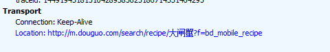

修改后fidder抓包图：

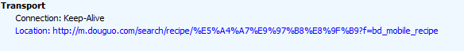

2：模板名=“wise_official”，query=“百度地图”，点击title链接时会有汉字

模板样式：

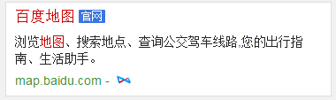

修改前fidder抓包图：

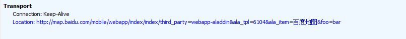

修改后fidder抓包图：

3：模板名=“wz_superphoneweak”，query=“圆通快递电话”，点击title链接时会有汉字

模板样式：

修改前fidder抓包图：

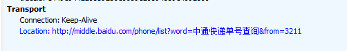

修改后fidder抓包图：

4：模板名=“moviesongs”，query=“好听的歌”，点击title链接时会有汉字

模板样式：

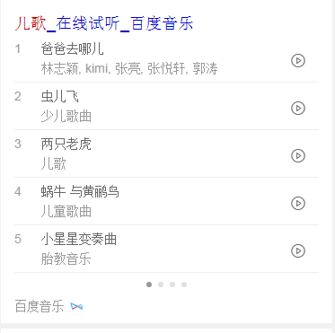

修改前fidder抓包图：

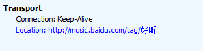

修改后fidder抓包图：

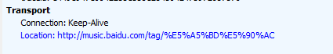

4：模板名=“singer_v2”，query=“郭燕”，这个模板之前验证时（当时验证时修改正确的），没截图，今天截图时找不到有汉字的链接了，不截图了

## 度秘数据格式

### 背景与目标

Wise模板中的数据映射到度秘上

### 完成情况

除了mcomment_list的模板没有验证，其他的四个都修改好了

### 效果截图

大概包含两种样式：

贴图例子（大概的图的样子，因为有的query可能时效性的原因都不到了，截的图肯能就不准了）：

tpl=“wenbku”，下边是前后样式对比：

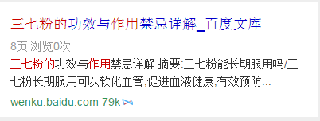
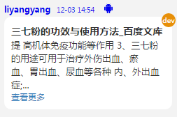

tpl=“wenkuala”，下边是前后样式对比：

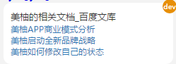

## 接下来的排期

* 继续企业名录的开发
