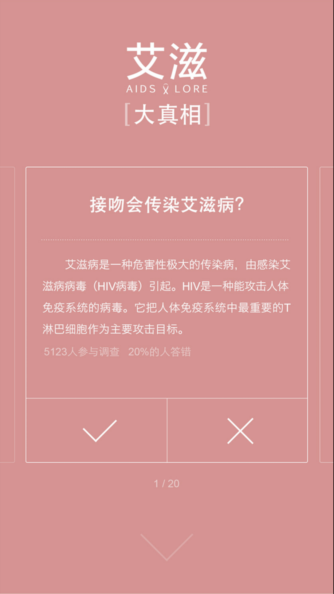
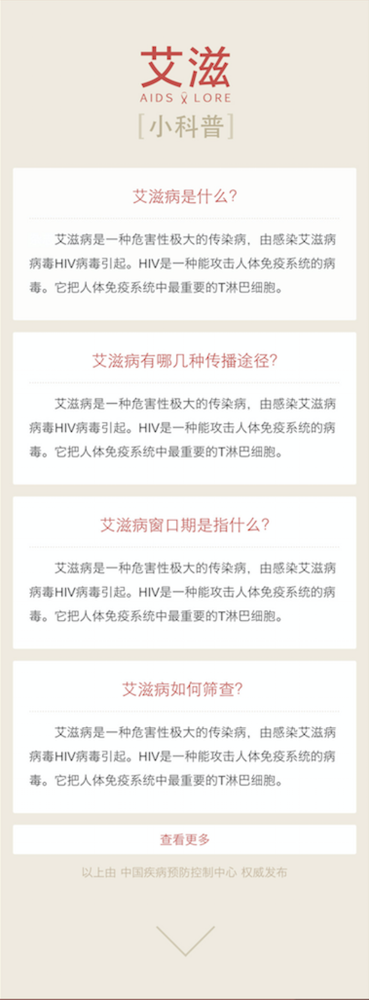
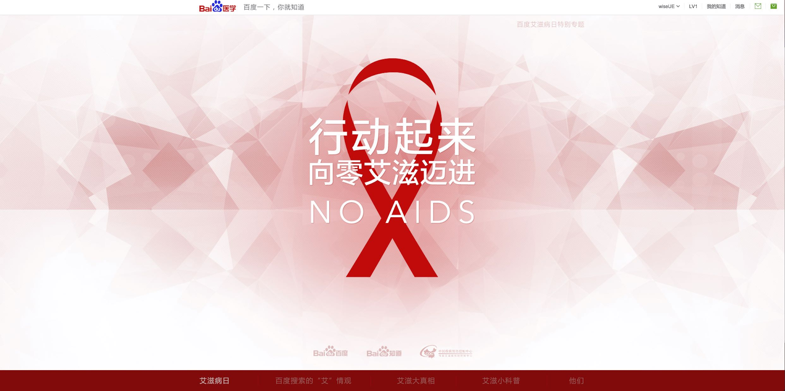
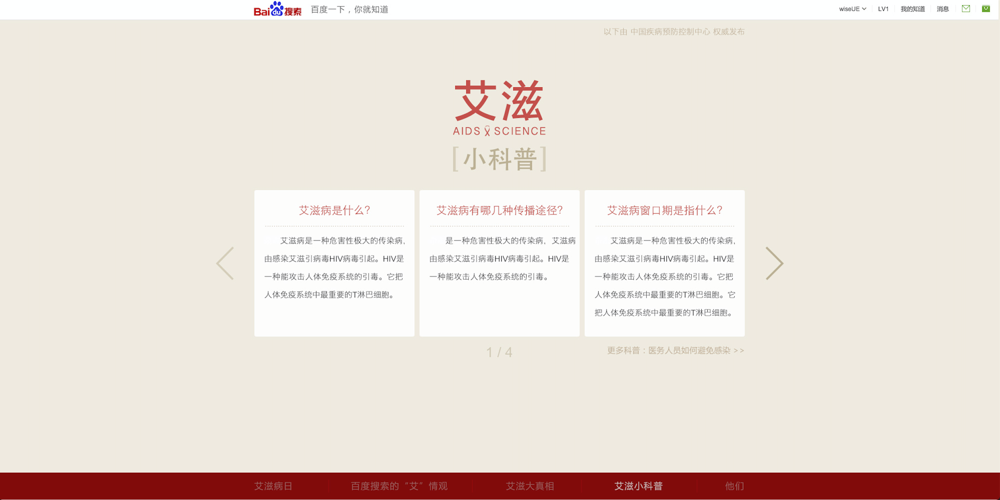
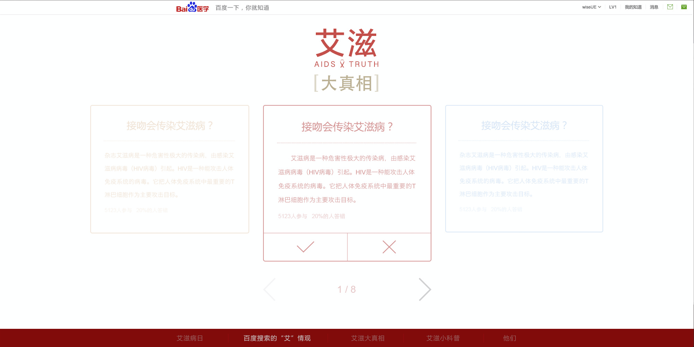
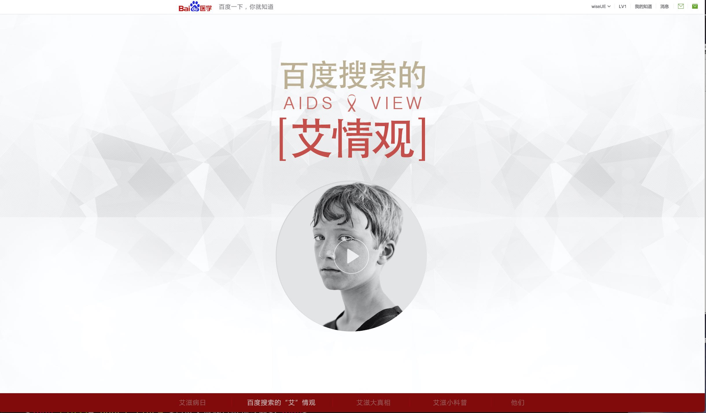
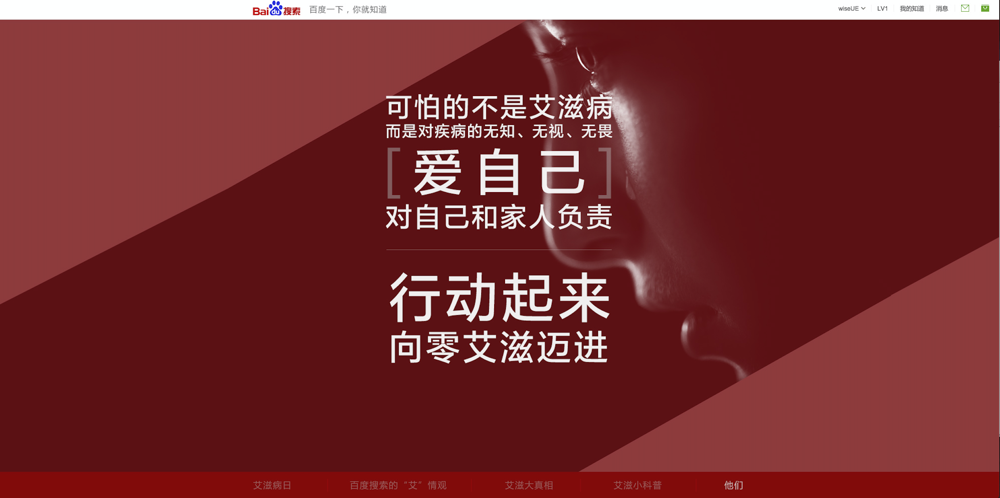

# 王培

> 从2015-11-30到2015-12-04

## 本周跟进

- 艾滋病日运营项目wise中间页

- 艾滋病日运营项目pc中间页

- 暴雪pc/pad通栏

- 运营项目改进任务

    
## 长视频运营项目(无更新)

### 完成情况

- PV：预估2W

- 状态：`周三已上线`

## 明星人物运营项目二期（无更新）
### 背景与目标

```
1、背景：为了更加突出明星人物的时效性，丰富模板应用场景，提升用户体验。

2、目标：
    
    1) 在明星人物模板原有的基础上，在Banner部分“个人信息区域”添加最新动态和祈福两个新功能
    
    2) 卡片时间轴状态下，由之前的新闻标题显示3条、更多可上下滑动——改为：最多显示4条，取消滑动功能
```

<table algin="center">
<tr>
<td></td>
<td></td>
</tr>
<tr>
<td></td>
<td></td>
</tr>
<tr>
<td colspan="2"></td>
</tr>
</table>

### 完成情况

- 基本样式开发已完成

- 祈福数据接口确认中...

### 效果图

- 见上表格


## 艾滋病日运营项目wise测试中间页 （已上线）

### 背景与目标

```
1、背景：百度搜索因为信息检索平台的属性，涵盖多而全的信息，但是针对艾滋病这类特殊词，需要给网民正确的答案、传递正确的价值观。

2、目标：以专题页的形式，将百度知道具有权威性、准确度的内容，及官方的科普信息聚合展现。将知识科普给大家，同时体现百度作为搜索平台的社会责任感，提升品牌好感度。
```

### 完成情况

- PV：预估60W/day 预计展现3-5days

- 状态：  
    
    - 已上线
    
### 效果截图

<table algin="center">
<tr>
<td></td>
<td></td>
<td></td>
</tr>
<tr>
<td></td>
<td></td>
</tr>

</table>

## 艾滋病日运营项目pc/pad测试中间页 (已上线) 

### 背景与目标

```
1、背景：百度搜索因为信息检索平台的属性，涵盖多而全的信息，但是针对艾滋病这类特殊词，需要给网民正确的答案、传递正确的价值观。

2、目标：以专题页的形式，将百度知道具有权威性、准确度的内容，及官方的科普信息聚合展现。将知识科普给大家，同时体现百度作为搜索平台的社会责任感，提升品牌好感度。
```

### 完成情况

- PV：预估50W/day 预计展现3-5days

- 状态：
  
     - 已上线
    
### 效果截图

<table algin="center">
<tr>
<td></td>
<td></td>
<td></td>
</tr>
<tr>
<td></td>
<td></td>
</tr>
</table>

## 暴雪PC/PAD通栏

### 背景与目标

```
1、暴雪运营项目背景：打造游戏生态，验证百度有能力为游戏厂商提供游戏推广、召回的解决方案。并通过本次活动带来更多游戏厂商的合作引入，并从运营角度推动产品功能完善，并让用户最终沉淀在游戏阿拉丁中。

2、暴雪通栏背景：暴雪运营项目中间页入口
```

### 完成情况

- PV：预估8W/day 线上展现20days

- 状态：

    - 测试完成，今天（`2015/12/04 15:00`上线模板）
    
### 效果截图


- 部分兼容浏览器显示动态视频

- 其余不兼容视频显示静态图片

- pad显示静态图片


## 运营项目改进任务

### 完成情况

- base目录

    - 顶部通栏c_base_top（`浪波思考中...`）
    
    - 运营基类模板c_base_optl (基本模板已整理，未上线)
    
    ```
        继『艾滋病日』中间页之后，了解到运营项目的中间页在统计，日志，参数等方面还不是很规范，因为和ubs的同学协商共同出一套规范以供大家使用。同时考虑如何统一规范运营中间页和wise结果页的参数、统计等问题。
    
        - 首先，在下周四（2015/12/10），ubs的同学会给出一个运营参数统计规范，包括：点击交互，点击跳转，pv，页面停留时长，导流等。
    
        - 其次，拿到运营参数统计规范后，优化c_base_optl，同时改写中间页的tangram.js和B.log.send()。
    
        - 然后，改写后的相关静态文件上传，统一管理。
    
        - 最后，整理相关文档。
    ```
- others（未开始）


## 下周计划

- 圣诞节运营卡片

- 运营项目改进任务及文档整理

 


