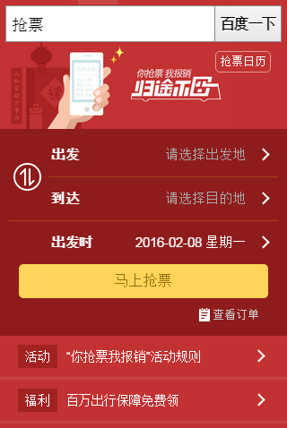
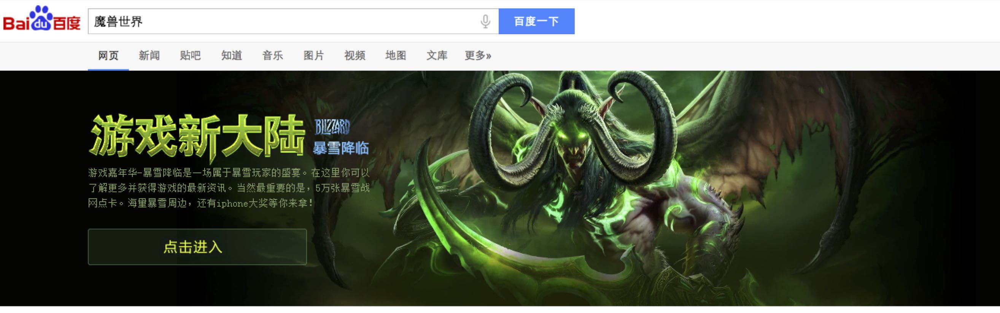
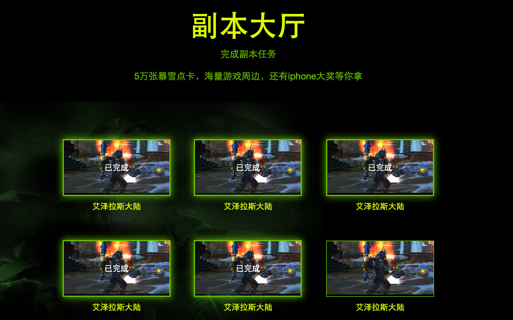
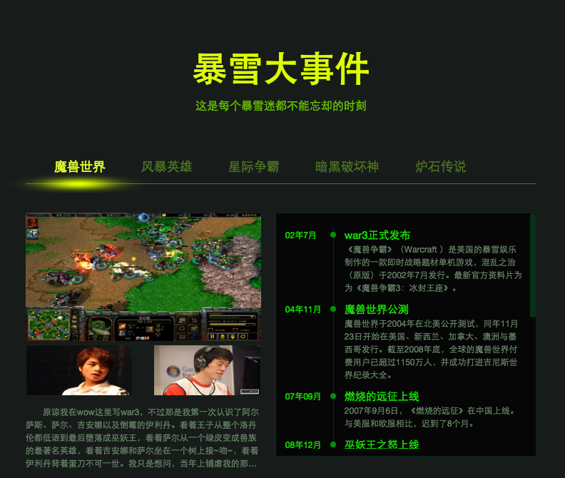
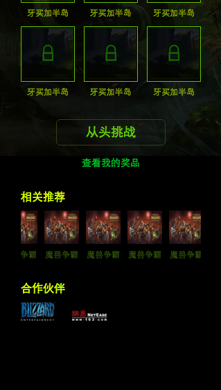
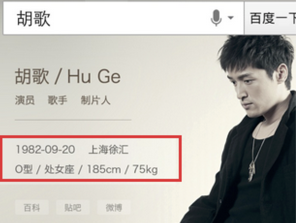
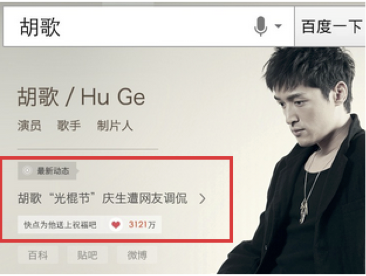
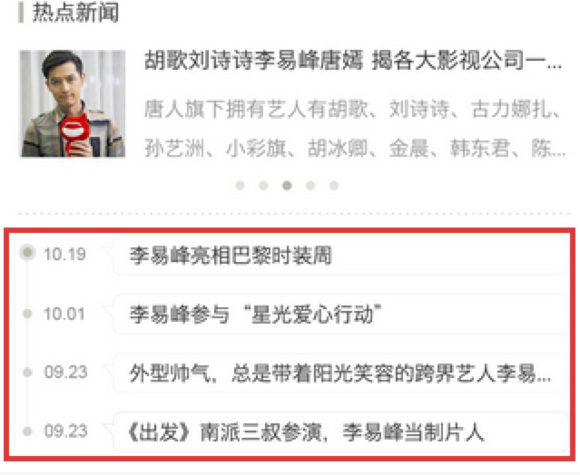
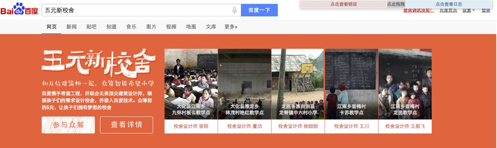

# 【阿拉丁运营方向周报】

> 从2015-12-07到2015-12-11


## 1. 艾滋病日运营项目(已下线)

- PC/PAD预览地址：http://fedev.baidu.com/~wangpei07/aidspc.html

- WISE预览地址：http://fedev.baidu.com/~wangpei07/aidswise.html

- PV：PC&WISE共157W


## 2. 春运抢票运营活动（无更新）

### 背景和目标
    临近春运，越来越多的用户有抢火车票的需求，为了满足这部分用户的需求，培养用户在百度买火车票的习惯，并且带来一定的GMV收益，我们紧急上线了一个抢票运营活动。

    卡片上只做用户出发地、目的地和出发时间收集，抢票过程在携程完成。
    
    覆盖8个query：抢票、云抢票、抢火车票、春运抢票、手机抢票、火车票抢票、百度抢票、百度云抢票，所有推广资源导到这8个query上。


### 效果截图

<table algin="center">
    <tr>
        <td></td>
        <td></td>
    </tr>
</table>


### 完成情况

本周进行改版，添加了福利导流banner，更新了中奖名单页（`@陈锐`）

### 影响面

PV 4w，提交订单 1000


## 3. 暴雪运营活动

### 背景和目标

    暴雪游戏作为全球最为知名的游戏公司之一，旗下众多经典游戏伴随了中国80、90后一代人的成长。

    本次活动以满足用户检索需求为主线，运营与产品紧密配合，进行首页与结果页、PC与WISE的多端联动，在满足用户需求的前提下，打造新型模式，建立具有商业生态的运营产品。提升百度在游戏领域的地位与作用。

### 效果截图

<table algin="center">
    <tr>
        <td colspan="3"></td>
    </tr> 
    <tr>
        <td colspan="3"></td>
    </tr> 
    <tr>
        <td ></td>
        <td ></td>
        <td ></td>
    </tr>
    <tr>
        <td ></td>
        <td ></td>
        
    </tr>  
</table>

### 完成情况

- **PC中间页**：12.11完成pc的所有功能的开发和调试，以及虚拟机装上win7（`@黎明`）

- **WISE 中间页**：基本功能完成，统计和导流未添加；预计下周二（12/15）完成全部病提测（`@黎明`）

- **WISE sigma卡片**：本周五（12/14）开始开发（`@黎明`）

- **PC 通栏**：本周五（12/4）完成开发（`@王培`）

### 预览地址

- PC通栏预览地址：https://alahttps.baidu.com/s?tn=tpldev&dev_workspace=platform&dev_tpl=top_wow&dev_online=0&dev_module=dev-aladdin&dev_file=default.xml&dev_fileformat=xml&dev_pos=topResult&wd=%E9%AD%94%E5%85%BD%E4%B8%96%E7%95%8C


## 4. 明星人物运营项目二期（测试中...）

### 背景与目标

```
1、背景：为了更加突出明星人物的时效性，丰富模板应用场景，提升用户体验。

2、目标：
    
    1) 在明星人物模板原有的基础上，在Banner部分“个人信息区域”添加最新动态和祈福两个新功能
    
    2) 卡片时间轴状态下，由之前的新闻标题显示3条、更多可上下滑动——改为：最多显示4条，取消滑动功能
    
    3) 增加白卡样式
```
### 效果截图

<table algin="center">
<tr>
<td></td>
<td></td>
</tr>
<tr>
<td></td>
<td></td>
</tr>
<tr>
<td colspan="2"></td>
</tr>
<tr>
<td colspan="2"></td>
</tr>
<tr>
<td colspan="2"></td>
</tr>
</table>

### 完成情况

- sigma基本样式开发已完成（`@王培`）

- 白卡样式开发完成（`@王培`）

## 5. 圣诞节wise中间页

### 背景与目标

```
营造圣诞节日氛围，给用户惊喜，聚合百度各产品线圣诞活动。
```

### 效果截图


### 完成情况

- 开发中，预计下周五（12/18）完成并提测（`@王培`）

- 预览地址：http://fedev.baidu.com/~wangpei07/mc/index.html

    
## 6. 五元新校设pc通栏

### 背景与目标

```
百度携手希望工程，病联合五位顶尖建筑设计师，根据孩子们的需求设计校舍，并接入百度技术。发起的众筹活动。
```

### 效果截图



### 完成情况

- 已提测，今天（`2015/12/18 11:00`模板提测）（`@王培`）

- 预览地址：https://alahttps.baidu.com/s?tn=tpldev&dev_workspace=platform&dev_tpl=top_comm_showcase&dev_online=0&dev_module=dev-aladdin&dev_file=default.xml&dev_fileformat=xml&dev_pos=topResult&wd=%E4%BA%94%E5%85%83%E6%96%B0%E6%A0%A1%E8%88%8Dnew


## 7. 印象中国：年终盘点
### * 背景和目标
针对美食，事件进行2015的热点总结，形式为WISE中间页

### * 效果图
无

### * 完成进度
本周确立一些基础的实现方案，下周三输出 UE 图并开始开发

### * 影响面
无    

## 8. 明星投票浮层导流模板
### * 背景和目标


### * 效果图
无

### * 完成进度
本周上线0流量 https://m.baidu.com/#|src_%E7%8E%8B%E4%BF%8A%E5%87%AF%E5%8A%A0%E6%B2%B9|sa_ib&sid=102015

### * 影响面
无

## 9. 运营项目开发改进进度

- 本周四拿到 UBS 的日志规范文档，周五和UBS同学确定最终的细节（`@陈锐`）

- 后续运营规范和改进进度整理到WISE文档里面。

- 列表

    <table>
        <tr>
            <td>序号</td>
            <td>类别</td>
            <td>任务名</td>
            <td>负责人</td>
            <td>进度</td>
        </tr>
        <tr>
            <td>1</td>
            <td>base模板</td>
            <td>顶部通栏c_base_top</td>
            <td>浪波</td>
            <td>思考结果：暂无此类需求，等有新的需求时再一起改进</td>
        </tr>
        <tr>
            <td>2</td>
            <td>base模板</td>
            <td>运营基类模板c_base_optl</td>
            <td>陈锐</td>
            <td>正在整理（<a href="http://sfe.baidu.com/#/阿拉丁/无线网页搜索/开发指导/PC&WISE中间页运营活动的规范及评估流程" target="_blank">ubs规范已输出</a>）</td>
        </tr>
        <tr>
            <td>3</td>
            <td>运营模板</td>
            <td>通用浮层模板</td>
            <td>陈锐</td>
            <td>已完成浮层导流模板，后续基于此模版改进</td>
        </tr>
        <tr>
            <td>4</td>
            <td>中间页</td>
            <td>PC/WISE统计</td>
            <td>陈锐</td>
            <td>2015-12-18</td>
        </tr>
        <tr>
            <td>5</td>
            <td>中间页</td>
            <td>PC/WISE登录</td>
            <td>陈锐</td>
            <td>2015-12-18</td>
        </tr>
        <tr>
            <td>6</td>
            <td>运营组件</td>
            <td>动画效果库优化</td>
            <td>陈锐</td>
            <td>2015-12-31</td>
        </tr>
        <tr>
            <td>7</td>
            <td>平台</td>
            <td>用户登录和统计</td>
            <td>小琴</td>
            <td>2015-12-15</td>
        </tr>
        <tr>
            <td>8</td>
            <td>平台</td>
            <td>实现平台测速</td>
            <td>小琴</td>
            <td>平台二期</td>
        </tr>
        <tr>
            <td>9</td>
            <td>平台</td>
            <td>运营项目预览平台</td>
            <td>小琴</td>
            <td>平台二期</td>
        </tr>
        <tr>
            <td>10</td>
            <td>平台</td>
            <td>中间页开发整合到平台</td>
            <td>小琴</td>
            <td>平台二期</td>
        </tr>
    </table>

## 10. 其他项目

- 长视频运营项目：已完成（`@王培`）

- GDP图表：已完成（`@黎明`）

- 违章项目：已完成（`@黎明`）

