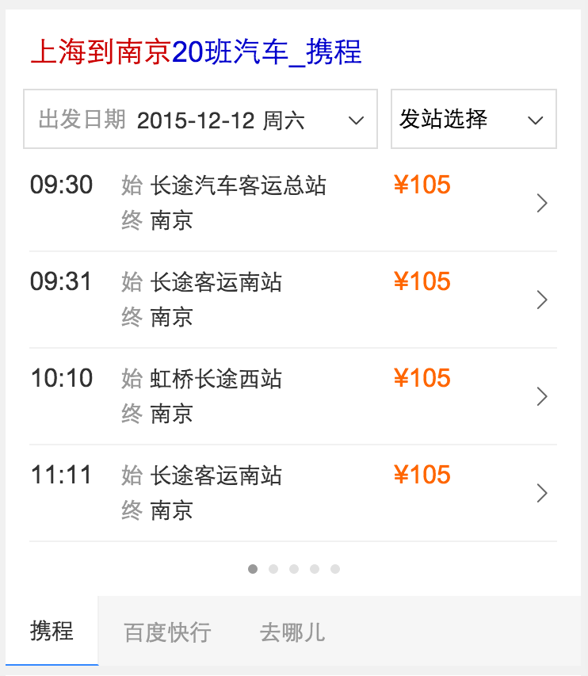
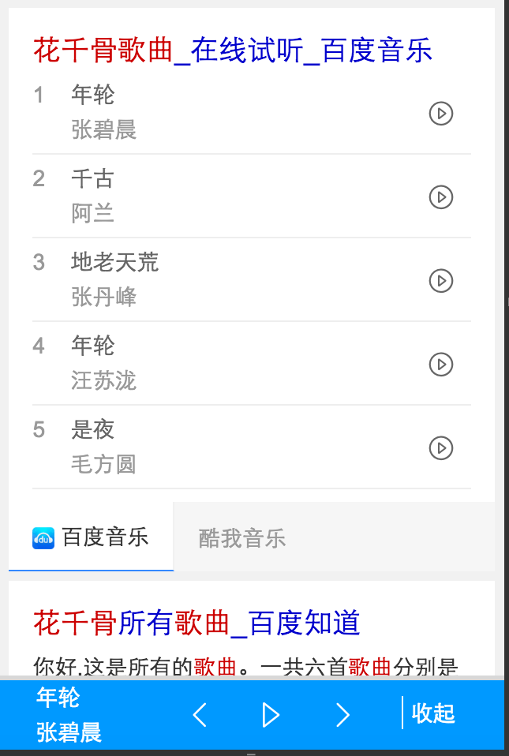
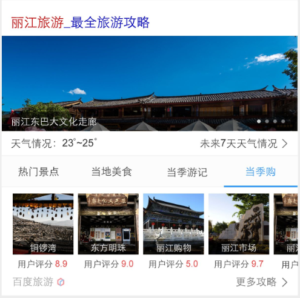
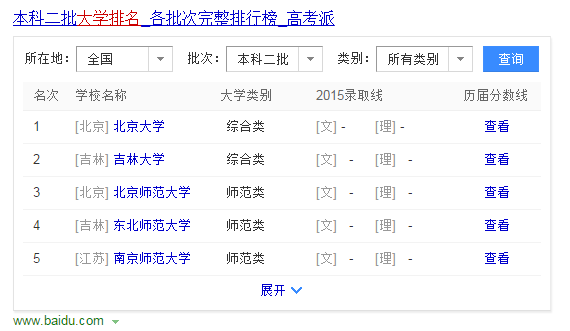
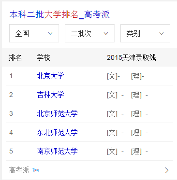
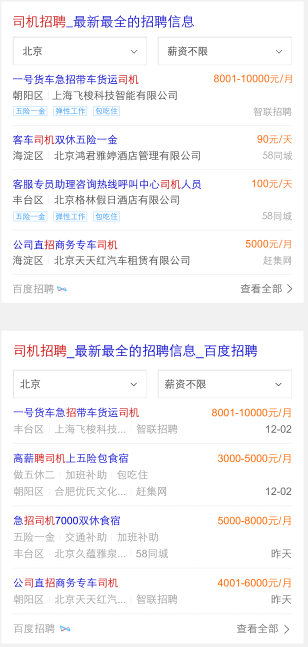

# 【阿拉丁产品方向周报】

> 从2015-12-07到2015-12-11

## 项目一、12.30 - 6869数据迁移wise端

### 背景与目标

wise上的召回情况不好,希望给他们补充召回.迁移pc上的数据.包含4个卡,电视剧,综艺,动漫,电影  ,电视剧动漫用同一套模板

### 最终效果截图


### pv

 <span style="color:blue;">预计pv50w</span>

### 完成情况

* <span style="color:red;">电视剧12.9日上线,,动漫下周一上线</span>
* <span style="color:red;">目前需要重新评估一下电视剧的pv情况,本项目优先级可能会降低,提高漫画项目优先级<span>


## 项目二、12.30 - 漫画卡片扩招

### 背景与目标

目前腾讯动漫、有妖气、漫画之家等资源方共提供了上万部作品，其中2000多部是两家或三家资源方都有提供数据的，且随着更多资源方、更多数据的接入，重叠部分预计还会有所上升。考虑到生态、用户偏好等多方面原因，希望能够支持多家资源方共同展现,样式重新设计

### pv

 <span style="color:blue;">预计pv 700万左右</span>

### 完成情况

* <span style="color:red;">本项目优先级提高,12月11号rd给到环境,12月14号介入开发.预计12月17号提测<span>

### 效果图


## 项目三、12.30 - 二手房

### 背景与目标

wise端，暂时并没有相关的特型去满足用户的筛选，用户需进入到房产相关网站去完成一系列动作。而二手房泛需求卡片，就是让用户在百度搜索结果页就完成目标的选择，缩短用户直达实体的路径，从而提升用户体验。

### pv

 <span style="color:blue;">预计pv 15万左右</span>

### 完成情况

 <span style="color:red">资源方已重新提交数据,预计周一给到.周3介入开发,大概是1天得工作量</span>

### 效果图


## 项目四、音乐融合-影视原声带

### 项目背景

```
1、背景：辐射垂直行业，覆盖影视类歌曲需求，如花千骨歌曲，琅琊榜插曲等
```

### 完成情况

- 12月09日完成开发，支持多资源方，现在pm正在评估酷我的数据效果

### 后续

- 1214提测 和音乐沉浸式体验项目一起进行测试


## 项目五、汽车票点到点卡片(上线)

### 背景与目标

- 为了提升线路覆盖率、提高转化率，优化汽车票点到点卡片。

### 完成情况

- 本周配合评估加联调，模板在12月10号上线完成，目前线上还没有资源

### 上线时间和影响面

- 资源12月11号下午开放，线上query：北京到天津；预计影响面100w

### 效果截图



## 项目六、音乐沉浸式体验

### 背景

- 探索音乐作为工具化的方向，将音乐作为插件，在明星沉浸式页面、音乐泛需求页面下展现，测试用户的使用情况，预期提升用户浏览体验，提升用户停留时长。

### 完成情况

- 音乐播放引入jquery的jplayer插件来做，支持上一首下一首，支持连续循环播放，本周基本功能以及完成，样式在review中；android手百下有兼容性问题，所以暂时先屏蔽掉；预计下周开始测试

### 后续

- 下周测试+上线

### 效果截图




## 项目七、场景化出行（wise_scene_trav）

### * 背景与目标
通过时间、地点场景信息定位有出行需求的用户，展现场景化出行卡片，围绕出行需求，集合信息、交通、消费等功能，精准满足其出行需求。

### * 完成情况
- 11月26日上线。
- 实验组/对照组流量各50%，每组影响pv约3.5w/天；策略触发后，场景化卡片覆盖的pv约1w/天。
- Query=香山(天安门，故宫等)，地点策略+时间策略。
- [点这里~点这里~](https://www.baidu.com/from=844b/s?word=%E9%A6%99%E5%B1%B1&ts=0015366&t_kt=0&rsv_iqid=5504612005285293655&rsv_t=f77fpuYM6PishRuwv6A9PSlfWEsQ%252FkBKd%252FtsgBcmqwBGyhR9vBwtIJNd3A&sa=ib&ms=1&rsv_sug4=3888&ss=101&inputT=2065&sid=102251)


- <span style="color:red">本周出行项目完成了几次迭代，添加展开收起动画头图样式调整。</span>

## 项目八、场景化餐饮（wise_scene_food）

### * 背景与目标
各种餐饮名店信息聚合，吃货的福利。为用户提供更便捷的餐饮搜索信息，给部分产品线导流。

### * 完成情况
- 12月1日已上线。
- 实验圈定query总 pv约3.5w/天；根据策略，卡片会在午饭和晚饭时段触发；触发后，卡片覆盖的pv约1w/天
- Query=全聚德(麻辣诱惑，海底捞等)。
- [点这里~点这里~](http://cq01-aladdin-product-05.epc.baidu.com:8003/s?word=%E6%B5%B7%E5%BA%95%E6%8D%9E&ts=2862183&t_kt=0&sa=ib&rsv_sug4=5921&inputT=4644&ss=100&cip=47.153.191.255&tn=iphone&sid=102122)
- <span style="color:red">本周出行项目完成了几次迭代，手百头图样式调整。</span>


## 项目九、场景化城市（wise_scene_city）

### * 背景与目标
不同地方的用户，在搜索相同的地域Query时，需求不同；根据用户所在地，用户搜索时间等条件，判断用户搜索的真实需求，整合现有资源，为用户提供高颜值高精准度的搜索结果展现。

### * 完成情况

- <span style="color:red">12月9日开发完成，12月10日联调。12月11日QA介入测试，下周一12月14日上线</span>
- <span style="color:red">下周场景话本地部分完成开发测试上线.</span>


## 项目十、 自由产品出图（zhidao,zhidaoala,wenku,wenkuala,www_zhidao_normal）

### * 背景与目标
以上五个模板增加出图样式。

### * 完成情况
- 前端已完成。
- <span style="color:red">商业和用户空转完成</span>
- <span style="color:red">后端准备小流量上线事宜。</span>

## 项目十一、场景化人物（wise_scene_person_kv）
从现有数据中抽象出这些趋势的一些规律，将其应用到产品设计和召回中，有效减少用户筛选成本，增加产品使用率。因此我们可以通过条件触发的sigma形式，将粉丝的各维度需求在sigma卡片上做聚合展示，让粉丝通过搜索来追星，获取明星的全面信息。
### * 背景与目标

### * 完成情况
- 本周添加微博与热门微博条数限制，已上线。
- Query=鹿晗，暂时只有鹿晗能触发，初始影响面PV=6.5W，试验期间减半。
- [点这里~点这里~](https://www.baidu.com/from=844b/s?word=%E9%B9%BF%E6%99%97&ts=9424931&t_kt=0&rsv_iqid=7099597460254613959&rsv_t=5473vbvJQ6CHpRcFDZVOcjgQ8PfD4HRnZdMdiAW4%252BJY8bnEwuCP4PPXMZA&sa=ib&ms=1&rsv_sug4=1960&ss=101&inputT=733)


- <span style="color:red">本周未更新。</span>
- <span style="color:red">该项目已转李晓跟进。</span>

## 项目十二、场景化大学（wise_scene_colleges）

### * 背景与目标
根据不同用户群体，不同地域，给用户提供不同高校信息的聚合展示。
### * 完成情况

- <span style="color:red">后端数据准备中。</span>


## 项目十三、 场景化展开收起动画

### * 背景与目标

由于前几个场景化上线紧急，展开收起暂无动画，觉得交互不太友好，计划为展开收起加一个交互动画，提高用户体验。

### * 完成情况

- 以出几版DEMO，已www童鞋商议，在安卓或低版本ios中，表现一版，可选择google的策略，只有高端机型开启动画，其余不开。

## 项目十四、旅游 - 目的地景点卡片优化

### 背景

* 原有目的地/景点改版

### 完成情况

* 涉及模板travel_strategy，11.20日模板上线，影响面约100W;

* 11.24上午小流量上线, 实验组（10%）：对照组（10%），

* <span style="color:red">实验结论尚未产出</span>

### 覆盖query

* 国内景点，如：故宫、天安门广场

### 效果截图


### 后续计划

* 原城市旅游卡片wise_city_travel，按照此策略做相应的交互、样式方面的升级。


## 项目十五、旅游 - 城市卡片优化

### 背景

* 原城市卡片样式升级改版，介入更多资源方扩大召回

### 完成情况

* 升级模板wise_city_travel，11.27日模板上线，全量影响面约200W，

* <span style="color:red">12/7下午小流量上线，小流量周期为12/7-12/16，实验组（5%）：对照组（5%），小流量前三天固定第三位，三天后放开点调。</span>

### 覆盖query

* 国内外城市

### 线上效果

* [北京旅游](https://m.baidu.com/ssid=c1c6737465706879777531313235e339/from=844b/s?word=%E5%8C%97%E4%BA%AC%E6%97%85%E6%B8%B8&sid=102393)

### 效果截图



### 后续计划

* 细分强弱样式，根据query点击调权的展现位置，触发不同的强弱样式形态。

## 项目十六、人物 - 粉丝场景化

### 背景

* 为更好地支持场景化的触发，方便pm更快铺量更好干预，与后端rd统一商定迁移为mini机制

* <span style="color:red">为更好地视觉体验，新增沉浸式样式</span>

* <span style="color:red">为支持团购商品需求——电影《老炮儿》首映礼票务团购，模板需增加活动区域模块</span>

### 完成情况

* 升级模板wise_scene_person_kv，12.02日模板上线，12.04日数据切换为mini机制，影响面约125W;

* <span style="color:red">沉浸式样式升级，并支持头部颜色可配置,12.10日模板已上线</span>

* <span style="color:red">头部文字描述支持可跳转，增加活动区域入口；增加活动区域模块，12.11日模板上线</span>

### 覆盖query

* 鹿晗，迪丽热巴，杨洋，郑爽，李易峰，杨幂

### 线上效果

* [吴亦凡](https://www.baidu.com/ssid=8a3d73746172c3f7d0c773746172fc4b/from=844b/s?word=%E5%90%B4%E4%BA%A6%E5%87%A1&sa=tb&ts=8665908&t_kt=0&ms=1&rsv_pq=6932049557572375983&ss=101&t_it=1&rsv_sug4=3221&inputT=2313&oq=%E7%8E%8B%E6%BA%90)

### 效果截图

* 唯一答案


## 项目十七、生肖卡片

### 背景与目标

目前无生肖阿拉丁产品，在做竞品分析中，其他搜索产品能对生肖内容有特型展现来满足用户需求；在年底年初之际，用户对生肖query需求较高，所以需生肖卡片，满足这部分用户需求。

根据用户query分析，这部分用户搜索需求主要停留在十二生肖，xx属相，xx属相xx年运势，xx属与xx相配

### 完成情况

`12月9日` 生肖首页完成，具体细节需要跟 `ue-王菲` 对下，`pm-韶增` 介入让先做生肖运势sigma，首页细节等开发完运势的再对下细节问题。

生肖运势 `sigma` 模板 `12月10日` 开始做，遇到数据问题，无法满足需求，后pm改变了卡片展现逻辑，把二维度换成一维度,数据正在修改，预计 `12月11日` 数据修改完成，可以继续开发。

### 效果截图

* 生肖首页卡片截图


* 运势卡片截图


## 项目十八、pm2.5（无进展）

### 背景与目标

目前线上pm2.5卡片内容过于单一，样式不够优美，需要对卡片进行优化，增加更多信息，丰富卡片内容

### 完成情况

pm2.5 `延期` 先做优先级较高的星座和生肖模板


## 项目十九、单一星座模板开发

### 背景与目标

将原有星座阿拉丁卡片改为sigma形式，增加更多星座信息（性格分析、运势、配对），为用户节省搜索时间。同时提升卡片颜值，提升用户体验。

### 完成情况

`sigma` 模板在 `12月10日` 测试完成，目前存在一些细节问题，预计今天解决一下。 召回query：[白羊座](http://cq01-ala-fe-4.epc.baidu.com:8003/s?word=%E7%99%BD%E7%BE%8A%E5%BA%A7&sa=tb&ts=1444338&t_kt=0&rsv_pq=16477918060565658879&ss=101&t_it=1&rsv_sug4=2468&inputT=1864&oq=%E7%94%9F%E8%82%96%E8%BF%90%E5%8A%BF)

`白卡` 模板在 `12月7日` 完成，经过ue和pm确认在 `12月10日` 测试完成，暂无问题，要求跟sigma同时上线

### 效果截图

* sigma效果


* 白卡效果


## 项目二十、kap大学排行榜

### 背景与目标

背景：大学排名一直是报考学生做出决策和寻找合适的高校的重要方式。对于大学排名线上现在主要是针对重点大学的相关排名和信息，但经过调研发现，用户对于二本大学等批次大学的搜索占比也很大，同时用户还会以工科类排名等方式进行搜索。而现有排名机制可以横向进行拓展，减少用户换query比例，进而优化。
目标：用户在搜索大学相关排名的时候，对于排名的需求纬度较多，如地区、批次、类型。通过优化全面满足各个纬度的大学排名。

### 进展情况

wise pc 上线完成
query=二本大学排名、北京二本大学排名 sid=7498，wise pv=40W  pc pv=30W


### 效果截图




## 项目二十一、wise百度词典卡片

### 背景与目标

针对线上中中释义卡片进行升级，主要满足用户字、词、成语实体卡片的查询，也作为字词成语实体卡片的一期项目，后期将继续问答卡片的满足。

### 进展情况

实体类型已开发并与rd调试完，问答类目前rd在映射query的查询属性 比如（query= xxx的读音、xxx的出处的读音、出处的属性），待渲染数据

### 效果截图


## 项目二十二、泛需求兼职kap

### 背景与目标

1、兼职在整个招聘中占据4.6%，均采用精确需求卡片覆盖，需求不符合，初步拉部分兼职query需求应该至少在20w起（保守估计）
2、整个兼职目前的已接入招聘资源质量差，集中给用户“假、骗、无保障”印象，是最大的顽疾；是个痛点—而之前使用58赶集等数据无法解决，反而令用户上当；
3、目前兼职领域冒起一批新兴兼职资源，有保障预付工资等形式在逆袭大型招聘网站，如兼职猫，探路、一米、斗米等兼职先后获得相关领导人接见与上样式，同时近期一批货的巨额融资：斗米4000w美金、探鹿1000w美金（他们的日活在几w左右），是新兴020布局的重要一环，但是这些创业企业缺少流量用户入口，这点是我们的一个机遇；另外新兼职客单利润和用户粘性高，内部了解兼职利润约为工资的20%，高频属性，对于目前没有巨头态势下，无论从生态和盈利布局都是一个重要的点；
4、兼职对于构建招聘垂搜来说是个重要组成，校招，社招，兼职
5、结合运营活动（寒假兼职期）改善用户形象和养成入口，打出品牌，同时为之后做铺垫。
6、目前线上资源有效性较差，无法满足用户需求，样式单一

### 进展情况

开发完成，测试中

### 效果截图


## 项目二十三、社招类 厨师招聘卡片样式优化 

### 进展情况

开发完，目前测试中，预计今天能上线, query=厨师招聘、司机招聘、产品经理招聘

### 效果截图



## 项目二十四、12.1菜谱精确和泛需求

### 背景与目标

针对百度搜索中的一系列菜谱相关的query，提供定制化的阿拉丁，优化现有阿拉丁，更加方便用户找菜谱的相关操作。。

### 完成情况

模板小流量上线，10%的流量，目前的pv是20w，&sid=102600,query="<a href="https://www.baidu.com/from=844b/s?word=%E5%8F%AF%E4%B9%90%E9%B8%A1%E7%BF%85%E7%9A%84%E5%81%9A%E6%B3%95&sa=ts_1&ts=3544046&t_kt=0&ms=1&rsv_pq=4863771742220929058&ss=100&rq=%E5%8F%AF%E4%B9%90%E9%B8%A1%E7%BF%85&rsv_sug4=1226&oq=%E5%8F%AF%E4%B9%90%E9%B8%A1%E7%BF%85&sid=102600">可乐鸡翅的做法</a>"


<p>--这周无工作量<p>

<p> 效果截图</p>

<p>菜谱的精确需求图：</p>

<p>点击制作步骤图：</p>

<p>点击tab相关菜谱图：</p>

<p>菜谱的泛需求图：</p>


## 项目二十五、wise端NBA球队卡（上线）

### 背景与目标

wise端现有NBA卡片中，未对NBA球队进行覆盖。在球队需求下未有样式满足用户对NBA球队维度的信息获取，为更好的满足并丰富用户获取信，增加对应类型卡片。

### 完成情况

模板12月7号全流量上线，影响PV日均约8w，query="<a href="http://m.baidu.com/#|src_%E9%87%91%E5%B7%9E%E5%8B%87%E5%A3%AB|sa_ib&tn=iphone">金州勇士</a>"


<p>--这周无工作量<p>

<p> 效果截图</p>

<p>球赛tab</p>

<p>球员tab：</p>

<p>统计tab：</p>


## 项目二十六、 12.1企业异常名录模板

### 背景与目标

百度政务之窗一期-政务寻址卡片同北京工商局合作初见成效，现同工商局达成进一步合作，从工商局获得一批北京市企业经营异常名录，可复用线上失信人模板展示这批数据。

### 完成情况

唯一答案卡和白卡，以及搜精确异常名录的卡片，初级的已完成，但是pmcheck后，有很多问题，需要调整，大概有功能上的，也有样式上的

--本周唯一答案卡没有工作，白卡和精确卡12-7和12-8号用了两天

<p> 唯一答案卡效果截图</p>

<p>开始搜‘北京市企业异常名录查询’出现<p>

<p>点击：如何移出企业经营异常名录？出现下图浮层：</p>

<p>点击每条的公司名称出现一下浮层：</p>

<p>点击右下角的查看更多，出现一下浮层：</p>


<p>白卡效果截图</p>

<p>开始搜‘北京市企业异常名录查询’出现<p>

<p>点击：查询：</p>

<p>点击每条的公司名称出现一下浮层：</p>

<p>点击右下角的查看更多，出现一下浮层：</p>


<p>精确卡</p>


<p>有好几个时可以点击切换</p>

## 项目二十七、 12-25号Wise端政务办事迁移卡片

### 背景与目标

政务wise办事指南类卡片影响面约占政务项目wise端整体影响面的30%。而wise目前没有覆盖到政务办事指南类目，用户对查找服务指南类信息的操作成本高且流程复杂；因此将指南类服务信息在搜索结果页进行聚合，满足用户便捷查询获知的需求。

### 完成情况

还有一个点击电话播出的功能和浮层的功能，样式搭好了，大概还需要一天时间完成

<p>--这周用了两天（12-9,12-10）时间来做<p>

<p> 效果截图（完成情况）</p>


## 项目二十八、【度秘】
### 项目背景
wise结果同步度秘，度秘访问wise的json接口和度秘对大搜索阿拉丁截图通用展现方案已经完成，
下一步展开阿拉丁模板适配度秘信息模板的映射，以便获得最优展现。

### 目标
度秘为用户提供更优的数据资源，大大提高用户体验

### 整体计划及排期
* <span style="color:green">一期适配（24个），现有信息模板已经支持的，预计12.7上线</span>
* 二期适配（32个），需要多实体卡片上线后支持的（NA1.1和手百7.1），预计12.14上线
* 三期适配（8个），多实体卡片升级和现有模板调整的（NA和手百的下一个版本，时间待定）

### 本周进度

* 周四（12.10）已完成二期适配模板开发，等待pm评估效果

## 项目二十九、 【栅格横滑线上模板迁移】
### 项目背景
横滑间距改用规范的公用类，方便统一修改。

### 本周进度

* 12.11上线5个迁移的模板。

## 项目三十、 【星河项目】
### 项目背景
由于入口流量转化率远不符合预期（预期1%，实际0.1%），新增推荐通用模板的查看更多入口。

### 本周进度

* 上线情况：12.8已上线。

* 效果图：

## 项目三十一、【sigma颜色问答大卡】
### 项目背景
优化搜索颜色类query时的用户体验，例如：“卡其色是什么颜色”“墨绿色是什么颜色”，用全屏颜色+简洁的说明文字的形式来精准满足用户需求，提升搜索产品的“颜值”。样式上采用唯一答案的样式风格。

### 本周进度

* 提测完成，今天走三级单。下周上线。pv 5w。
* 效果图：

## 项目三十二、【app分发】
### 项目背景
在线上已有横滑模板的基础上做的优化，主要为下方展现的文案除了“app名称”外，增加了“下载量”、“评分”文案。其他交互没有变化，仍未横滑，点击后仍然发起新的搜索

### 本周进度

* 提测完成，12.11上线模板。pv500w。
* 效果图：

## 项目三十三、【SPO问答卡片】

### 项目背景
对已有的ks_general栅格迁移。

### 本周进度

* 今天已介入开发。下周三提测。

## 项目三十四、12.30 - 购物非标类卡片优化

### 背景与目标

用户在搜索商品的时候，有购买、浏览商品的需求。而目前线上无此类卡片，且大多自然结果为一些不知名的网站，商品质量无法保障。

购物非标类卡片对接电商，旨在为用户提供商品，商品优惠、优质商品推荐和购买指南等信息服务。

以全屏瀑布流的形式，让用户可以在百度更为流畅的浏览商品。

### 完成情况

该需求属于在线上模板`generalshopping`上做优化，但会重构整个代码，新ue图没有滑屏，但加入了新交互：全屏浏览+无限滚动模式，目前全屏浏览需要等@杨帆那边组件上线后开发，@杨帆那边预计组件 12.15 左右上线

#### 更新：目前`psd`确认稿已ok，下周一着手开发

## 项目三十五、12.30 - 购物商品列表卡-特卖卡（新卡）

### 背景与目标

用户在搜索商品的时候，有购买、浏览商品的需求。而购物特卖卡片配合电商的优惠活动，结合返利信息，把更多的优惠呈现给用户。且特卖模板也可以兼容适合列表形式展现的商品。

### 完成情况

该模板属于新模板，资源属于全量上线，模板名`wise_discount`，预计影响面`200w`，模板开发完成，12.11模板上线

### 效果图


### 功能点

该模板内有`倒计时`功能，目前就自己实现好了，没必要组件化

## 项目三十六、12.30 - 二手车阿拉丁（新模板pk老模板）

### 背景与目标

用户在查询二手车时，有查看具体车型信息的需求。而线上卡片只是一个入口，二手车卡片展示车型信息，可以更好的帮助用户决策，满足需求。

### 完成情况

该模板属于新模板`wise_usedcar`，上线全量召回后会pk掉老模板，目前模板自测中，预计12.14提测，预计影响面`30w`

### 效果图


## 项目三十七、12.30 - 疾病卡

### 背景与目标

目前疾病卡片只满足于基础的疾病介绍需求，此次尝试增加相关推荐服务，在满足疾病介绍的同时，为用户提供更好的服务。

### 完成情况

定为`mini`的新模板，模板名为`img_recom`，正在开发中，联调要依赖后端的召回+数据，预计12.15提供测试数据，预计影响面`300w`

### 效果图


## 项目三十八、12.1金融 - 主卡

### 背景

主卡迭代，增加K线图和量图需求，提升用户体验

### 完成情况

模板核心是中间的图表，采用canvas实现，为了照顾高清屏，先绘制2倍尺寸的图片，然后用css缩小到1倍尺寸，没有什么技术难点。模板已经上线，影响面2000w/日。

### 示例query

* 美股：bidu
* A股：600030

### 效果图


### 更新

无更新，1230需求12月14日评审

## 项目三十九、天气突击

### 背景

在北京天气的query下进行实验，尝试在生活相关的卡片下接入衣食住行的服务，探索新方向

### 完成情况

本周进行了几次样式迭代，最终确定头图+瀑布流的方案。无技术难点。目前实验在『北京天气』这个query下已经全量，影响面50w/日。

#### 示例query

北京天气

### 效果图


### 更新

项目进入二期，准备扩大召回，模板数据机制需要迁移到AE，12月14日开始进行，12月18日联调

## 项目四十、图片沉浸式体验

### 背景

在用户需求明确为图片时，对该情景下的图片样式进行优化，采用唯一答案+瀑布流形式，提升用户体验。

### 完成情况

需求已评审，预计12月16日开始开发。

## 项目四十一、分享组件

### 背景

目前wise上的分享组件无法自定义分享信息，且存在一些过时的分享社区，例如开心网等，所以本次我重构了分享组件，支持分享到QQ空间和新浪微博，也支持使用者自定义分享面板的功能。

### 进度

分享组件已完成，12月11日上线。具体文档参考http://sfe.baidu.com/#/阿拉丁/无线网页搜索/js组件/分享组件


## 下周计划

- 音乐沉浸式体验 上线

- 音乐原声带多资源方 上线

- 场景化城市本地卡片开发，联调，测试，上线。

- 场景化出行，场景化餐饮，场景化异地卡片城市迭代。

- 场景化交互动画迭代。

- “天使之翼”格瓦拉下滑样式实验

- 旅游：1. 主题泛需求旅游；2. 旅游工具百宝箱

- 人物：1. 粉丝场景化，“天使之翼”格瓦拉下滑样式实验；2. 我是歌手人物联动卡片

- 解梦卡片开发，暂无ue图，1230飘红项目

- 星座运势卡卡发，1230飘红项目

- 天气指数-pm2.5卡片开发。

- 教育：百度词典数据渲染 

- 招聘：泛需求兼职卡片 （qa测试，上线）

- 做企业聚合卡片。大概需要一天时间

- 彩票的xml已给，等待下步开发

- 节目的今天下班前给xml


## 想法
- 有些方法不要想着趋于完美了再去实施，完美的东西都有一个迭代的过程。

## 开发痛点&吐槽
- langbo：Js拼链接不得不用form，目前跳转的都需要走m.baidu的代理，需要有di和sec，但是局限性比较大；并且js如果还要根据情况来拼接的话 不得不用form来跳转，比较麻烦。
- langbo：手百浮层点击穿透的bug。
- liuquanyou：手百就是个IE6！！！还有那搜索框新头部，各种姿势的展开，唯一答案的背景图可以背挤成各种BUG，得想个好的解决办法。
- liyangyang:企业异常名录吐槽一下：觉得这个卡片真心有些恶心，不是很好搞，mrd图不清晰，一些功能后来加进去，还有ue的标注图也不全乎，里边的滑屏真心不好搞，大哭，打算等12-5号之后完成一些手头的项目，继续开发


## 新交互调研

### 背景与目标   

希望能使结果页能够动起来,拥有更多的展现以及交互形式

### 完成情况
* 谷歌中间页新交互demo调整,6s上不卡顿,其他机型没测 [传送门](http://cp01-msg-mcp-web-26.epc.baidu.com:8003/s?word=%E8%A7%81%E9%AC%BC%E6%96%B9%E6%B3%95%E5%8D%83%E4%B8%87%E5%88%AB%E8%AF%95&sa=thr_6&ts=5751547&t_kt=0&rsv_pq=14898917097903175743&ss=101&rsv_sug4=3419&inputT=2804&oq=%E8%AE%A9%E5%AD%90%E5%BC%B9%E9%A3%9E)
* 展示页交互demo(或许会扩展为一种中间页交互) [传送门-打开手机模拟器看](http://lijialong01.fe.baidu.com/newway/newway.html)
* bannar无限横滑demo (后续扩展为无限卡片横滑) [传送门](http://lijialong01.fe.baidu.com/slider/index.html)

