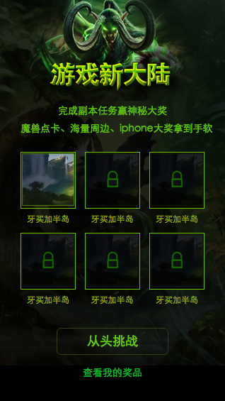
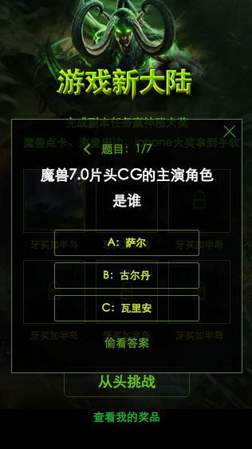

# 范黎明
> 从2015-12-07到2015-12-11

## 暴雪pc中间页项目

### 背景与目标

暴雪游戏作为全球最为知名的游戏公司之一，旗下众多经典游戏伴随了中国80、90后一代人的成长。本次活动以满足用户检索需求为主线，运营与产品紧密配合，进行首页与结果页、pc与wise的多端联动，在满足用户需求的前提下，打造新型模式，建立具有商业生态的运营产品。提升百度在游戏领域的地位与作用。

### 完成情况

* 页面切图完成80%
* 换肤功能未能测试
* ie等浏览器未能适配
* 一些效果样式还需要在修改
* 统计和导流的参数还未配置

### 预览地址

http://hz01-ps-zhixin4.hz01.baidu.com:8000/pae/component/page/baoxueactive

### 计划

12.11完成pc的所有功能的开发和调试，以及虚拟机装上win7

## 暴雪wise中间页

### 背景和目标

同pc

### 完成情况

* 切图和功能已经全部完成
* 统计和导流的还未做

### 预览地址

http://hz01-ps-zhixin4.hz01.baidu.com:8000/pae/component/page/baoxueactive

### 效果截图

## 暴雪sigma

### 背景和目标

同pc中间页

### 完成情况

下周一开始开发

