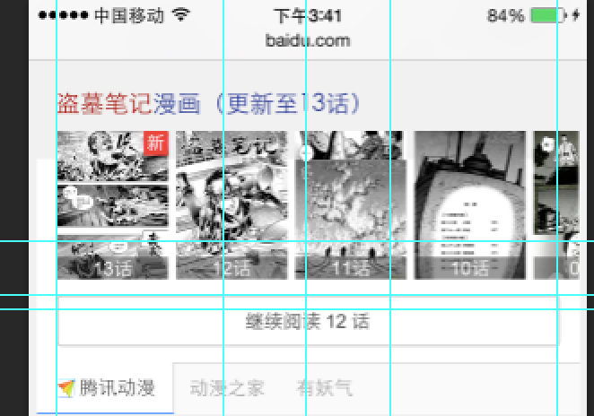

# 李佳隆

> 从2015-12-07到2015-12-11

## 12.30 - 6869数据迁移wise端

### 背景与目标

wise上的召回情况不好,希望给他们补充召回.迁移pc上的数据.包含4个卡,电视剧,综艺,动漫,电影  ,电视剧动漫用同一套模板

### 最终效果截图

### pv

 预计pv50w

### 完成情况

* 电视剧12.9日上线,,动漫下周一上线
* 目前需要重新评估一下电视剧的pv情况,本项目优先级可能会降低,提高漫画项目优先级

## 12.30 - 漫画卡片扩招

### 背景与目标

目前腾讯动漫、有妖气、漫画之家等资源方共提供了上万部作品，其中2000多部是两家或三家资源方都有提供数据的，且随着更多资源方、更多数据的接入，重叠部分预计还会有所上升。考虑到生态、用户偏好等多方面原因，希望能够支持多家资源方共同展现,样式重新设计

### pv

 预计pv 700万左右

### 完成情况

* 本项目优先级提高,今天rd给到环境,下周1介入开发.预计周4提测

### 效果图

## 12.30 - 二手方

### 背景与目标

wise端，暂时并没有相关的特型去满足用户的筛选，用户需进入到房产相关网站去完成一系列动作。而二手房泛需求卡片，就是让用户在百度搜索结果页就完成目标的选择，缩短用户直达实体的路径，从而提升用户体验。

### pv

 预计pv 15万左右

### 完成情况

 资源方已重新提交数据,预计周一给到.周3介入开发,大概是1天得工作量

### 效果图

## 新交互调研

### 背景与目标   

希望能使结果页能够动起来,拥有更多的展现以及交互形式

### 完成情况
* 谷歌中间页新交互demo调整,6s上不卡顿,其他机型没测 [传送门](http://cp01-msg-mcp-web-26.epc.baidu.com:8003/s?word=%E8%A7%81%E9%AC%BC%E6%96%B9%E6%B3%95%E5%8D%83%E4%B8%87%E5%88%AB%E8%AF%95&sa=thr_6&ts=5751547&t_kt=0&rsv_pq=14898917097903175743&ss=101&rsv_sug4=3419&inputT=2804&oq=%E8%AE%A9%E5%AD%90%E5%BC%B9%E9%A3%9E)
* 展示页交互demo(或许会扩展为一种中间页交互) [传送门-打开手机模拟器看](http://lijialong01.fe.baidu.com/newway/newway.html)
* bannar无限横滑demo (后续扩展为无限卡片横滑) [传送门](http://lijialong01.fe.baidu.com/slider/index.html)
