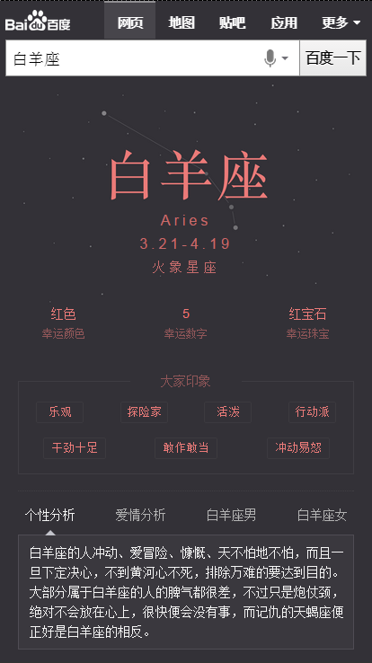
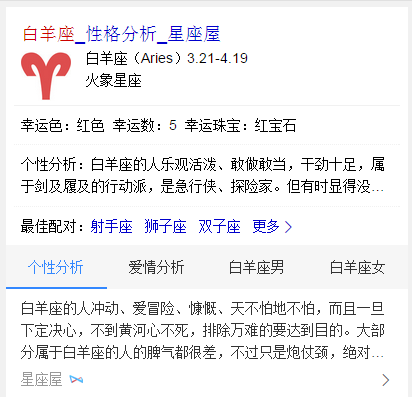
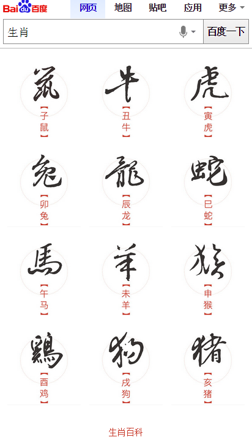
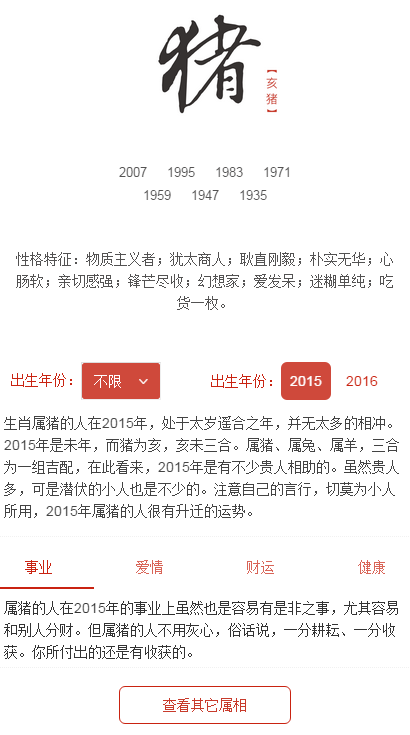

# 常健驰

> 从2015-12-5到2015-12-11

## 单一星座模板开发

### 背景与目标

将原有星座阿拉丁卡片改为sigma形式，增加更多星座信息（性格分析、运势、配对），为用户节省搜索时间。同时提升卡片颜值，提升用户体验。

### 完成情况

`sigma` 模板在 `12月10日` 测试完成，目前存在一些细节问题，预计今天解决一下。 召回query：[白羊座](http://cq01-ala-fe-4.epc.baidu.com:8003/s?word=%E7%99%BD%E7%BE%8A%E5%BA%A7&sa=tb&ts=1444338&t_kt=0&rsv_pq=16477918060565658879&ss=101&t_it=1&rsv_sug4=2468&inputT=1864&oq=%E7%94%9F%E8%82%96%E8%BF%90%E5%8A%BF)

`白卡` 模板在 `12月7日` 完成，经过ue和pm确认在 `12月10日` 测试完成，暂无问题，要求跟sigma同时上线

### 效果截图

* sigma效果

* 白卡效果

## 度秘

### 背景与目标

wise结果同步度秘，度秘访问wise的json接口和度秘对大搜索阿拉丁截图通用展现方案已经完成，
下一步展开阿拉丁模板适配度秘信息模板的映射，以便获得最优展现。度秘为用户提供更优的数据资源，大大提高用户体验

### 完成情况

一共负责8个模版，有5个OK但是客户端不召回（应该是客户端存在问题，普遍都不召回），3个测试环境不召回数据，已告知相关负责人

## 生肖卡片

### 背景与目标

目前无生肖阿拉丁产品，在做竞品分析中，其他搜索产品能对生肖内容有特型展现来满足用户需求；在年底年初之际，用户对生肖query需求较高，所以需生肖卡片，满足这部分用户需求。

根据用户query分析，这部分用户搜索需求主要停留在十二生肖，xx属相，xx属相xx年运势，xx属与xx相配

### 完成情况

`12月9日` 生肖首页完成，具体细节需要跟 `ue-王菲` 对下，`pm-韶增` 介入让先做生肖运势sigma，首页细节等开发完运势的再对下细节问题。

生肖运势 `sigma` 模板 `12月10日` 开始做，遇到数据问题，无法满足需求，后pm改变了卡片展现逻辑，把二维度换成一维度,数据正在修改，预计 `12月11日` 数据修改完成，可以继续开发。

### 效果截图

* 生肖首页卡片截图

* 运势卡片截图

## pm2.5

### 背景与目标

目前线上pm2.5卡片内容过于单一，样式不够优美，需要对卡片进行优化，增加更多信息，丰富卡片内容

### 完成情况

pm2.5 `延期` 先做优先级较高的星座和生肖模板

## 接下来的排期

* 解梦卡片开发，暂无ue图，1230飘红项目
* 星座运势卡卡发，1230飘红项目
* 天气指数-pm2.5卡片开发。
