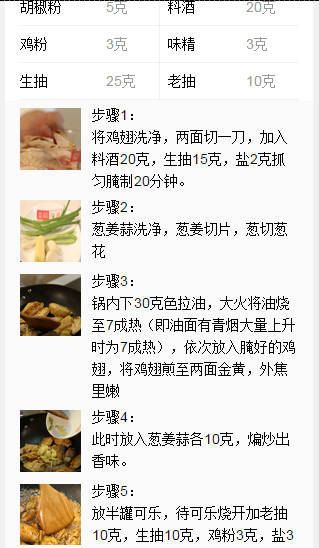
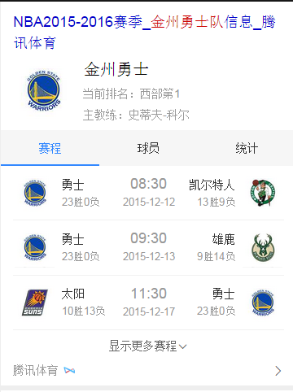
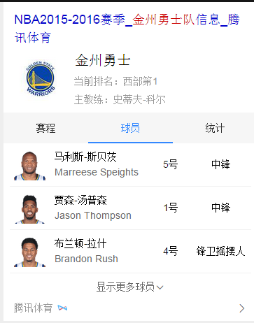
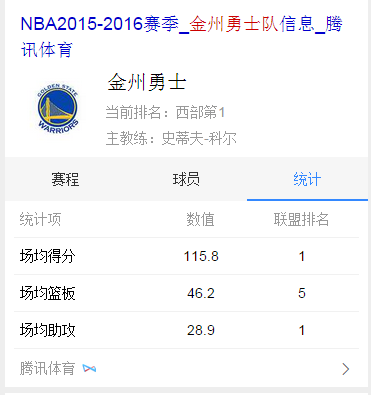
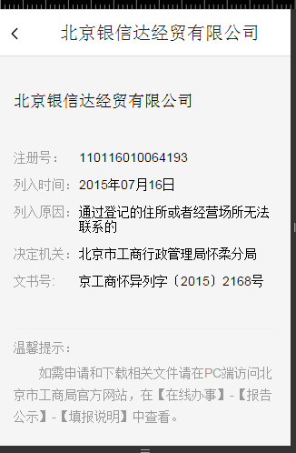
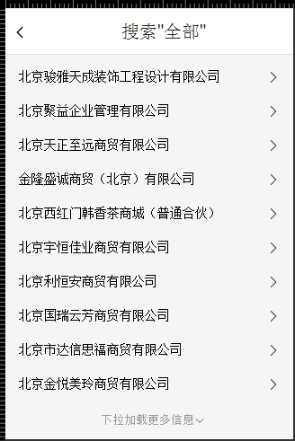
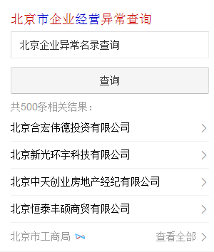
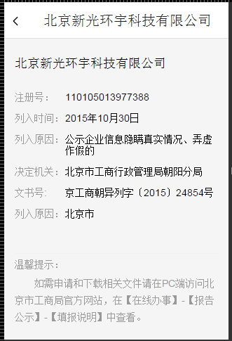
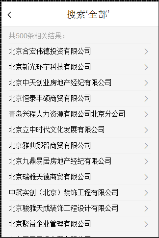
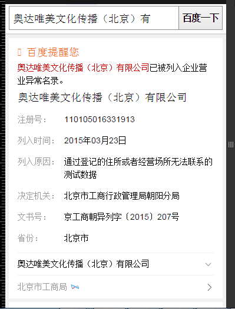

# 李阳阳

> 从2015-12-7到2015-12-11

## 12.1菜谱精确和泛需求

### 背景与目标

针对百度搜索中的一系列菜谱相关的query，提供定制化的阿拉丁，优化现有阿拉丁，更加方便用户找菜谱的相关操作。。

### 完成情况

模板小流量上线，10%的流量，目前的pv是20w，&sid=102600,query="<a href="https://www.baidu.com/from=844b/s?word=%E5%8F%AF%E4%B9%90%E9%B8%A1%E7%BF%85%E7%9A%84%E5%81%9A%E6%B3%95&sa=ts_1&ts=3544046&t_kt=0&ms=1&rsv_pq=4863771742220929058&ss=100&rq=%E5%8F%AF%E4%B9%90%E9%B8%A1%E7%BF%85&rsv_sug4=1226&oq=%E5%8F%AF%E4%B9%90%E9%B8%A1%E7%BF%85&sid=102600">可乐鸡翅的做法</a>"

--这周无工作量

 效果截图

菜谱的精确需求图：

点击制作步骤图：

点击tab相关菜谱图：

菜谱的泛需求图：

 附wise端NBA球队卡

 背景与目标

wise端现有NBA卡片中，未对NBA球队进行覆盖。在球队需求下未有样式满足用户对NBA球队维度的信息获取，为更好的满足并丰富用户获取信，增加对应类型卡片。

### 完成情况

模板12月7号全流量上线，影响PV日均约8w，query="<a href="http://m.baidu.com/#|src_%E9%87%91%E5%B7%9E%E5%8B%87%E5%A3%AB|sa_ib&tn=iphone">金州勇士</a>"

--这周无工作量

 效果截图

球赛tab

球员tab：

统计tab：

 12.1企业异常名录模板

 背景与目标

百度政务之窗一期-政务寻址卡片同北京工商局合作初见成效，现同工商局达成进一步合作，从工商局获得一批北京市企业经营异常名录，可复用线上失信人模板展示这批数据。

 完成情况

唯一答案卡和白卡，以及搜精确异常名录的卡片，初级的已完成，但是pmcheck后，有很多问题，需要调整，大概有功能上的，也有样式上的

吐槽一下：觉得这个卡片真心有些恶心，不是很好搞，mrd图不清晰，一些功能后来加进去，还有ue的标注图也不全乎，里边的滑屏真心不好搞，大哭，打算等12-5号之后完成一些手头的项目，继续开发

--本周唯一答案卡没有工作，白卡和精确卡12-7和12-8号用了两天

 唯一答案卡效果截图

开始搜‘北京市企业异常名录查询’出现

点击：如何移出企业经营异常名录？出现下图浮层：

点击每条的公司名称出现一下浮层：

点击右下角的查看更多，出现一下浮层：

白卡效果截图

开始搜‘北京市企业异常名录查询’出现

点击：查询：

点击每条的公司名称出现一下浮层：

点击右下角的查看更多，出现一下浮层：

精确卡

有好几个时可以点击切换

## 12-25号Wise端政务办事迁移卡片

### 背景与目标

政务wise办事指南类卡片影响面约占政务项目wise端整体影响面的30%。而wise目前没有覆盖到政务办事指南类目，用户对查找服务指南类信息的操作成本高且流程复杂；因此将指南类服务信息在搜索结果页进行聚合，满足用户便捷查询获知的需求。

### 完成情况

还有一个点击电话播出的功能和浮层的功能，样式搭好了，大概还需要一天时间完成

--这周用了两天（12-9,12-10）时间来做

 效果截图（完成情况）

## 度秘数据格式

### 背景与目标

Wise模板中的数据映射到度秘上

### 完成情况

这周大概用了一天的时间搞这个，还有点问题，下午改下，有8个模板，下午除了两个没有召回，其他的应该可以做好

## 接下来的排期

* 做企业聚合卡片。大概需要一天时间

* 彩票的xml已给，等待下步开发

* 节目的今天下班前给xml
