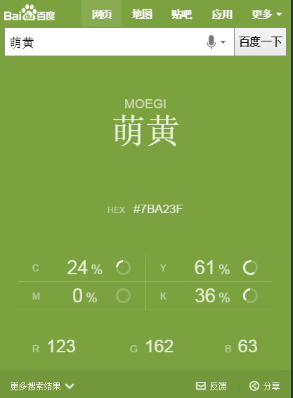
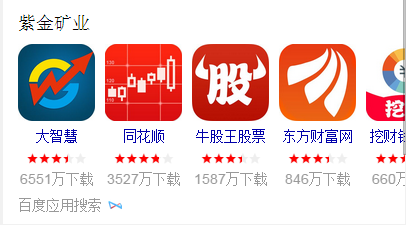

# 谢玲娟

> 2015.11.28 - 2015.12.4

## 【度秘】
### 项目背景
wise结果同步度秘，度秘访问wise的json接口和度秘对大搜索阿拉丁截图通用展现方案已经完成，
下一步展开阿拉丁模板适配度秘信息模板的映射，以便获得最优展现。

### 目标
度秘为用户提供更优的数据资源，大大提高用户体验

### 整体计划及排期
* 一期适配（24个），现有信息模板已经支持的，预计12.7上线
* 二期适配（32个），需要多实体卡片上线后支持的（NA1.1和手百7.1），预计12.14上线
* 三期适配（8个），多实体卡片升级和现有模板调整的（NA和手百的下一个版本，时间待定）

### 本周进度

* 12.15已上线度秘二期确认适配模板

## 【星河项目】
### 项目背景

* 原因：1、头图与明星场景化有重合且形式一致容易引起用户误解；2、头图的肖像权、摄影权无法短期落实到铺量的众明星，可能会引起法务纠纷；3、头部下方推荐内容非需求满足，需要和需求满足部分区分。
    
* 优化内容：去掉明星头图；推荐内容部分背景色由黑变浅灰。

### 本周进度

* 上线情况：12.17已开发完，UE review中。预计12.21上线。

* 效果图：

## 【sigma颜色问答大卡】
### 项目背景
优化搜索颜色类query时的用户体验，例如：“卡其色是什么颜色”“墨绿色是什么颜色”，用全屏颜色+简洁的说明文字的形式来精准满足用户需求，提升搜索产品的“颜值”。样式上采用唯一答案的样式风格。

### 本周进度

* 已评估完，依然三级单中。pv 5w。
* 效果图：

## 【spo问答栅格化】
### 项目背景
针对线上单实体的问答ks_general模板进行栅格化迁移。

### 本周进度

* 提测完成，12.11上线模板。pv300w。
* 效果图：

## 【SPO人物sigma大卡】

### 项目背景
针对问答类的明星类人物卡片的用户潜在推荐需求多维度呈现。

### 本周进度

* 已提测完毕，12.18上线。pv10w。
* 效果图：

## 【春运推荐项目】

### 项目背景
复用星河的模板；针对火车票、机票相关的query导流到春运的sigma模板；运营性质，春节后一个星期下线。

* UE review中。预计周一上线。
* 效果图：

## 下周

### spo诗词问答 todo

### spo多实体问答 todo
