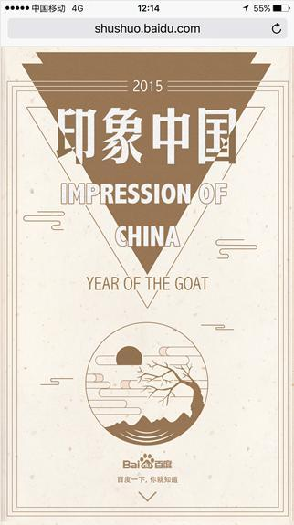
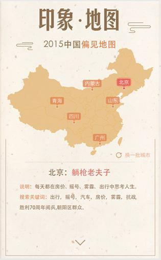
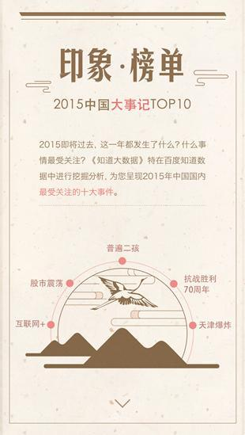
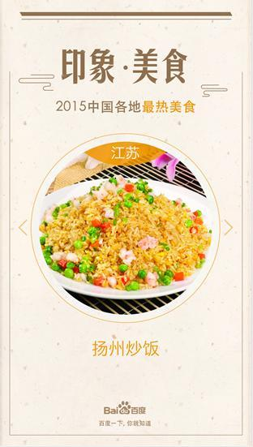

# 【阿拉丁运营方向周报】

> 从2015-12-14到2015-12-18

## <font color="#FF5E19">进行中项目</font>

### <font color="#FF5E19">1. 暴雪运营活动</font>

#### 背景和目标

    暴雪游戏作为全球最为知名的游戏公司之一，旗下众多经典游戏伴随了中国80、90后一代人的成长。

    本次活动以满足用户检索需求为主线，运营与产品紧密配合，进行首页与结果页、PC与WISE的多端联动，在满足用户需求的前提下，打造新型模式，建立具有商业生态的运营产品。提升百度在游戏领域的地位与作用。

#### 效果截图

<table algin="center">
    <tr>
        <td colspan="3"></td>
    </tr> 
    <tr>
        <td colspan="3"></td>
    </tr> 
    <tr>
        <td colspan="3"></td>
    </tr>
    <tr>
        <td colspan="3"></td>
    </tr> 
    <tr>
        <td ></td>
        <td ></td>
        <td ></td>
    </tr>
    <tr>
        <td ></td>
        <td ></td>
        
    </tr>  
</table>

#### 完成情况

- **PC && wise中间页**：剩余一些样式的修改和浏览器的兼容调试（`@黎明`）

- **WISE sigma卡片**：资源配置完成，进入开发截断...（`@黎明`）

- **PC 通栏**：本周五（12/4）完成开发（`@王培`）

#### 预览地址

- PC预览地址：http://st01-spi-lileding2.st01.baidu.com:8000/pae/component/page/baoxueactive

- PC通栏预览地址：https://alahttps.baidu.com/s?tn=tpldev&dev_workspace=platform&dev_tpl=top_wow&dev_online=0&dev_module=dev-aladdin&dev_file=default.xml&dev_fileformat=xml&dev_pos=topResult&wd=%E9%AD%94%E5%85%BD%E4%B8%96%E7%95%8C

### <font color="#FF5E19">2. 圣诞节wise中间页（已提测）</font>

#### 背景与目标

```
营造圣诞节日氛围，给用户惊喜，聚合百度各产品线圣诞活动。
```

#### 效果截图


#### 完成情况

- 开发中，预计下周五（12/18）完成并提测（`@王培`）

- 预览地址：http://fedev.baidu.com/~wangpei07/mc/index.html

    
### <font color="#FF5E19">3. 五元新校设pc通栏（模板已上线）</font>

#### 背景与目标

```
百度携手希望工程，病联合五位顶尖建筑设计师，根据孩子们的需求设计校舍，并接入百度技术。发起的众筹活动。
```

#### 效果截图


#### 完成情况

- 模板已上线，暂无线上资源

- 预览地址：https://alahttps.baidu.com/s?tn=tpldev&dev_workspace=platform&dev_tpl=top_comm_showcase&dev_online=0&dev_module=dev-aladdin&dev_file=default.xml&dev_fileformat=xml&dev_pos=topResult&wd=%E4%BA%94%E5%85%83%E6%96%B0%E6%A0%A1%E8%88%8Dnew

### <font color="#FF5E19">4.圣诞节sigma升级</font>

#### 背景与目标

```
结合圣诞节活动，为圣诞节中间页导流的sigma。
```

#### 完成情况

- PV：暂无

- 状态：

    - 模板升级完成（计划今天 12/18 15:00模板上线）（`@王培`）

- 预览地址：http://cp01-ps-fe-11.epc.baidu.com:8003/s?word=%E8%B0%81%E4%B9%9F%E4%B8%8D%E5%A5%BD%E6%90%9C%E4%B8%8D%E7%9F%A5%E9%81%93%E7%9A%84%E9%9B%AA&ts=5425068&t_kt=538&rsv_iqid=2175892084767207320&sa=ihr_1&rsv_sug4=1069&ss=001
    
#### 效果截图

 


### <font color="#FF5E19">5. 印象中国：年终盘点</font>

#### * 背景和目标
相比春节用户主要聚焦在团聚、传统、红包，元旦前后，跨年之际更适合对全年进行盘点，来引导用户回顾2015。从各地区搜索top榜看各地区差异。挖掘趣味对比，吸引网民关注，同时侧面传递百度服务全国网民的概念。

#### * 效果图

<table algin="center">
    <tr>
        <td ></td>
        <td ></td>
        <td ></td>
    </tr>
    <tr>
        <td ></td>
        <td ></td>
    </tr>  
</table>

#### * 完成进度

已输出UE图，正在开发，预计下周四完成。（`@陈锐`）

#### * 影响面

无  


## <font color="#9AB6EF">无更新项目</font>

### <font color="#9AB6EF">1. 春运抢票运营活动（无更新）</font>

#### 背景和目标
    临近春运，越来越多的用户有抢火车票的需求，为了满足这部分用户的需求，培养用户在百度买火车票的习惯，并且带来一定的GMV收益，我们紧急上线了一个抢票运营活动。

    卡片上只做用户出发地、目的地和出发时间收集，抢票过程在携程完成。
    
    覆盖8个query：抢票、云抢票、抢火车票、春运抢票、手机抢票、火车票抢票、百度抢票、百度云抢票，所有推广资源导到这8个query上。


#### 效果截图

<table algin="center">
    <tr>
        <td></td>
        <td></td>
    </tr>
</table>


#### 完成情况

本周进行改版，添加了福利导流banner，更新了中奖名单页（`@陈锐`）

#### 影响面

PV 4w，提交订单 1000

### <font color="#9AB6EF">2. 明星人物运营项目二期（无更新）</font>

#### 背景与目标

```
1、背景：为了更加突出明星人物的时效性，丰富模板应用场景，提升用户体验。

2、目标：
    
    1) 在明星人物模板原有的基础上，在Banner部分“个人信息区域”添加最新动态和祈福两个新功能
    
    2) 卡片时间轴状态下，由之前的新闻标题显示3条、更多可上下滑动——改为：最多显示4条，取消滑动功能
    
    3) 增加白卡样式
```
#### 效果截图

<table algin="center">
<tr>
<td></td>
<td></td>
</tr>
<tr>
<td></td>
<td></td>
</tr>
<tr>
<td colspan="2"></td>
</tr>
<tr>
<td colspan="2"></td>
</tr>
<tr>
<td colspan="2"></td>
</tr>
</table>

#### 完成情况

- sigma基本样式开发已完成（`@王培`）

- 白卡样式开发完成（`@王培`）


## <font color="#9E5E83">运营项目开发改进进度</font>

- 本周完成 WISE中间页的 统计 log.js 和 分享 share.js 功能 (基于朱雷的 share 组件)，后期考虑和 PC 的统一。

- 添加一条：旧的运营模版的迁移（常用的  cjgeneral 和 generalevent，目前维护修改成本较高）

- 列表

<table>
    <tr>
        <td>序号</td><td>类别</td><td>任务名</td><td>负责人</td><td>进度</td>
    </tr>
    <tr>
        <td>1</td><td>base模板</td><td>顶部通栏c_base_top</td><td>浪波</td><td>思考中...</td>
    </tr>
    <tr>
        <td>2</td><td>base模板</td><td>运营基类模板c_base_optl</td><td>陈锐</td><td>根据后续的需求和形式再定</td>
    </tr>
    <tr>
        <td>3</td><td>运营模板</td><td>旧的运营模版迁移</td><td>王培</td><td>待定</td>
    </tr>
    <tr>
        <td>3</td><td>运营模板</td><td>通用浮层模板</td><td>陈锐</td><td>已完成浮层导流模板，后续基于此模版改进</td>
    </tr>
    <tr>
        <td>4</td><td>中间页</td><td>PC/WISE统计</td><td>陈锐</td><td>2015-12-18</td>
    </tr>
    <tr>
        <td>5</td><td>中间页</td><td>PC/WISE登录</td><td>陈锐</td><td>2015-12-18</td>
    </tr>
    <tr>
        <td>6</td><td>运营组件</td><td>动画效果库优化</td><td>陈锐</td><td>2015-12-31</td>
    </tr>
    <tr>
        <td>7</td><td>平台</td><td>用户登录和统计</td><td>小琴</td><td>2015-12-15</td>
    </tr>
    <tr>
        <td>8</td><td>平台</td><td>实现平台测速</td><td>小琴</td><td>平台二期</td>
    </tr>
    <tr>
        <td>9</td><td>平台</td><td>运营项目预览平台</td><td>小琴</td><td>平台二期</td>
    </tr>
    <tr>
        <td>10</td><td>平台</td><td>中间页开发整合到平台</td><td>小琴</td><td>平台二期</td>
    </tr>
</table>
    
## <font color="#9E5E83">Legend体验总结及建议</font>

地址：<a href="http://legend.baidu.com/list" target="_blank">点这里</a>

通过对Legend的总体体验发现，Legend能够快速便捷的开发页面，支持动画、表单等多重组件，优点众多。
    
但是，同时也存在着许多不利于开发的缺点。例如：    
    
1. 不支持单屏滑动
        
2. 不利于模板复用

3. 示例多但无效果简介和分类

4. 不支持在线代码修改和编辑

5. 不支持文案可配

6. 不方便日志统计 

7. 不兼容pc 等
        
因此，为提高中间页开发效率，建议以百度H5为原型开发一套中间页开发平台（以最简单的形式，建议重新开发，感觉Legend有点弱）,并希望平台支持以下几点需求：
        
1. 兼容pc

2. 支持用户登录

3. 模板分类管理，方便复用

4. 有基础动画，并支持动画效果添加（添加后其他人可以使用）

5. 支持通过修改代码进行编辑（同时满足组件拖拽功能），可以先通过拖拽生成基本代码，然后在代码的基础上进行修改

6. 支持文案可配置（xml）

7. 可以添加日志统计（可通过选择是否添加日志统计，并可配置统计参数）
        
8. 所有涉及的静态文件（如动画效果js等）可以同步到结果页（结果页可通过amd方式，中间页引入相关js即可）

9. 支持中间页上线，方式可选


