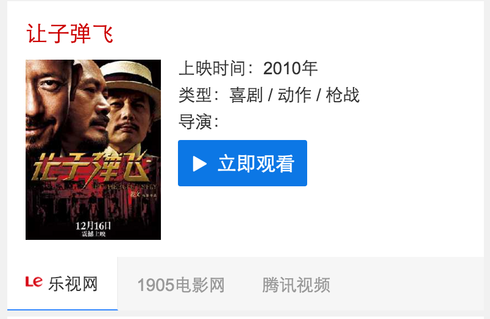

# 李佳隆

> 从2015-12-11到2015-12-18

## 12.30 - 6869数据迁移wise端

### 背景与目标

wise上的召回情况不好,希望给他们补充召回.迁移pc上的数据.包含4个卡,电视剧,综艺,动漫,电影  ,电视剧动漫用同一套模板

### 最终效果截图

### pv

 预计pv50w

### 完成情况

* 电视剧12.9日上线,,动漫12.15日上线
* 综艺,电影预计下周3上线

## 12.30 - 漫画卡片扩招

### 背景与目标

目前腾讯动漫、有妖气、漫画之家等资源方共提供了上万部作品，其中2000多部是两家或三家资源方都有提供数据的，且随着更多资源方、更多数据的接入，重叠部分预计还会有所上升。考虑到生态、用户偏好等多方面原因，希望能够支持多家资源方共同展现,样式重新设计

### pv

 预计pv 700万左右

### 完成情况

* 开发完毕,预计下周1模板上线

### 效果图

## 12.30 - 二手房

### 背景与目标

wise端，暂时并没有相关的特型去满足用户的筛选，用户需进入到房产相关网站去完成一系列动作。而二手房泛需求卡片，就是让用户在百度搜索结果页就完成目标的选择，缩短用户直达实体的路径，从而提升用户体验。

### pv

 预计pv 15万左右

### 完成情况

 原计划是周3介入开发,周5上线,不过数据delay了1天,周4才介入开发,目前正在走单,本周上线有风险,可能会延迟到下周1

### 效果图

## 新交互调研

### 背景与目标   

希望能使结果页能够动起来,拥有更多的展现以及交互形式

### 完成情况
持续跟进,暂无更新

## 下周计划

* 上线12.30项目模板
