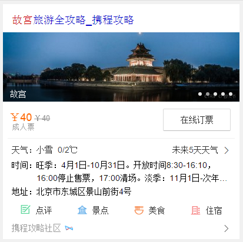

# 李晓

> 从2015-12-14到2015-12-18

## 1、旅游 - 目的地景点卡片优化

### 背景

* 原有目的地/景点改版

### 完成情况

* 涉及模板travel_strategy，11.20日模板上线，影响面约100W;

* 11.24上午小流量上线, 实验组（10%）：对照组（10%），

* 实验结论尚未产出

### 覆盖query

* 国内景点，如：故宫、天安门广场

### 效果截图

### 后续计划

* 原城市旅游卡片wise_city_travel，按照此策略做相应的交互、样式方面的升级。

## 2、旅游 - 城市卡片优化

### 背景

* 原城市卡片样式升级改版，介入更多资源方扩大召回

### 完成情况

* 升级模板wise_city_travel，11.27日模板上线，全量影响面约200W，

* 12/7下午小流量上线，小流量周期为12/7-12/16，实验组（5%）：对照组（5%），小流量前三天固定第三位，三天后放开点调。

* 实验结论尚未产出

### 覆盖query

* 国内外城市

### 线上效果

* [北京旅游](https://m.baidu.com/ssid=c1c6737465706879777531313235e339/from=844b/s?word=%E5%8C%97%E4%BA%AC%E6%97%85%E6%B8%B8&sid=102393)

### 效果截图

### 后续计划

* 细分强弱样式，根据query点击调权的展现位置，触发不同的强弱样式形态。

## 3、人物 - 粉丝场景化

### 背景

* 为更好地支持场景化的触发，方便pm更快铺量更好干预，与后端rd统一商定迁移为mini机制

* 为更好地视觉体验，新增沉浸式样式

* 为支持团购商品需求——电影《老炮儿》首映礼票务团购，模板需增加活动区域模块

### 完成情况

* 升级模板wise_scene_person_kv，12.02日模板上线，12.04日数据切换为mini机制，影响面约125W;

* 沉浸式样式升级，并支持头部颜色可配置,12.10日模板已上线

* 头部文字描述支持可跳转，增加活动区域入口；增加活动区域模块，12.11日模板上线

* 12.11上午沉浸式样式小流量上线，仍保持90%生效，其中10%生效人群识别策略，覆盖人数12人，影响面150w/天

### 覆盖query

* 鹿晗，迪丽热巴，杨洋，郑爽，李易峰，杨幂

### 线上效果

* [吴亦凡](https://www.baidu.com/ssid=8a3d73746172c3f7d0c773746172fc4b/from=844b/s?word=%E5%90%B4%E4%BA%A6%E5%87%A1&sa=tb&ts=8665908&t_kt=0&ms=1&rsv_pq=6932049557572375983&ss=101&t_it=1&rsv_sug4=3221&inputT=2313&oq=%E7%8E%8B%E6%BA%90)

### 效果截图

* 唯一答案

### 后续计划

* “天使之翼”格瓦拉下滑样式实验

## 4、todo

### 旅游
1. 主题泛需求旅游
1. 旅游工具百宝箱

### 人物
1. 粉丝场景化，“天使之翼”格瓦拉下滑样式实验
1. 我是歌手人物联动卡片

### 图片
1. 图片沉浸式体验

### 股票
1. 股票泛需求-板块指数卡片

## 5、开发心得交流总结

1. 评审时尽量把各个【schema确定，开发，联调，测试，上线】时间点敲定，如需走单或数据评估在排期中也体现出整体并邮件出来， pm能及时check每个环节，并推进完成；
1. Xml示例务必尽量详细，图片所需要的原始尺寸在注释中写明;
1. 上线时间点的把控，尽量上线的前一天跟pm确认好效果，给自己预留一天得时间，需要的三级单什么的也提前走完，改动较多的模板务必早发cr;
1. 改动较多的模板尽量早发cr
1. Ue初稿反馈大致排期，Ue定稿后反馈整体排期
1. 手百下的问题收集@刘泉有，pm接口同学统一反馈手百修复。
