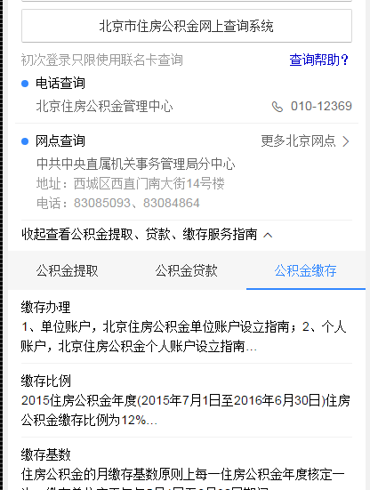
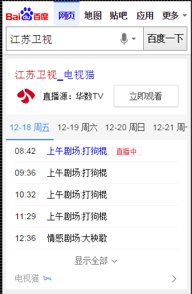
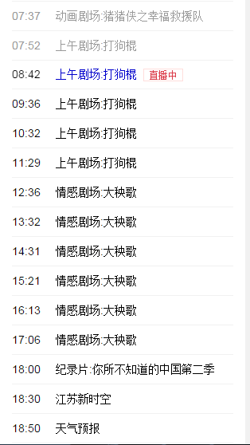
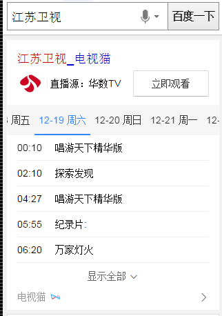
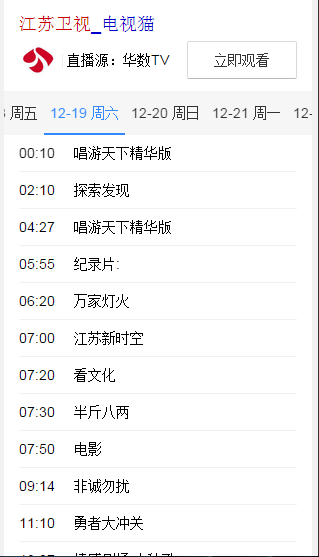
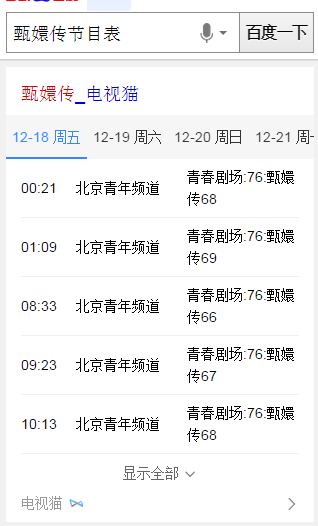
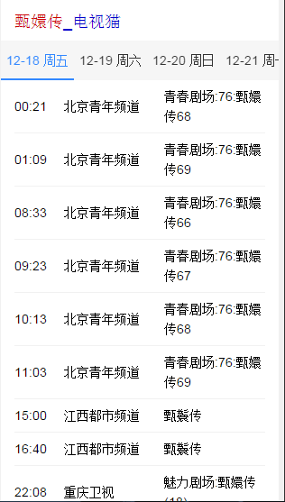

# 李阳阳

> 从2015-12-14到2015-12-18

## 12.25 Wise端政务办事迁移卡片

### 背景与目标

政务wise办事指南类卡片影响面约占政务项目wise端整体影响面的30%。而wise目前没有覆盖到政务办事指南类目，用户对查找服务指南类信息的操作成本高且流程复杂；因此将指南类服务信息在搜索结果页进行聚合，满足用户便捷查询获知的需求。

### 完成情况

模板基本完事了，有一个问题还需要处理，就是资源方提过来的title的链接是pc的，没有wise的，需要模板里转一下，这个资源方应该今天把数据再提一版正确的数据，再小处理一下，就可以提测了，大概下周一提测

<!--本周只是调了下小样式，大概用了半天-->

 效果截图

 12-25号 电视节目类的卡片

 背景与目标

现有wise端节目单资源，线上需求满足低、展现样式弱、文字遮挡问题严重，通过最近调研情况，我们卡片在内容丰富程度，展现效果及时效性上，都与竞品有很大差距，根据用户阅读和使用习惯，需要对节目单整体进行优化，主要侧重点在“直播”需求满足及丰富节目单“内容”两方面，预期新节目每天Pv>40w，同比增长15%，通过满足用户直播需求上，极致提升用户体验，赶超竞品。

 完成情况

目前频道精准需求和节目精准需求模板已发开完成，今天应该可以提测，电视节目泛需求和电视台泛需求还在搞，大概今天可以搞完，最晚周一搞完

 频道精确需求效果截图

 节目精确需求效果截图

## 接下来的排期

* 搞节目的泛需求的两个卡片，大概一天搞完

* 修改企业异常名录的样式和存在的bug

