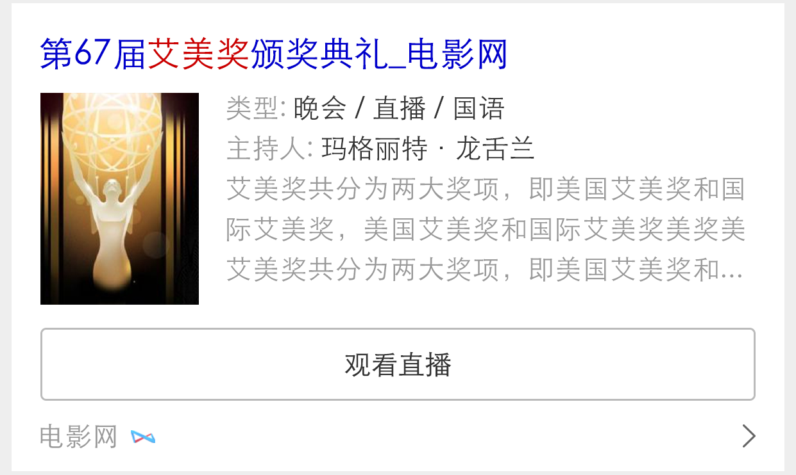
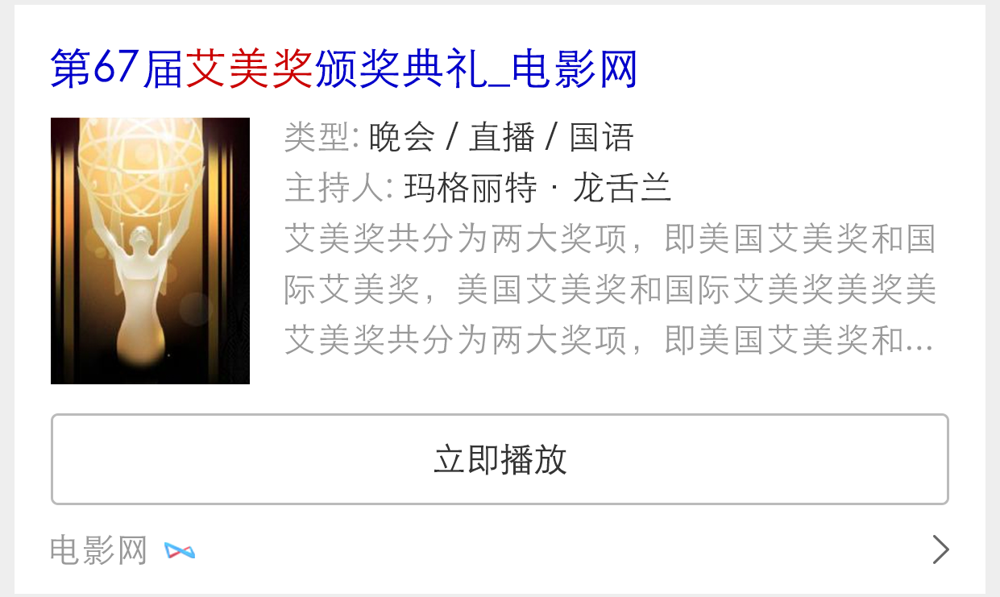

# 【阿拉丁运营方向周报】

> 从2015-12-20到2015-12-25


## <font color="#FF5E19">进行中项目</font>


### <font color="#FF5E19">1. 暴雪运营活动</font>


#### 背景和目标

    暴雪游戏作为全球最为知名的游戏公司之一，旗下众多经典游戏伴随了中国80、90后一代人的成长。

    本次活动以满足用户检索需求为主线，运营与产品紧密配合，进行首页与结果页、PC与WISE的多端联动，在满足用户需求的前提下，打造新型模式，建立具有商业生态的运营产品。提升百度在游戏领域的地位与作用。

#### 效果截图

<table >
    <tr>
        <td colspan="6"></td>
                
    </tr> 
    <tr>
        <td colspan="2"></td>
        <td colspan="2"></td>
        <td colspan="2"></td>
    </tr> 
    <tr>
        <td ></td>
        <td ></td>
        <td ></td>
        <td ></td>
        <td ></td>
    </tr>
    <tr>
        <td ></td>
        <td ></td>
        <td ></td>
        <td ></td>
        
    </tr>
     
</table>

#### 完成情况

- **<font color="#B9AB26" size="3px">【PC && wise中间页】</font>**：测试完成，预计今天模板上线（`2015/12/25`）（`@黎明`）

- **<font color="#B9AB26" size="3px">【WISE sigma卡片】</font>**：模板已提测（`@黎明`）

- **<font color="#B9AB26" size="3px">【PC 通栏】</font>**：模板已上线，预计`2015/12/28`上线资源（`@王培`）

#### 预览地址

- 中间页：<a href="http://st01-spi-lileding2.st01.baidu.com:8000/pae/component/page/baoxueactive" target="_blank">预览PC中间页</a>

- Wise sigma：<a href="http://cp01-msg-mcp-web-27.epc.baidu.com:8003/s?word=%E6%98%9F%E9%99%85%E4%BA%89%E9%9C%B82" target="_blank">预览wise sigma</a>

- PC通栏预览地址：<a href="https://alahttps.baidu.com/s?tn=tpldev&dev_workspace=platform&dev_tpl=top_wow&dev_online=0&dev_module=dev-aladdin&dev_file=default.xml&dev_fileformat=xml&dev_pos=topResult&wd=%E9%AD%94%E5%85%BD%E4%B8%96%E7%95%8C" target="_blank">预览PC通栏</a>

### <font color="#FF5E19">2. 圣诞节wise中间页（已上线）</font>

#### 背景与目标

```
营造圣诞节日氛围，给用户惊喜，聚合百度各产品线圣诞活动。
```

#### 效果截图


#### 完成情况

- 项目已上线（`@王培`）

- 预览地址：<a href="http://m.baidu.com/static/search/ala/yunyingtt/yinxiangchina.html?refer=wise&ssid=8634446561725f546561724d6973734325&from=0&uid=0&pu=usm@5,sz@1320_2001,ta@iphone_1_8.0_3_600&bd_page_type=1&baiduid=B5F9E5D6273302ED4A5812FF3265FA29&tj=3xU_1_0_10_b1" target="_blank">预览</a>

#### 预览地址

- 暂无线上预览地址

### <font color="#FF5E19">3.圣诞节sigma升级（已上线）</font>

#### 背景与目标

```
结合圣诞节活动，为圣诞节中间页导流的sigma。
```

#### 完成情况

- PV：暂无

- 状态：

    - 已上线（`@王培`）

- 预览地址：<a href="https://m.baidu.com/ssid=8634446561725f546561724d6973734325/s?word=%E5%9C%A3%E8%AF%9E%E8%8A%82&ts=6816666&t_kt=0&rsv_iqid=2394689866967634412&rsv_t=468ah2Tz2Q4pizmBhw%252Fp%252FbbRQ85A1BEIKunpGaurebdVo2p1epk5&sa=ihr_1&rsv_pq=2394689866967634412&rsv_sug4=1254&ss=001" target="_blank">预览</a>
    
#### 效果截图

 

### <font color="#FF5E19">4. 印象中国：年终盘点</font>

#### 背景和目标
相比春节用户主要聚焦在团聚、传统、红包，元旦前后，跨年之际更适合对全年进行盘点，来引导用户回顾2015。从各地区搜索top榜看各地区差异。挖掘趣味对比，吸引网民关注，同时侧面传递百度服务全国网民的概念。

#### 效果图

<table algin="center">
    <tr>
        <td ></td>
        <td ></td>
        <td ></td>
        <td ></td>
        <td ></td>
    </tr>  
</table>

#### 完成进度

- 状态：本周完成开发和测试，下周一（12/28）上线（`@陈锐`）

- 预览地址：<a href="http://cp01-ps-fe-11.epc.baidu.com:8088/static/share/guest/impress/index.html" target="_blank">预览</a>

#### 影响面

无  

    
### <font color="#FF5E19">5. 长视频运营项目（白卡样式）</font>

#### 背景与目标

```
wise直播视频模版唯一答案卡片在搜索结果出现 “ 推广广告 ” 时，会退化成唯一答案弱展现样式。
```

#### 完成情况

- PV：预估2W

- 状态：`模板周二（2015/12/22）模板已上线`

#### 效果图

<table algin="center">
<tr>
<td></td>
<td></td>
<td></td>
</tr>
</table>

#### 预览地址

- 暂无线上预览地址


### <font color="#FF5E19">6. 明星人物运营项目二期（白卡样式模板已上线）</font>
#### 背景与目标

```
1、背景：为了更加突出明星人物的时效性，丰富模板应用场景，提升用户体验。

2、目标：
    
    1) 在明星人物模板原有的基础上，在Banner部分“个人信息区域”添加最新动态和祈福两个新功能
    
    2) 卡片时间轴状态下，由之前的新闻标题显示3条、更多可上下滑动——改为：最多显示4条，取消滑动功能
    
    3) 增加白卡样式
```

#### 完成情况

- sigma基本样式开发已完成

- 白卡样式模板已上线

#### 效果图

<table algin="center">
<tr>
<td></td>
<td></td>
<td></td>
<td></td>
</tr>
<tr>
</tr>
<tr>
<td colspan="2"></td>
<td colspan="2"></td>
</tr>
</table>


## <font color="#9AB6EF">无更新项目</font>

### <font color="#9AB6EF">1. 春运抢票运营活动（无更新）</font>

#### 背景和目标
    临近春运，越来越多的用户有抢火车票的需求，为了满足这部分用户的需求，培养用户在百度买火车票的习惯，并且带来一定的GMV收益，我们紧急上线了一个抢票运营活动。

    卡片上只做用户出发地、目的地和出发时间收集，抢票过程在携程完成。
    
    覆盖8个query：抢票、云抢票、抢火车票、春运抢票、手机抢票、火车票抢票、百度抢票、百度云抢票，所有推广资源导到这8个query上。


#### 效果截图

<table algin="center">
    <tr>
        <td></td>
        <td></td>
    </tr>
</table>


#### 完成情况

本周进行改版，添加了福利导流banner，更新了中奖名单页（`@陈锐`）

#### 影响面

PV 4w，提交订单 1000

### <font color="#9AB6EF">2. 五元新校设pc通栏（模板已上线）</font>

#### 背景与目标

```
百度携手希望工程，病联合五位顶尖建筑设计师，根据孩子们的需求设计校舍，并接入百度技术。发起的众筹活动。
```

#### 效果截图


## <font color="#9E5E83">运营项目开发改进进度</font>

- 本周完成 WISE中间页的 统计 log.js 和 分享 share.js 功能 (基于朱雷的 share 组件)，后期考虑和 PC 的统一。

- 添加一条：旧的运营模版的迁移（常用的  cjgeneral 和 generalevent，目前维护修改成本较高）

- 列表

<table>
    <tr>
        <td>序号</td><td>类别</td><td>任务名</td><td>负责人</td><td>进度</td>
    </tr>
    <tr>
        <td>1</td><td>base模板</td><td>顶部通栏c_base_top</td><td>浪波</td><td>思考中...</td>
    </tr>
    <tr>
        <td>2</td><td>base模板</td><td>运营基类模板c_base_optl</td><td>王培</td><td>和浪波沟通中</td>
    </tr>
    <tr>
        <td>3</td><td>运营模板</td><td>旧的运营模版迁移</td><td>王培</td><td>待定</td>
    </tr>
    <tr>
        <td>3</td><td>运营模板</td><td>通用浮层模板</td><td>陈锐</td><td>已完成浮层导流模板，后续基于此模版改进</td>
    </tr>
    <tr>
        <td>4</td><td>中间页</td><td>PC/WISE统计</td><td>陈锐</td><td>2015-12-18</td>
    </tr>
    <tr>
        <td>5</td><td>中间页</td><td>PC/WISE登录</td><td>陈锐</td><td>2015-12-18</td>
    </tr>
    <tr>
        <td>6</td><td>运营组件</td><td>动画效果库优化</td><td>陈锐</td><td>2015-12-31</td>
    </tr>
    <tr>
        <td>7</td><td>平台</td><td>用户登录和统计</td><td>小琴</td><td>2015-12-15</td>
    </tr>
    <tr>
        <td>8</td><td>平台</td><td>实现平台测速</td><td>小琴</td><td>平台二期</td>
    </tr>
    <tr>
        <td>9</td><td>平台</td><td>运营项目预览平台</td><td>小琴</td><td>平台二期</td>
    </tr>
    <tr>
        <td>10</td><td>平台</td><td>中间页开发整合到平台</td><td>小琴</td><td>平台二期</td>
    </tr>
    <tr>
        <td>11</td><td>中间页</td><td>WISE中间页的 统计 log.js 和 分享 share.js</td><td>陈锐</td><td>已完成</td>
    </tr>
</table>
    

