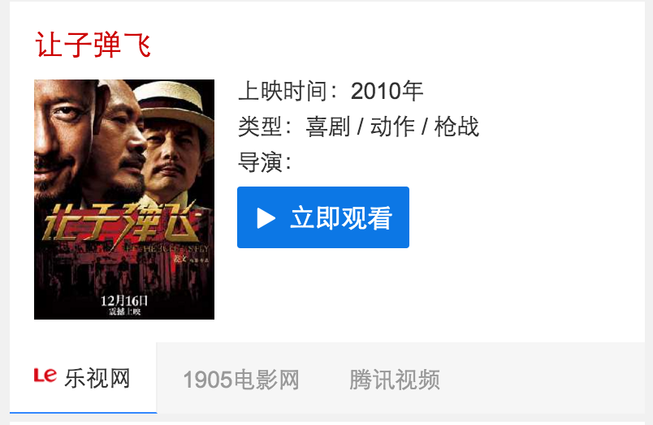
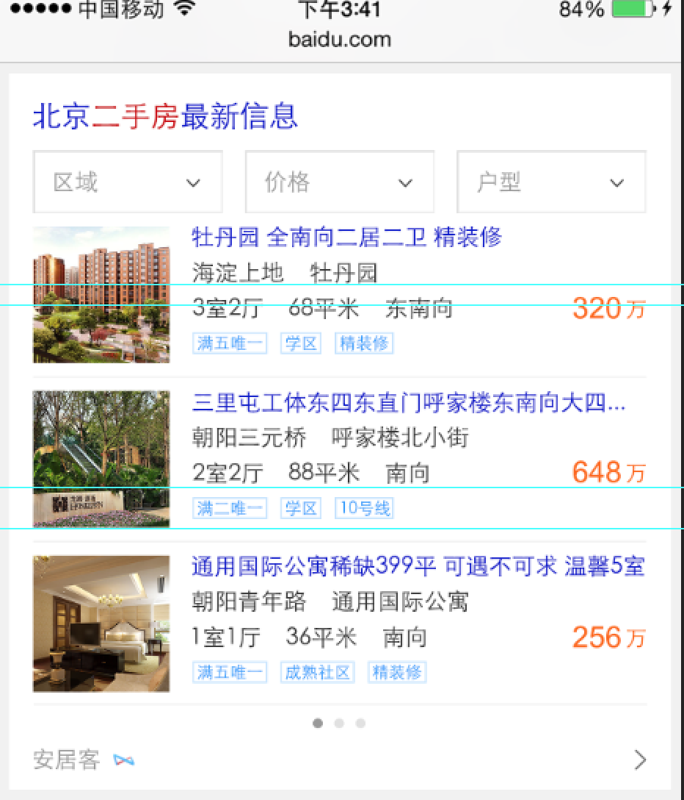
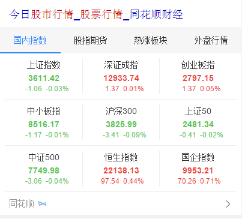
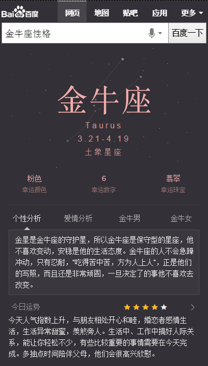
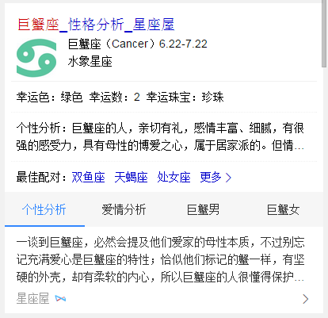
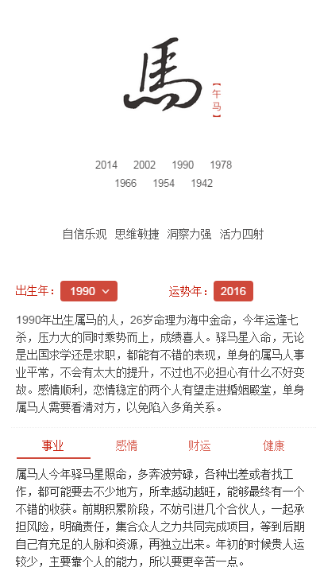
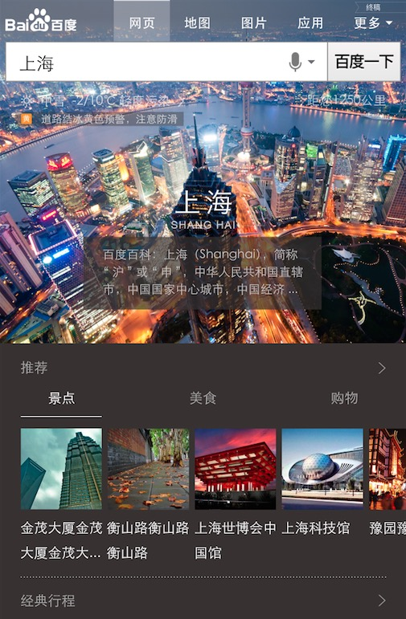
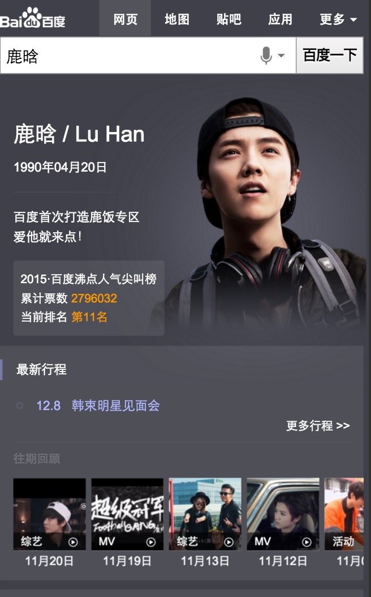

# 【阿拉丁产品方向周报】

> 从2015-12-21到2015-12-25

## 12.30 - 6869数据迁移wise端

### 背景与目标

wise上的召回情况不好,希望给他们补充召回.迁移pc上的数据.包含4个卡,电视剧,综艺,动漫,电影  ,电视剧动漫用同一套模板

### 最终效果截图




### pv

 <span style="color:blue;">预计pv50w</span>

### 完成情况

* <span style="color:red;">电视剧12.9日上线,,动漫12.15日上线,综艺12.20日上线,电影12.23日上线</span>
* <span style="color:red;">迁移完毕<span>


## 12.30 - 漫画卡片扩招

### 背景与目标

目前腾讯动漫、有妖气、漫画之家等资源方共提供了上万部作品，其中2000多部是两家或三家资源方都有提供数据的，且随着更多资源方、更多数据的接入，重叠部分预计还会有所上升。考虑到生态、用户偏好等多方面原因，希望能够支持多家资源方共同展现,样式重新设计

### pv

 <span style="color:blue;">预计pv 700万左右</span>

### 完成情况

* <span style="color:red;">模板于12.20日上线<span>

### 效果图


## 12.30 - 二手房

### 背景与目标

wise端，暂时并没有相关的特型去满足用户的筛选，用户需进入到房产相关网站去完成一系列动作。而二手房泛需求卡片，就是让用户在百度搜索结果页就完成目标的选择，缩短用户直达实体的路径，从而提升用户体验。

### pv

 <span style="color:blue;">预计pv 15万左右</span>

### 完成情况

 <span style="color:red">模板于12.23日上线</span>

### 效果图



## 音乐融合-影视原声带

### 项目背景

```
1、背景：辐射垂直行业，覆盖影视类歌曲需求，如花千骨歌曲，琅琊榜插曲等
```

### 完成情况

- 前端模板已于12月23号上线


## 音乐沉浸式体验

### 背景

- 探索音乐作为工具化的方向，将音乐作为插件，在明星沉浸式页面、音乐泛需求页面下展现，测试用户的使用情况，预期提升用户浏览体验，提升用户停留时长。

### 完成情况

- 前端模板已于12月23号上线，icon入口效果不明显，24号修改了一版icon样式并上线完成

-实验组对照组各取 50%小流量 实验组资源号9008，sid=102904；对照组资源号6010，sid=102905。实际影响面约30w。query:好听的歌

### 效果截图


## 歌词反查

### 背景

- 优化线上样式（kv、仅百度音乐），走mini机制能够扩大召回，增加多资源方丰富资源

### 完成情况

- 12月23号开发完成，并通过pm、UE确认，24号开始测试，目前基本测试完成。

## 场景化接糯米资源之图片问题

### 背景

- 糯米资源图片不能提供方图，并且图片尺寸可能有好几种，目前前端实现是流式布局，必须图片尺寸按要求才行。

### 解决方案

调研两种方案：1、通过css使图片居中；2、通过TIMG服务在线裁剪图片。产生两个对应的demo，通过和黎昀确认需要走第二种方案。

方案2可以通过timg的size参数来裁剪方图，只需传fX_X即可，X是对应的方图宽度；ae需要支持sec和di，已经推荐晓炜、晓晖、宽哥支持。

## 创新项目之模板组件化

### 背景

- 推行模板组件化，能够在场景化、sigma卡片、2号项目中复用

### 进展

- 场景话头图开始设计，月底评审；图片list、左图右文模板组件开始设计开发，月底评审。

- 2号项目也在抽离


## 1、旅游 - 目的地景点卡片优化

### 背景

* 原有目的地/景点改版

### 完成情况

* 涉及模板travel_strategy，11.20日模板上线，影响面约100W;

* 11.24上午小流量上线, 实验组（10%）：对照组（10%），

* <span style="color:red">评估结论为持平</span>

### 覆盖query

* 国内景点，如：故宫、天安门广场

### 效果截图


### 后续计划

* <span style="color:red">资源方ready转全流量。</span>


## 2、旅游 - 城市卡片优化

### 背景

* 原城市卡片样式升级改版，介入更多资源方扩大召回

### 完成情况

* 升级模板wise_city_travel，11.27日模板上线，全量影响面约200W，

* 12/7下午小流量上线，小流量周期为12/7-12/16，实验组（5%）：对照组（5%），小流量前三天固定第三位，三天后放开点调。

* <span style="color:red">实验结论尚未产出</span>

### 覆盖query

* 国内外城市

### 线上效果

* [北京旅游](https://m.baidu.com/ssid=c1c6737465706879777531313235e339/from=844b/s?word=%E5%8C%97%E4%BA%AC%E6%97%85%E6%B8%B8&sid=102393)

### 效果截图


### 后续计划

* 细分强弱样式，根据query点击调权的展现位置，触发不同的强弱样式形态。


## 4、金融 - 股票行情指数卡片

### 背景

* 在股票泛需求query下，填补股票板块相关指数的特型空白，体验赶超竞品。

### 完成情况

* 新增模板stockindex，12月24日全流量上线，影响面约20w/day，

### 线上效果

* [股票行情](http://m.baidu.com/ssid=0776d5d4b2a9373135505c/s?word=%E8%82%A1%E7%A5%A8%E8%A1%8C%E6%83%85&sa=tb&ts=0368564&t_kt=0&rsv_t=d6ad49BN6KY1PIQQyH49ua7XUo41%2FKs2SHW81cKJkgGYINgzdHdM&rsv_pq=8972728725618691800&ss=100&t_it=1&rsv_sug4=3725&inputT=2519&oq=%E8%82%A1%E7%A5%A8%E8%A1%8C%E6%83%85)

### 效果截图



## 单一星座模板开发 

### 背景与目标

将原有星座阿拉丁卡片改为sigma形式，增加更多星座信息（性格分析、运势、配对），为用户节省搜索时间。同时提升卡片颜值，提升用户体验。

### 完成情况

`12月22日` 模板上线，已走小流量 pv:10万，效果预览 `sigma` [金牛座性格](https://m.baidu.com/ssid=22266368616e676a69616e636869df09/s?word=%E9%87%91%E7%89%9B%E5%BA%A7%E6%80%A7%E6%A0%BC&sa=tb&ts=1924838&t_kt=0&ie=utf-8&rsv_t=75481B1idrmIlbpThLP50MG6TNPtsNO0rExvxKk5OvZJjmwfN193&rsv_pq=16842609235223452361&ss=100&rsv_sug4=5299&inputT=3787&oq=%E9%87%91%E7%89%9B%E5%BA%A7) ， `白卡` [巨蟹座男生](https://m.baidu.com/ssid=22266368616e676a69616e636869df09/s?word=%E5%B7%A8%E8%9F%B9%E5%BA%A7%E7%94%B7%E7%94%9F&sa=tb&ts=3752446&t_kt=0&ie=utf-8&rsv_t=9fd3QPpsg0cARxIjBY%252FghUb3%252F9LwMeKMNCdQTRjtoasgqn%252FYqKZ3&rsv_pq=16848769880138457866&oq=%E5%B7%A8%E8%9F%B9%E5%BA%A7%E7%94%B7%E7%94%9F)

### 效果截图





## 生肖卡片 (上线时间delay，十二生肖首页白卡完成后一起上线)

### 背景与目标

目前无生肖阿拉丁产品，在做竞品分析中，其他搜索产品能对生肖内容有特型展现来满足用户需求；在年底年初之际，用户对生肖query需求较高，所以需生肖卡片，满足这部分用户需求。

根据用户query分析，这部分用户搜索需求主要停留在十二生肖，xx属相，xx属相xx年运势，xx属与xx相配

### 完成情况

模板已可以上线，但是模板中的链接跳转落地页是需要到十二生肖首页，十二生肖首页暂时只有sigma，所以需要等十二生肖白卡出来后，一起上线

### 效果截图



## pm2.5 (模板delay)

### 背景与目标

目前线上pm2.5卡片内容过于单一，样式不够优美，需要对卡片进行优化，增加更多信息，丰富卡片内容

### 完成情况

pm2.5 `delay` ，先做优先级较高的解梦模板

## 社招类 厨师招聘卡片 排查pv下降原因，回滚到原样式 

### 进展情况

周一（12月21）上线完成

### 效果截图


## wise百度词典卡片

### 背景与目标

针对线上中中释义卡片进行升级，主要满足用户字、词、成语实体卡片的查询，也作为字词成语实体卡片的一期项目，后期将继续问答卡片的满足。

### 进展情况

周一（12月21）上线完成，目前数据rd还没上线（估计今天上线），线上还不能预览

### 效果截图


## wise日历 切换年份后放假安排没有更新数据

### 进展情况

周三（12月23）上线完成

### 效果截图


## 天气白卡增加pm2.5信息 （pc 和 wise）

### 进展情况

周三（12月23）（pc 和 wise）上线完成

### 效果截图


## 招聘中间页（首页）

### 进展情况

开发中

## 12.25 Wise彩票泛需求的卡片

### 背景与目标

目前q=彩票、福彩、体彩的泛需求query还没有彩票卡片覆盖，需用户做再次搜索跳转，急需做一张泛彩票卡片满足用户需求，沉淀用户。

### 完成情况

模板在12月24号全流量上线，影响面约为pv40w，线上query="<a href="https://m.baidu.com/pu=sz%401320_2001/s?word=%E5%BD%A9%E7%A5%A8%E5%BC%80%E5%A5%96&sa=tb&ts=1422958&t_kt=0&ie=utf-8&rsv_t=ff7aXO0BN%252BdoIb2PbhsPHri2PnUWZFT8p1MlsgxXO3CgQDRCDtMl&rsv_pq=15205885459494900046&ss=100&t_it=1&rsv_sug4=2403&inputT=887&oq=%E5%BD%A9%E7%A5%A8">彩票开奖</a>"
<p> 效果截图</p>


## 12.25 Wise端政务办事迁移卡片

### 背景与目标

政务wise办事指南类卡片影响面约占政务项目wise端整体影响面的30%。而wise目前没有覆盖到政务办事指南类目，用户对查找服务指南类信息的操作成本高且流程复杂；因此将指南类服务信息在搜索结果页进行聚合，满足用户便捷查询获知的需求。

### 完成情况

模板还有一个地域扩展的问题需要解决，今天如果可以弄好，今天开始送评走单，可以在12月30号之前上线
<p> 效果截图</p>


<p> 12-25号 电视节目类的卡片</p>

<p> 背景与目标</p>

现有wise端节目单资源，线上需求满足低、展现样式弱、文字遮挡问题严重，通过最近调研情况，我们卡片在内容丰富程度，展现效果及时效性上，都与竞品有很大差距，根据用户阅读和使用习惯，需要对节目单整体进行优化，主要侧重点在“直播”需求满足及丰富节目单“内容”两方面，预期新节目每天Pv>40w，同比增长15%，通过满足用户直播需求上，极致提升用户体验，赶超竞品。

<p> 完成情况</p>

目前频道精准需求和节目精准需求模板已发开完成，三级单已过，12月25号上线，下午模板上线，电视节目泛需求和电视台泛需也已完成，已送测，今天应该可以测试完成，12月30号之前可以上线

<p> 频道精确需求效果截图</p>


<p> 节目精确需求效果截图</p>


<p> 电视节目泛需求效果截图</p>


<p> 电视台泛需求效果截图</p>


## 【星河项目】
### 项目背景

* 原因
    
* 优化内容：去掉明星头图；推荐内容部分背景色由黑变浅灰。

### 本周进度

* 上线情况: 12.22上线，小流量中。pv1w。

* 效果图：

## 【sigma颜色问答大卡】
### 项目背景
优化搜索颜色类query时的用户体验，例如：“卡其色是什么颜色”“墨绿色是什么颜色”，用全屏颜色+简洁的说明文字的形式来精准满足用户需求，提升搜索产品的“颜值”。样式上采用唯一答案的样式风格。

### 本周进度

* 上线情况：12.22上线，pv5w。
* 效果图：


## 【SPO人物sigma大卡】

### 项目背景
针对问答类的明星类人物卡片的用户潜在推荐需求多维度呈现。

### 本周进度

* 上线情况：12.25上线。pv10w。
* 效果图1：


## 【春运推荐项目】

### 项目背景
复用星河的模板；针对火车票、机票相关的query导流到春运的sigma模板；运营性质，春节后一个星期下线。

* 目前情况：项目走单被打回（==！）
* 效果图：

## 【sigma诗词】

### 项目背景
在提供主需求诗词内容的主需求下，增加诗人简介，诗人其他诗词，相关诗人，相关诗词等激发性需求。

### 目前情况：demo数据没ready，模板完成80%，预计12.25小流量delay


## 12.30 - 购物非标类卡片优化

### 更新进度

模板已上线，资源未上，**后端接口没有上线**，后端接口预计周六（12-26）上线

### 背景与目标

用户在搜索商品的时候，有购买、浏览商品的需求。而目前线上无此类卡片，且大多自然结果为一些不知名的网站，商品质量无法保障。

购物非标类卡片对接电商，旨在为用户提供商品，商品优惠、优质商品推荐和购买指南等信息服务。

以全屏瀑布流的形式，让用户可以在百度更为流畅的浏览商品。

### 完成情况

属于新模板`generalshopping2`，会于线上的`generalshopping`做pk，使用了新的交互方式，使用`activity`方式开发，但目前`activity`属于内测阶段可能需要写大量的逻辑实现代码，`activity`组件将在1月初做出通用的组件，预计影响面为`200W`

### 遇到的问题 - 已全部解决

* ~~拼跳转链接问题，由于`activity`与`aladdin`之前不好处理数据传输，导致浮层里不能处理tc跳转链接，目前`activity`提供数据共享方案，且该方案已经全量上线，可使用~~
* ~~`activity`交互日志处理问题，目前要走`webb`日志，具体参数需要跟@刘悦沟通~~


### 效果图


## 12.30 - 二手车阿拉丁（新模板pk老模板）

### 更新进度

模板已上线，模板有地域扩展，0流量中，`sid=7500`，召回: [二手车](https://m.baidu.com/s?word=二手车&sid=7500)、[天津二手车](https://m.baidu.com/s?word=天津二手车&sid=7500)

### 背景与目标

用户在查询二手车时，有查看具体车型信息的需求。而线上卡片只是一个入口，二手车卡片展示车型信息，可以更好的帮助用户决策，满足需求。

### 完成情况

该模板属于新模板`wise_usedcar`，上线全量召回后会pk掉老模板，模板开发完成，正在走单，预计影响面`30w`

### 效果图


## 12.30 - 疾病卡

### 更新进度

模板已上线，现后端正在调试召回策略

### 背景与目标

目前疾病卡片只满足于基础的疾病介绍需求，此次尝试增加相关推荐服务，在满足疾病介绍的同时，为用户提供更好的服务。

### 完成情况

定为`mini`的新模板，模板名为`img_recom`，模板开发完成，模板已上线，预计影响面`300w`

### 效果图


## 北京积分落户计算器

### 背景与目标

12月10日北京积分落户管理政策公布征集意见，刚发布后wise端用户的检索量一天达到十几万以上的影响面。从12月10日到31日前属于政策意见征集阶段，具有强时效性。因此政务小团队这边想针对积分落户做一个wise上的积分状态查询功能，属于临时需求。希望在本月内能借此时效性待政策先积淀用户，待政策颁布后计划将此计算器作为办事工具型产品

### 完成情况

新模板`gov_calculator`，为`sigma`样式，目前还没有出确认稿，已跟pm@陈欣对需求和计算规则，已跟rd@胜楠对接初版接口参数，确认稿到手后即可开始开发

### 效果图

<a href="http://gitlab.baidu.com/psfe/ala-weeklyreport/uploads/a3faaa0fe952d2a69ea66f067c6fe47d/image.png" target="_blank"></a><a href="http://gitlab.baidu.com/psfe/ala-weeklyreport/uploads/f7c0d132e17795d446c56b59c54bdb71/image.png" target="_blank"></a>

## 优化、修复bug

* [优化电影票模板的banner图https问题](http://icafe.baidu.com/issue/WiseAladdinTemplate-1050)
* [比价卡片默认勾选优化](http://icafe.baidu.com/issue/WiseAladdinTemplate-1010)

## 正在跟进的其他需求

* [3c比价卡片反转实验的抽样模板需求](http://icafe.baidu.com/issue/WiseAladdinTemplate-1059)
* [汽车评测卡多tab升级](http://icafe.baidu.com/issue/WiseAladdinTemplate-1011)
* [汽车排行榜卡片升级-兼容多资源](http://icafe.baidu.com/issue/WiseAladdinTemplate-1009/)

## 12.1金融 - 主卡（无更新）

### 背景

主卡迭代，增加K线图和量图需求，提升用户体验

### 完成情况

模板核心是中间的图表，采用canvas实现，为了照顾高清屏，先绘制2倍尺寸的图片，然后用css缩小到1倍尺寸，没有什么技术难点。模板已经上线，影响面2000w/日。

### 示例query

* 美股：bidu
* A股：600030

### 效果图


## 马文号项目 

### 背景

创新2号项目之一，之前北京天气的探索收益为正，所以本期扩大到13个重点城市，模板从kv机制迁移到AE。

### 完成情况

模板已上线，线上20%小流量，sid=102720

#### 示例query

北京天气

### 效果图


## 2号创新项目

### 背景

2号创新项目为百度无线搜索近期主推的方向之一，包含天气、spo等多个类目，在满足用户主需求的情况下激发用户的潜在需求。

### 进度

目前已经评审的需求有天气、诗词、spo人物、作品类问答需求，天气和spo人物都已经完成了2期开发，诗词需求正在开发中。

## 图片沉浸式体验（无更新）

### 背景

在用户需求明确为图片时，对该情景下的图片样式进行优化，采用唯一答案+瀑布流形式，提升用户体验。

### 完成情况

需求已评审，预计12月16日开始开发。

### 更新

由于排期问题，已经转由李晓跟进。

## 分享组件（无更新）

### 背景

目前wise上的分享组件无法自定义分享信息，且存在一些过时的分享社区，例如开心网等，所以本次我重构了分享组件，支持分享到QQ空间和新浪微博，也支持使用者自定义分享面板的功能。

### 进度

分享组件已完成，12月11日上线。具体文档参考http://sfe.baidu.com/#/阿拉丁/无线网页搜索/js组件/分享组件


## 1. 场景化出行（wise_scene_trav）

### * 背景与目标
通过时间、地点场景信息定位有出行需求的用户，展现场景化出行卡片，围绕出行需求，集合信息、交通、消费等功能，精准满足其出行需求。

### * 完成情况
- 11月26日上线。
- 实验组/对照组流量各50%，每组影响pv约3.5w/天；策略触发后，场景化卡片覆盖的pv约1w/天。
- Query=香山(天安门，故宫等)，地点策略+时间策略。
- [点这里~点这里~](https://www.baidu.com/from=844b/s?word=%E9%A6%99%E5%B1%B1&ts=0015366&t_kt=0&rsv_iqid=5504612005285293655&rsv_t=f77fpuYM6PishRuwv6A9PSlfWEsQ%252FkBKd%252FtsgBcmqwBGyhR9vBwtIJNd3A&sa=ib&ms=1&rsv_sug4=3888&ss=101&inputT=2065&sid=102251)


`本周修改出行头图支持百科信息及跳转,更新地图部分的落地页跳转。`

`已完成第一轮上线实验，外网已下掉，调整后会上第二轮实验，目前只有内网能召回`

<span style="color:red">本周场景化出行新增天气，更改评论,推荐，主卡模块，预计周天12月27零流量上线。</span>

## 2. 场景化餐饮（wise_scene_food）

### * 背景与目标
各种餐饮名店信息聚合，吃货的福利。为用户提供更便捷的餐饮搜索信息，给部分产品线导流。

### * 完成情况
- 12月1日已上线。
- 实验圈定query总 pv约3.5w/天；根据策略，卡片会在午饭和晚饭时段触发；触发后，卡片覆盖的pv约1w/天
- Query=全聚德(麻辣诱惑，海底捞等)。
- [点这里~点这里~](http://cq01-aladdin-product-05.epc.baidu.com:8003/s?word=%E6%B5%B7%E5%BA%95%E6%8D%9E&ts=2862183&t_kt=0&sa=ib&rsv_sug4=5921&inputT=4644&ss=100&cip=47.153.191.255&tn=iphone&sid=102122)

<span style="color:red">本周场景化餐饮更改评论,推荐，团购模块，新增食客推荐，预计周天12月27零流量上线。</span>


## 3. 场景化城市（wise_scene_city）

### * 背景与目标
不同地方的用户，在搜索相同的地域Query时，需求不同；根据用户所在地，用户搜索时间等条件，判断用户搜索的真实需求，整合现有资源，为用户提供高颜值高精准度的搜索结果展现。

### * 完成情况

- 场景化城市-异地部分已于12月14日上线，本地部分预计今天12月18上线。

- 实验组/对照组流量各50%，每组影响PV约10W/天；策略触发后，场景化卡片覆盖的PV约7W/天。

- Query=广州(上海，北京等)。
- [点这里~点这里~](http://cq01-aladdin-product-05.epc.baidu.com:8003/s?word=%E8%A5%BF%E5%AE%89&sa=tb&ts=7886850&t_kt=0&rsv_t=d93dQMJ8oDkEP%252FAP42XH91G2DzxGN7euopVrqPYifT3ciDlwi6TI&rsv_pq=1595416660186666569&ss=101&t_it=1&rsv_sug4=3603&inputT=1781&oq=%E9%A2%90%E5%92%8C%E5%9B%AD)

<span style="color:red">本周场景化城市新增本地出行模块，更改异地出行模块，新增旅游贴士模块，预计周天12月27零流量上线。</span>




## 4. 自由产品出图

### * 背景与目标
以上五个模板增加出图样式。

### * 完成情况
- 本周完成测试，于12月16日小流量上线知道类模板(www_zhidao_normal, zhidao, wenda)
- 总计PV 3000W+
- Query=自动咖啡机(水星无线路由器设置，高通骁龙等)。
- [点这里~点这里~](https://www.baidu.com/s?word=%E9%87%91%E6%9E%97%E9%92%A3%E9%87%91%E6%89%8B%E6%9C%BA%E7%89%88&sid=102423)

<span style="color:red">本周无更新</span>


## 5. 场景化人物（wise_scene_person_kv）
从现有数据中抽象出这些趋势的一些规律，将其应用到产品设计和召回中，有效减少用户筛选成本，增加产品使用率。因此我们可以通过条件触发的sigma形式，将粉丝的各维度需求在sigma卡片上做聚合展示，让粉丝通过搜索来追星，获取明星的全面信息。
### * 背景与目标

### * 完成情况
- 本周添加微博与热门微博条数限制，已上线。
- Query=鹿晗，暂时只有鹿晗能触发，初始影响面PV=6.5W，试验期间减半。
- [点这里~点这里~](https://www.baidu.com/from=844b/s?word=%E9%B9%BF%E6%99%97&ts=9424931&t_kt=0&rsv_iqid=7099597460254613959&rsv_t=5473vbvJQ6CHpRcFDZVOcjgQ8PfD4HRnZdMdiAW4%252BJY8bnEwuCP4PPXMZA&sa=ib&ms=1&rsv_sug4=1960&ss=101&inputT=733)



`12.11上午沉浸式样式小流量上线，仍保持90%生效，其中10%生效人群识别策略，覆盖人数12人，影响面150w/天`

<span style="color:red">本周无更新</span>


## 6. 场景化大学（wise_scene_colleges）

### * 背景与目标
根据不同用户群体，不同地域，给用户提供不同高校信息的聚合展示。
### * 完成情况

<span style="color:red">本周无更新</span>


## 7. 场景化展开收起动画

### * 背景与目标

由于前几个场景化上线紧急，展开收起暂无动画，觉得交互不太友好，计划为展开收起加一个交互动画，提高用户体验。

### * 完成情况

- 出了N版方案，至今没有自己满意的，暂时给线上外网能的两个场景化加了该动画。
- 找到自己满意的方案并实现，然后场景化收起展开动画统一。

<span style="color:red">本周无更新</span>

## 3、人物 - 粉丝场景化

### 背景

* 为更好地支持场景化的触发，方便pm更快铺量更好干预，与后端rd统一商定迁移为mini机制

* 为更好地视觉体验，新增沉浸式样式

* 为支持团购商品需求——电影《老炮儿》首映礼票务团购，模板需增加活动区域模块

### 完成情况

* 升级模板wise_scene_person_kv，12.02日模板上线，12.04日数据切换为mini机制，影响面约125W;

* 沉浸式样式升级，并支持头部颜色可配置,12.10日模板已上线

* 头部文字描述支持可跳转，增加活动区域入口；增加活动区域模块，12.11日模板上线

* 12.11上午沉浸式样式小流量上线，仍保持90%生效，其中10%生效人群识别策略，覆盖人数12人，影响面150w/天

* <span style="color:red">增加图片模块，12.25日模板上线</span>

### 覆盖query

* 鹿晗，迪丽热巴，杨洋，郑爽，李易峰，杨幂

### 线上效果

* [吴亦凡](https://www.baidu.com/ssid=8a3d73746172c3f7d0c773746172fc4b/from=844b/s?word=%E5%90%B4%E4%BA%A6%E5%87%A1&sa=tb&ts=8665908&t_kt=0&ms=1&rsv_pq=6932049557572375983&ss=101&t_it=1&rsv_sug4=3221&inputT=2313&oq=%E7%8E%8B%E6%BA%90)

### 效果截图

* 唯一答案


## 新交互调研

### 背景与目标   

希望能使结果页能够动起来,拥有更多的展现以及交互形式

### 完成情况
<span style="color:red">持续跟进,暂无更新</span>

## 想法
- 有些方法不要想着趋于完美了再去实施，完美的东西都有一个迭代的过程。

## 开发痛点&吐槽

`已解决`

1. langbo：Js拼链接不得不用form，目前跳转的都需要走m.baidu的代理，需要有di和sec，但是局限性比较大；并且js如果还要根据情况来拼接的话 不得不用form来跳转，比较麻烦。
2. langbo：手百浮层点击穿透的bug。
3. quanyou：手百就是个IE6！！！还有那搜索框新头部，各种姿势的展开，唯一答案的背景图可以背挤成各种BUG，得想个好的解决办法。
4. liangbo：脱离c-container手百BUG会很多。
5. lingjuan：不紧急的项目催着FE紧急处理，后又其他地方耽搁了。
6. jialong：出了UE图后才给排期。解决：FE得根据UE图来评估时间，给出排期。
7. lixiao：PM沟通xml验证不通过。  解决：前期得教会PM如何查找问题。

`新增`

8. xiaowu: Bscroll得传一个class字符串
9. xiaowu: 改了c-img也要改border:none安卓的手百或者qq浏览器
10. langabo: 注释使用smarty注释

