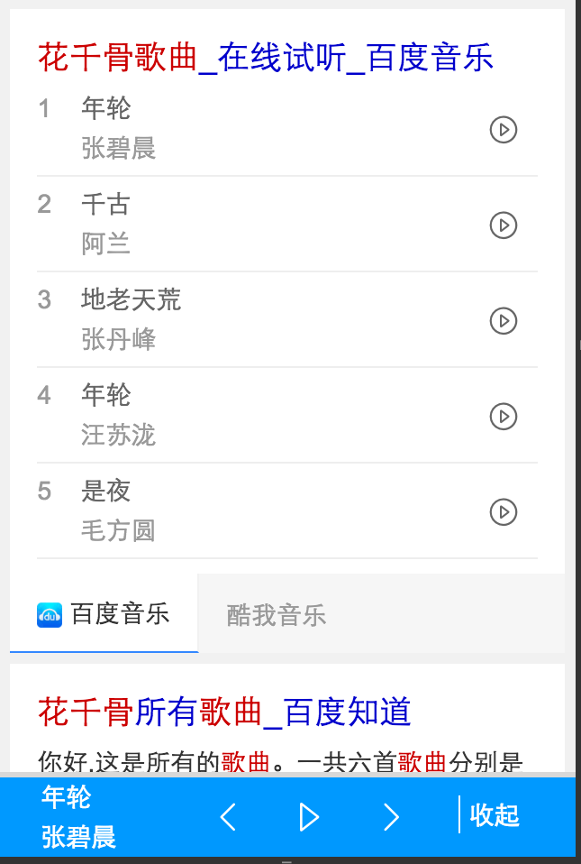

# 李浪波

> 从从2015-12-21到2015-12-25

## 音乐融合-影视原声带

### 项目背景

```
1、背景：辐射垂直行业，覆盖影视类歌曲需求，如花千骨歌曲，琅琊榜插曲等
```

### 完成情况

- 前端模板已于12月23号上线


## 音乐沉浸式体验

### 背景

- 探索音乐作为工具化的方向，将音乐作为插件，在明星沉浸式页面、音乐泛需求页面下展现，测试用户的使用情况，预期提升用户浏览体验，提升用户停留时长。

### 完成情况

- 前端模板已于12月23号上线，icon入口效果不明显，24号修改了一版icon样式并上线完成

### 效果截图



## 歌词反查

### 背景

- 优化线上样式（kv、仅百度音乐），走mini机制能够扩大召回，增加多资源方丰富资源

### 完成情况

- 12月23号开发完成，并通过pm、UE确认，24号开始测试，目前基本测试完成。

## 场景化接糯米资源之图片问题

### 背景

- 糯米资源图片不能提供方图，并且图片尺寸可能有好几种，目前前端实现是流式布局，必须图片尺寸按要求才行。

### 解决方案

调研两种方案：1、通过css使图片居中；2、通过TIMG服务在线裁剪图片。产生两个对应的demo，通过和黎昀确认需要走第二种方案。

方案2可以通过timg的size参数来裁剪方图，只需传fX_X即可，X是对应的方图宽度；ae需要支持sec和di，已经推荐晓炜、晓晖、宽哥支持。

## 创新项目之模板组件化

### 背景

- 推行模板组件化，能够在场景化、sigma卡片、2号项目中复用

### 进展

- 场景话头图开始设计，月底评审；图片list、左图右文模板组件开始设计开发，月底评审。

- 2号项目也在抽离

## 下周计划

- 创新项目之模板组件化

- 音乐原声带多资源方 上线

- 歌词反查 上线
