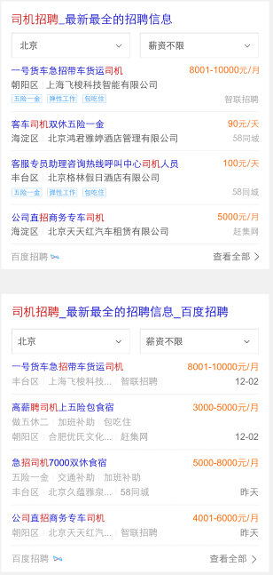
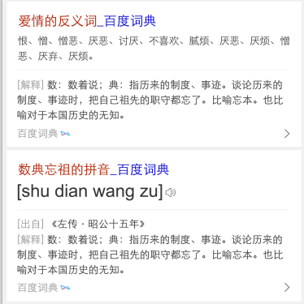
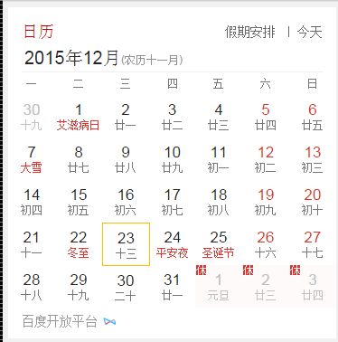
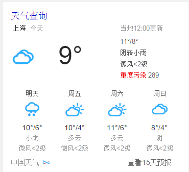
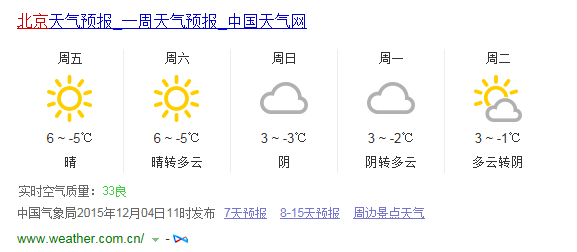

# 刘玲玲

> 从2015-12-21到2015-12-25

## 社招类 厨师招聘卡片 排查pv下降原因，回滚到原样式 

### 进展情况

周一（12月21）上线完成

### 效果截图

## wise百度词典卡片

### 背景与目标

针对线上中中释义卡片进行升级，主要满足用户字、词、成语实体卡片的查询，也作为字词成语实体卡片的一期项目，后期将继续问答卡片的满足。

### 进展情况

周一（12月21）上线完成，目前数据rd还没上线（估计今天上线），线上还不能预览

### 效果截图

## wise日历 切换年份后放假安排没有更新数据

### 进展情况

周三（12月23）上线完成

### 效果截图

## 天气白卡增加pm2.5信息 （pc 和 wise）

### 进展情况

周三（12月23）（pc 和 wise）上线完成

### 效果截图

## 招聘中间页（首页）

### 进展情况

开发中

## 下周排期项目

### 招聘中间页首页开发

