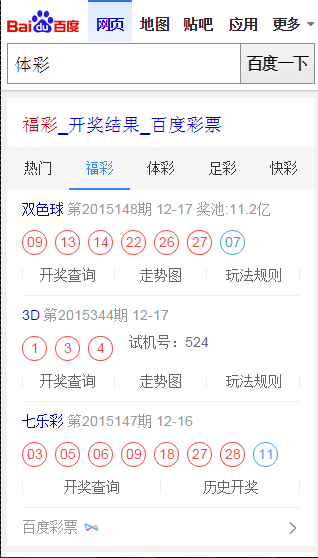
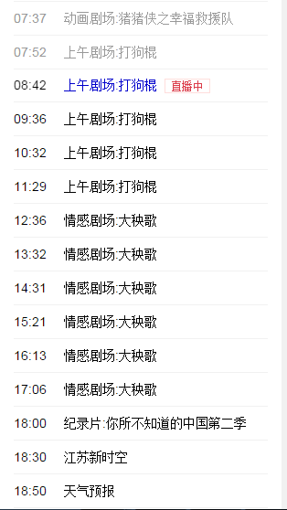
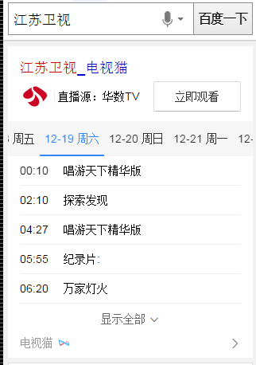
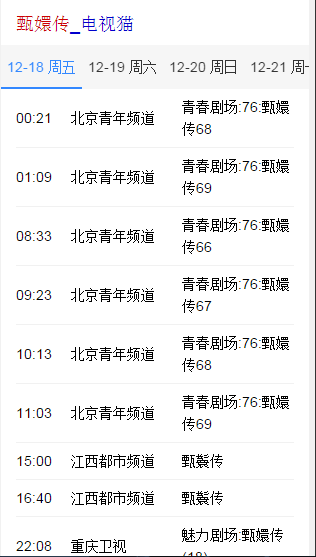
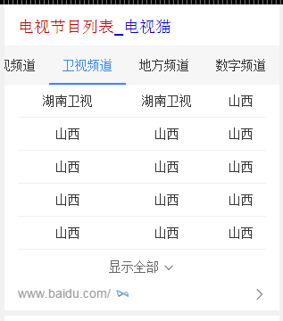
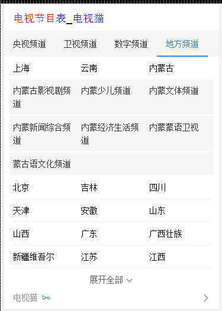
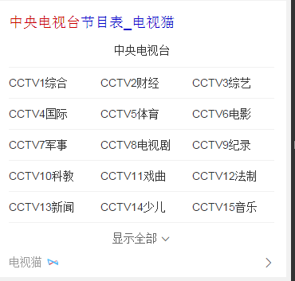

# 李阳阳

> 从2015-12-21到2015-12-25

## 12.25 Wise彩票泛需求的卡片

### 背景与目标

目前q=彩票、福彩、体彩的泛需求query还没有彩票卡片覆盖，需用户做再次搜索跳转，急需做一张泛彩票卡片满足用户需求，沉淀用户。

### 完成情况

模板在12月24号全流量上线，影响面约为pv40w，线上query="<a href="https://m.baidu.com/pu=sz%401320_2001/s?word=%E5%BD%A9%E7%A5%A8%E5%BC%80%E5%A5%96&sa=tb&ts=1422958&t_kt=0&ie=utf-8&rsv_t=ff7aXO0BN%252BdoIb2PbhsPHri2PnUWZFT8p1MlsgxXO3CgQDRCDtMl&rsv_pq=15205885459494900046&ss=100&t_it=1&rsv_sug4=2403&inputT=887&oq=%E5%BD%A9%E7%A5%A8">彩票开奖</a>"

 效果截图

## 12.25 Wise端政务办事迁移卡片

### 背景与目标

政务wise办事指南类卡片影响面约占政务项目wise端整体影响面的30%。而wise目前没有覆盖到政务办事指南类目，用户对查找服务指南类信息的操作成本高且流程复杂；因此将指南类服务信息在搜索结果页进行聚合，满足用户便捷查询获知的需求。

### 完成情况

模板还有一个地域扩展的问题需要解决，今天如果可以弄好，今天开始送评走单，可以在12月30号之前上线

 效果截图

 12-25号 电视节目类的卡片

 背景与目标

现有wise端节目单资源，线上需求满足低、展现样式弱、文字遮挡问题严重，通过最近调研情况，我们卡片在内容丰富程度，展现效果及时效性上，都与竞品有很大差距，根据用户阅读和使用习惯，需要对节目单整体进行优化，主要侧重点在“直播”需求满足及丰富节目单“内容”两方面，预期新节目每天Pv>40w，同比增长15%，通过满足用户直播需求上，极致提升用户体验，赶超竞品。

 完成情况

目前频道精准需求和节目精准需求模板已发开完成，三级单已过，12月25号上线，下午模板上线，电视节目泛需求和电视台泛需也已完成，已送测，今天应该可以测试完成，12月30号之前可以上线

 频道精确需求效果截图

 节目精确需求效果截图

 电视节目泛需求效果截图

 电视台泛需求效果截图

## 接下来的排期

* 修改企业异常名录的样式和存在的bug

