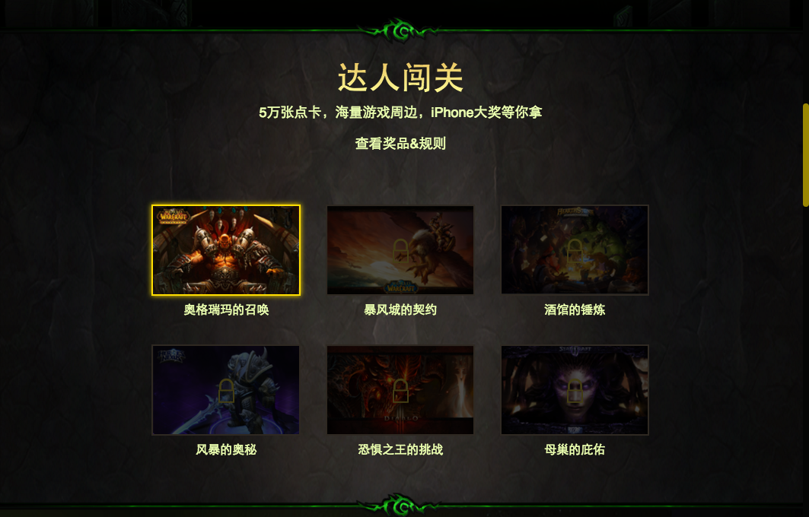
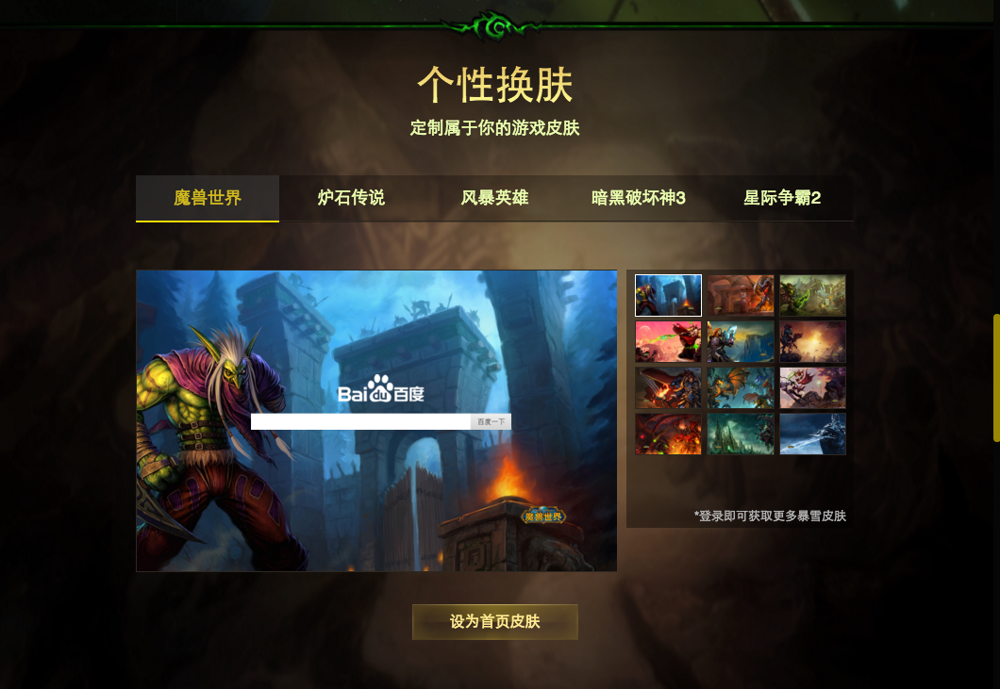
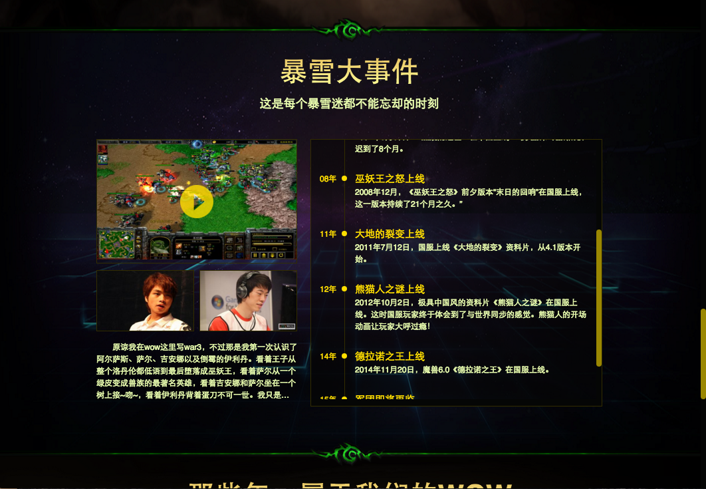
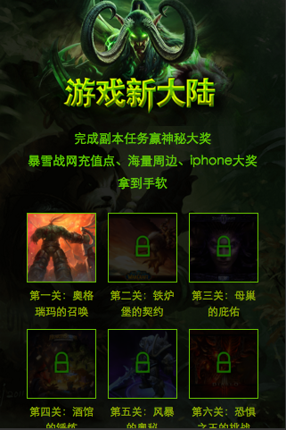
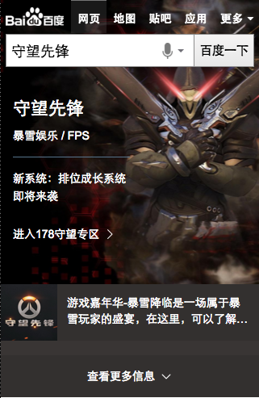
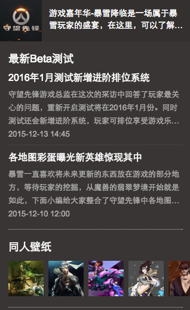
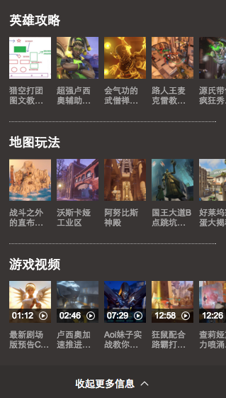
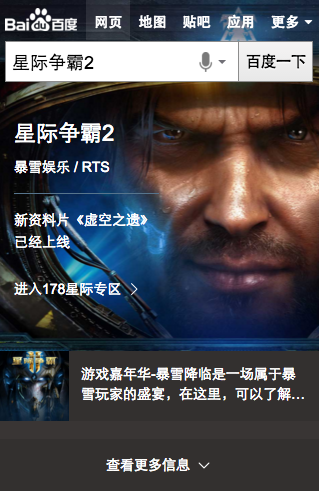

# 范黎明
> 从2015-12-25到2015-12-31

## 暴雪项目

### 背景与目标

暴雪游戏作为全球最为知名的游戏公司之一，旗下众多经典游戏伴随了中国80、90后一代人的成长。本次活动以满足用户检索需求为主线，运营与产品紧密配合，进行首页与结果页、pc与wise的多端联动，在满足用户需求的前提下，打造新型模式，建立具有商业生态的运营产品。提升百度在游戏领域的地位与作用。

### 完成情况

pc和wise中间页周一已经上线，wise的sigma卡片周四pm上资源

### 线上地址

中间页：[http://vote.baidu.com/pae/component/page/baoxueactive](http://vote.baidu.com/pae/component/page/baoxueactive)

sigma：[http://cp01-msg-mcp-web-27.epc.baidu.com:8003/s?word=%E9%AD%94%E5%85%BD%E4%B8%96%E7%95%8C](http://cp01-msg-mcp-web-27.epc.baidu.com:8003/s?word=%E9%AD%94%E5%85%BD%E4%B8%96%E7%95%8C)

### 效果截图

