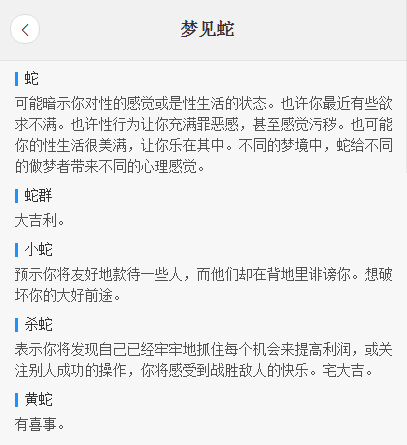
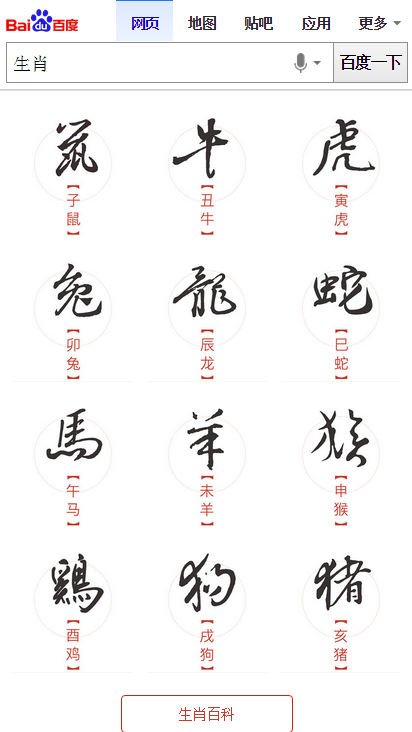
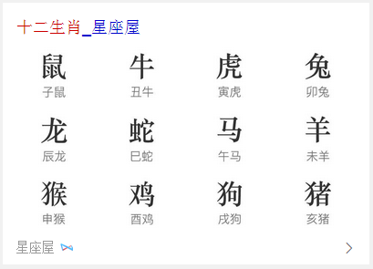

# 常健驰

> 从2015-12-28到2015-12-31

## 解梦白卡 - 已上线

### 背景与目标

解梦类query线上一共有两张卡片，解梦泛需求和解梦精细需求。两张卡片的样式上都略差于竞品，主要是1、泛需求卡片缺少其他类，交互上差于竞品。2、精准需求卡片数据不全，样式上太单一，无法满足用户换梦境的需求。由于精准需求满足较差，一期集中于精准需求卡片的优化。

### 完成情况

模板已在 `12月25日`上线，后发现bug，修复后上线，目前没有其他问题。 `pv` ：80万，预览地址：[梦见蛇](https://m.baidu.com/ssid=22266368616e676a69616e636869df09/s?word=%E6%A2%A6%E8%A7%81%E8%9B%87&ts=5956093&t_kt=0&ie=utf-8&rsv_iqid=14364825507458649014&rsv_t=3db3%252FHc0L2RZnGWWVaWW7FxiMzb22gbuo1dyf69i%252FaIYNJK4oM2l&sa=ihr_2&rsv_pq=14364825507458649014&rsv_sug4=1050&ss=001)

### 效果截图

## 生肖首页白卡

### 背景与目标

目前无生肖阿拉丁产品，在做竞品分析中，其他搜索产品能对生肖内容有特型展现来满足用户需求；在年底年初之际，用户对生肖query需求较高，所以需生肖卡片，满足这部分用户需求。

根据用户query分析，这部分用户搜索需求主要停留在十二生肖，xx属相，xx属相xx年运势，xx属与xx相配

`这里只展现生肖首页模板，运势不展现`

### 完成情况

模板已经完成，白卡测试通过，sigma现在纠结图片不清晰，其他没有问题。

### 效果截图

sigma

白卡

## pm2.5 (模板delay)

### 背景与目标

目前线上pm2.5卡片内容过于单一，样式不够优美，需要对卡片进行优化，增加更多信息，丰富卡片内容

### 完成情况

pm2.5 `delay` ，先做优先级较高的解梦模板

## 接下来的排期

* nba主卡有个遗留问题，需要跟 `安瑞-pm` 对接一下,看如何修改。
* 周二跟 `保丹-pm` 对了下需求，可以开发，由于生肖需要做白卡，pm2.5的delay了。
