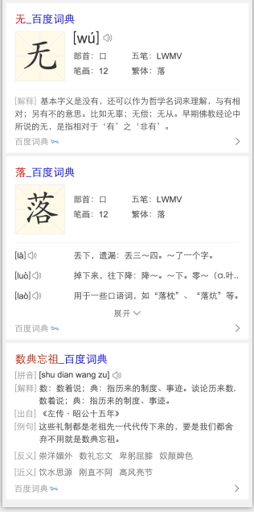
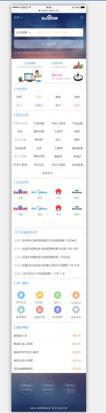

# 刘玲玲

> 从2015-12-28 到 2015-12-31

## wise百度词典卡片

### 背景与目标

针对线上中中释义卡片进行升级，主要满足用户字、词、成语实体卡片的查询，也作为字词成语实体卡片的一期项目，后期将继续问答卡片的满足。

### 进展情况

因新的odp环境下配置了encoding字段，模板中新加编码判断，周三（12月30）上线完成，

### 效果截图

## 招聘中间页 首页开发(wise)

### 进展情况

目前开发中

### 效果截图

## 下周排期项目

### 招聘中间页首页开发

