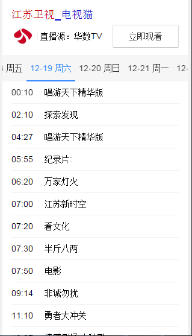
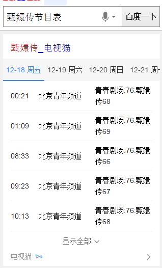
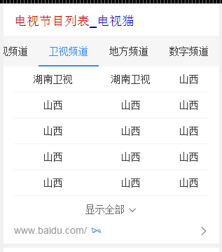
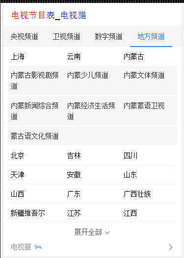
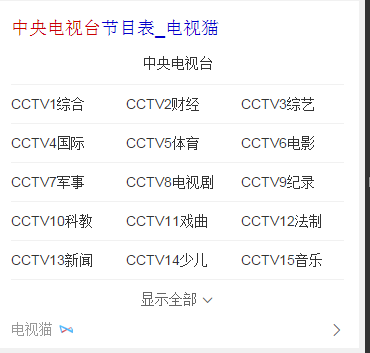

# 李阳阳

> 从2015-12-28到2015-12-31

## 12.25 Wise端政务办事迁移卡片

### 背景与目标

政务wise办事指南类卡片影响面约占政务项目wise端整体影响面的30%。而wise目前没有覆盖到政务办事指南类目，用户对查找服务指南类信息的操作成本高且流程复杂；因此将指南类服务信息在搜索结果页进行聚合，满足用户便捷查询获知的需求。

### 完成情况

12月30号全流量上线，pv量20w，线上query="<a href='https://m.baidu.com/s?word=%E5%8C%97%E4%BA%AC%E5%85%AC%E7%A7%AF%E9%87%91'>北京公积金</a>"

 效果截图

 12-25号 电视节目类的卡片

 背景与目标

现有wise端节目单资源，线上需求满足低、展现样式弱、文字遮挡问题严重，通过最近调研情况，我们卡片在内容丰富程度，展现效果及时效性上，都与竞品有很大差距，根据用户阅读和使用习惯，需要对节目单整体进行优化，主要侧重点在“直播”需求满足及丰富节目单“内容”两方面，预期新节目每天Pv>40w，同比增长15%，通过满足用户直播需求上，极致提升用户体验，赶超竞品。

 完成情况

目前频道精准需求和节目精准需求模板已发开完成，12月25号已上线，Pv量250W线上query="<a href='https://m.baidu.com/s?word=%E6%B7%B1%E5%9C%B3%E5%8D%AB%E8%A7%86'>深圳卫视</a>",电视节目泛需求和电视台泛需求这两个模板，走三级单时被关总拍回来了，样式上需要重现调整，pm这周请假，说等回来再搞和重现走单，节后6号左右可以上线

 频道精确需求效果截图

 节目精确需求效果截图

 电视节目泛需求效果截图

 电视台泛需求效果截图

## WISE影视sigma迭代优化，说是这周上线，周二开始着手搞，现在感觉会有风险，可能上不了线今天

### 背景与目标

   针对已经上线的糯米正在热映的运营卡片，需要FE进行优化，优化点在这里详述，希望本周内可以优化上线：
①schema整体结构优化，补充说明，方便后续PM手动填写

### 完成情况

逻辑上已经改的差不多了，今天数据来一版测试一下，白卡的样式重现整了一版，现在还么有数据，没有效果图

## 接下来的排期

* 修改企业异常名录的样式和存在的bug

