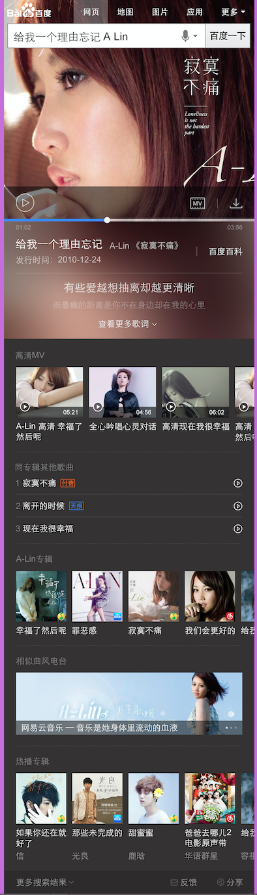

# 李佳隆

> 从2015-12-21到2015-12-25

##	2号项目-音乐

### 背景

2号项目的意义是在满足用户主需求的情况下,激发用户的额外需求.
在满足用户单曲精确查找的需求基础上，充分利用搜索结果的后面点击率较少的区域，激发用户在音乐上的需求。  
Query示例：小幸运（只有一位歌手唱过）  
依赖张靓颖（精准明确歌手与歌曲）  
影响面：首先针对可以在线播放的百度音乐资源的，排在首位的资源。  
初步按照圈定歌曲的方式，小流量测试10w/day  
全量约25w/day  

### 完成情况

* 音乐播放的核心功能线下跑通了.
* 1.7日ue稿才定稿,1.7日晚上rd给出了主卡环境与主卡数据,相关推荐数据还没有.delay了2天,1.8日会重新和pm,rd确认排期

### 效果图

## 擎天柱-imglist组件开发

### 背景

在场景化,2号项目中有非常多相似的模块,故抽离出模板代码为模板组件,由数据来控制展现.节省开发成本  

### 完成情况

为了更好的扩展性以及同步异步调用的统一,js代码重写为require模块,进一步调整了数据接口,统一模板组件开发规范
目前可以在平台使用了,为线下调用,下周会上线

