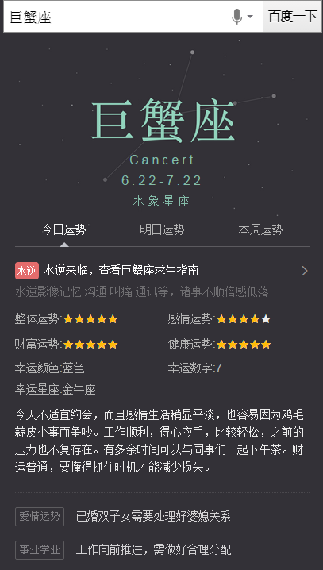

# 常健驰

> 从2016-01-04到2015-01-08

## 星座运势卡

### 背景与目标

将原有星座运势阿拉丁卡片改为sigma形式，线上卡片虽为用户展示了较全的运势信息，但月和年运势用户需求不大，无必要展示，用户在运势中，需求强度为：今日运势>明日运势>本周运势，而该3个运势占比80%。期望对卡片升级以进一步提高星座类需求的流量激发、颜值以及体验提升、以及进一步的搜索动机激活。

### 完成情况

模板已在 `1月7日`完成，预览地址：[巨蟹座](https://wwwhttps.baidu.com/s?dev_workspace=platform&dev_tpl=wise_fortune&tn=iphone&sid=99999&dev_online=0&dev_module=aladdin-wise&dev_file=default.xml&dev_fileformat=xml&dev_pos=asResult&wd=%E5%B7%A8%E8%9F%B9%E5%BA%A7&word=%E5%B7%A8%E8%9F%B9%E5%BA%A7)

### 效果截图

sigma效果

## 生肖首页

### 背景与目标

目前无生肖阿拉丁产品，在做竞品分析中，其他搜索产品能对生肖内容有特型展现来满足用户需求；在年底年初之际，用户对生肖query需求较高，所以需生肖卡片，满足这部分用户需求。

根据用户query分析，这部分用户搜索需求主要停留在十二生肖，xx属相，xx属相xx年运势，xx属与xx相配

`这里只展现生肖首页模板，运势不展现`

### 完成情况

`sigma` 和 `白卡` 已通过测试，`生肖运势卡` 有细微调整, `1月7日` 调整完毕，效果确认。正在走单ing...

## pm2.5 (模板delay)

### 背景与目标

目前线上pm2.5卡片内容过于单一，样式不够优美，需要对卡片进行优化，增加更多信息，丰富卡片内容

### 完成情况

pm2.5 `delay` 预期 `1月12日` 开始做，但是中间要插入 `度秘` 项目，可能要 `delay` 1~2天。`保丹-pm` 要疯了~~~

## 接下来的排期

* nba主卡有个遗留问题，需要跟 `安瑞-pm` 对接一下,看如何修改。
